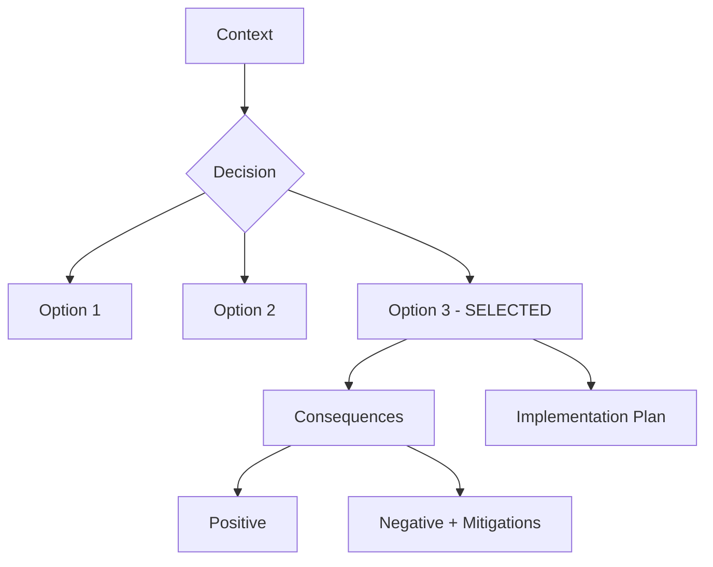

# Architecture Decision Record Template

## Metadata

| Field | Value |
|-------|-------|
| **ADR ID** | NNNN |
| **Title** | [Short descriptive title] |
| **Status** | Proposed \| Accepted \| Deprecated \| Superseded |
| **Date** | YYYY-MM-DD |
| **Authors** | [List] |
| **Reviewers** | [List] |
| **Related ADRs** | [Links] |

## Sections

### 1. Status

What is the status of this decision? (Proposed, Accepted, Deprecated, Superseded)

### 2. Context

What is the issue that we're seeing that is motivating this decision or change?

- What are the problem statement and pain points?
- What are the drivers for this decision?
- What are the constraints and requirements?
- What are the business/technical goals?

### 3. Decision

What is the change that we're proposing and/or doing?

- Clear statement of the decision
- Technical approach and architecture
- Key components and their interactions
- Diagrams where helpful

### 4. Alternatives Considered

What other approaches did we consider, and why did we reject them?

For each alternative:
- Brief description
- Pros and cons
- Why it was rejected

### 5. Consequences

- **Positive**: What benefits will we realize?
- **Negative**: What drawbacks or risks does this introduce?
- **Neutral**: What doesn't change?
- **Mitigation**: How will we address the negatives?

### 6. Implementation

How will we implement this decision?

- Phases and milestones
- Dependencies and blockers
- Resource requirements
- Timeline

### 7. References

- Links to relevant documentation
- Research and proof of concepts
- Industry standards and best practices

---

## Example ADR Structure

## ADR Index

| ID | Title | Status | Date |
|----|-------|--------|------|
| 0001 | ADR Template | Accepted | 2026-01-18 |
| 0002 | High-Level System Architecture | Proposed | 2026-01-18 |
| 0003 | Microkernel Pattern for Core Platform | Proposed | 2026-01-18 |
| 0004 | Event-Driven Architecture with CQRS | Proposed | 2026-01-18 |
| 0005 | Telemetry Pipeline with Kafka | Proposed | 2026-01-18 |
| 0006 | Anomaly Detection with ONNX Runtime | Proposed | 2026-01-18 |
| 0007 | Correlation Engine Design | Proposed | 2026-01-18 |
| 0008 | Remediation Engine with Temporal | Proposed | 2026-01-18 |
| 0009 | Service Topology with Graph Database | Proposed | 2026-01-18 |
| 0010 | Time-Series Data Storage Strategy | Proposed | 2026-01-18 |
| 0011 | Log Storage with ClickHouse | Proposed | 2026-01-18 |
| 0012 | Data Retention and Tiering Strategy | Proposed | 2026-01-18 |
| 0013 | OpenTelemetry Integration | Proposed | 2026-01-18 |
| 0014 | Kubernetes Integration Patterns | Proposed | 2026-01-18 |
| 0015 | Multi-Cloud Provider Abstraction | Proposed | 2026-01-18 |
| 0016 | ITSM Platform Integration Strategy | Proposed | 2026-01-18 |
| 0017 | Tokio Async Runtime Selection | Proposed | 2026-01-18 |
| 0018 | Error Handling with Result and anyhow | Proposed | 2026-01-18 |
| 0019 | Concurrency Patterns for Pipeline Processing | Proposed | 2026-01-18 |
| 0020 | Memory Management for Long-Running Services | Proposed | 2026-01-18 |
