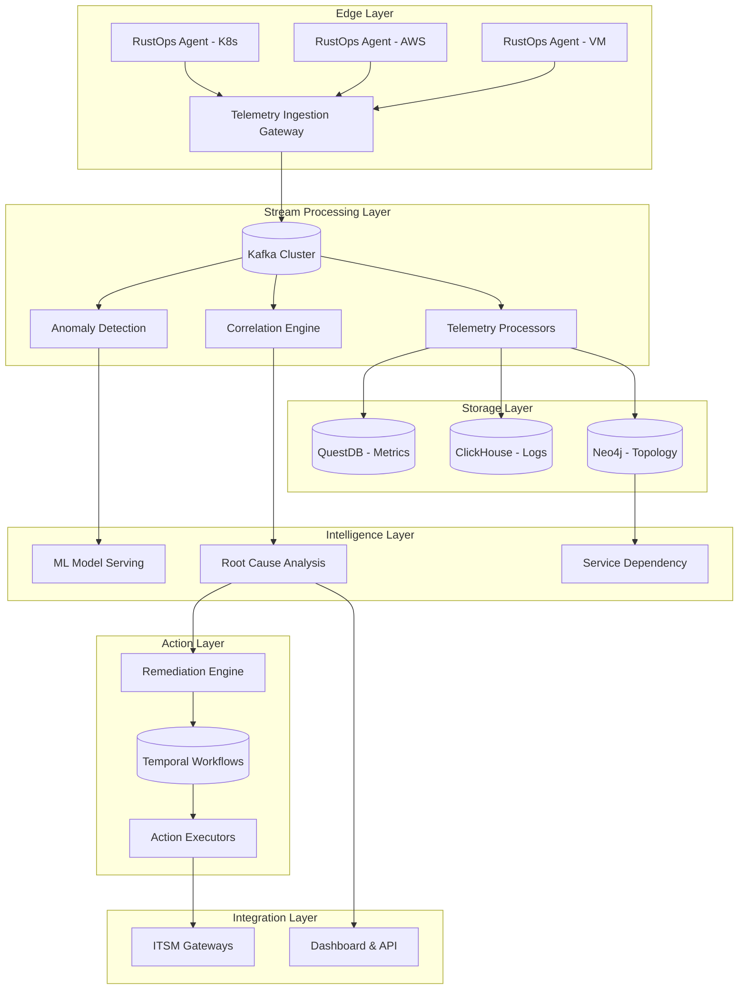
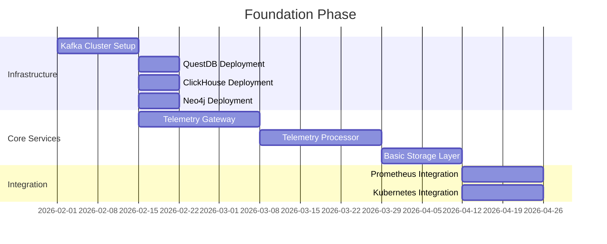

# ADR 0002: High-Level System Architecture

## Metadata

| Field | Value |
|-------|-------|
| **ADR ID** | 0002 |
| **Title** | High-Level System Architecture for RustOps AIOps Platform |
| **Status** | Proposed |
| **Date** | 2026-01-18 |
| **Authors** | System Architecture Team |
| **Related ADRs** | 0003 (Microkernel), 0004 (Event-Driven), 0005 (Telemetry) |

---

## 1. Status

**Proposed** - Under review by architecture team

---

## 2. Context

### Problem Statement

RustOps must process massive volumes of telemetry data (10M metrics/minute, 1TB logs/day) while providing:
- Sub-500ms alert correlation latency
- 99.99% platform uptime
- Horizontal scalability across regions
- Support for heterogeneous data sources

Current monolithic AIOps platforms struggle with:
- **Scaling bottlenecks**: Single components become choke points
- **Cascading failures**: Component failures ripple across the system
- **Deployment complexity**: Updates require full platform restarts
- **Resource inefficiency**: Over-provisioning for peak loads

### Requirements

| Category | Requirement |
|----------|------------|
| **Performance** | Process 10M metrics/minute with <100ms p95 latency |
| **Scalability** | Scale to 100K+ monitored endpoints |
| **Reliability** | 99.99% uptime, <30s failover |
| **Maintainability** | Independent component deployment |
| **Observability** | Full telemetry pipeline visibility |

---

## 3. Decision

### Architecture: Distributed Microservices with Event-Driven Communication

### Core Architectural Principles

1. **Separation of Concerns**: Each component has a single, well-defined responsibility
2. **Loose Coupling**: Components communicate via events, not direct calls
3. **High Cohesion**: Related functionality grouped together
4. **Fault Isolation**: Component failures don't cascade
5. **Independent Scalability**: Each component scales based on load

### Technology Stack Summary

| Layer | Technology | Justification |
|-------|------------|---------------|
| **Agent** | Rust + tokio | Low overhead, memory safety, async I/O |
| **Messaging** | Kafka/Redpanda | High throughput, durability, replay capability |
| **Metrics** | QuestDB | Time-series optimized, SQL-compatible, 20x faster than TSDB |
| **Logs** | ClickHouse | Columnar storage, compression, fast full-text search |
| **Graph** | Neo4j | Native graph database, mature query language |
| **ML** | ONNX Runtime | Cross-platform, optimized inference, multiple framework support |
| **Workflows** | Temporal | Durable execution, retries, visibility |
| **API** | Axum | Type-safe, async, middleware ecosystem |

---

## 4. Alternatives Considered

### Alternative 1: Monolithic Architecture

**Description**: Single Rust binary containing all functionality

**Pros**:
- Simpler deployment
- No network overhead
- Easier debugging

**Cons**:
- Scaling bottleneck
- Single point of failure
- Difficult to update components independently
- Technology lock-in

**Rejected**: Scaling requirements (10M metrics/minute) exceed monolithic capabilities

### Alternative 2: Serverless (Lambda/FaaS)

**Description**: Deploy each function as serverless function

**Pros**:
- Auto-scaling
- No infrastructure management
- Pay-per-use

**Cons**:
- Cold start latency (violates <100ms requirement)
- Execution time limits
- State management complexity
- Vendor lock-in

**Rejected**: Latency and statefulness requirements incompatible

### Alternative 3: Microservices with REST

**Description**: Services communicate via synchronous REST calls

**Pros**:
- Simple to understand
- Standard protocols
- Easy testing

**Cons**:
- Temporal coupling
- Cascading failures
- Harder to achieve backpressure
- Synchronous blocking

**Rejected**: Event-driven architecture provides better decoupling and fault tolerance

---

## 5. Consequences

### Positive

| Benefit | Impact |
|---------|--------|
| **Horizontal scaling** | Each component scales independently based on load |
| **Fault isolation** | Component failure doesn't crash entire system |
| **Technology flexibility** | Different components can use optimal technologies |
| **Team autonomy** | Teams can own and deploy components independently |
| **Resilience** | Natural retries via event replay and dead letter queues |

### Negative

| Challenge | Mitigation |
|-----------|------------|
| **Operational complexity** | Comprehensive observability and automation |
| **Network latency** | Co-locate related services, optimize serialization |
| **Distributed transactions** | Use saga pattern via Temporal for consistency |
| **Data consistency** | Eventual consistency with reconciliation jobs |
| **Testing complexity** | Contract testing, consumer-driven contracts |

### Neutral

- **Development overhead**: More services to develop initially, but faster iteration later
- **Learning curve**: Team needs to understand distributed systems patterns

---

## 6. Implementation

### Phase 1: Foundation (Months 1-3)

**Deliverables**:
- Working telemetry pipeline
- Agent deployment mechanism
- Basic dashboard
- Prometheus + Kubernetes integrations

### Phase 2: Intelligence (Months 4-6)

**Components**:
- Anomaly Detection Service
- Correlation Engine
- Service Topology Discovery
- Root Cause Analysis

### Phase 3: Automation (Months 7-9)

**Components**:
- Remediation Engine
- Temporal workflow integration
- Runbook automation

### Phase 4: Enterprise (Months 10-12)

**Components**:
- Multi-region support
- Advanced ML models
- Enterprise integrations

---

## 7. References

### Documentation
- [Google SRE Book - Distributed System Design](https://sre.google/sre-book/designing-distributed-systems/)
- [Microservices Patterns by Chris Richardson](https://microservices.io/patterns/)
- [Reactive Messaging Systems](https://www.reactivemanifesto.org/)

### Technologies
- [Kafka Documentation](https://kafka.apache.org/documentation/)
- [QuestDB Architecture](https://questdb.io/docs/concept/architecture/)
- [ClickHouse Architecture](https://clickhouse.com/docs/en/architecture/)
- [Temporal Pattern: Saga](https://temporal.io/blog/saga-pattern-for-microservices)

### Research
- Gartner "AIOps Platform Market Guide" 2025
- Forrester "The State of Observability" 2025
