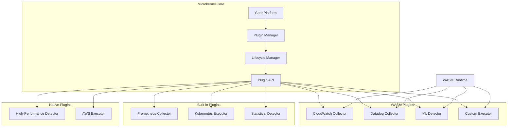

# ADR 0003: Microkernel Pattern for Core Platform

## Metadata

| Field | Value |
|-------|-------|
| **ADR ID** | 0003 |
| **Title** | Microkernel Pattern for RustOps Core Platform |
| **Status** | Proposed |
| **Date** | 2026-01-18 |
| **Authors** | System Architecture Team |
| **Related ADRs** | 0002 (System Architecture), 0004 (Event-Driven) |

---

## 1. Status

**Proposed** - Under review

---

## 2. Context

### Problem Statement

The RustOps core platform must support:
- **Pluggable telemetry collectors** (Prometheus, StatsD, CloudWatch, Datadog, etc.)
- **Extensible anomaly detectors** (statistical, ML-based, rule-based)
- **Multiple remediation executors** (Kubernetes, AWS, Azure, GCP, custom)
- **Custom integrations** developed by customers

A monolithic approach would:
- Make the platform rigid and hard to extend
- Require core updates for new integrations
- Slow down innovation (every change needs full platform release)
- Create vendor lock-in

### Requirements

| Requirement | Description |
|-------------|-------------|
| **Extensibility** | Add collectors, detectors, and actions without recompiling core |
| **Isolation** | Plugin failures don't crash the platform |
| **Versioning** | Support multiple plugin versions simultaneously |
| **Discovery** | Automatic plugin discovery and registration |
| **Lifecycle** | Hot-reload plugins without restart |
| **Safety** | Plugins cannot corrupt memory or violate safety guarantees |

---

## 3. Decision

### Architecture: Microkernel with WASM-based Plugin System



### Plugin Categories

| Category | Interface | Example Plugins |
|----------|-----------|-----------------|
| **Collectors** | `TelemetryCollector` | Prometheus, StatsD, CloudWatch, Datadog |
| **Processors** | `TelemetryProcessor` | Sampling, aggregation, enrichment |
| **Detectors** | `AnomalyDetector` | Statistical, LSTM, Isolation Forest, Custom |
| **Correlators** | `AlertCorrelator` | Time-based, topology-based, ML-based |
| **Executors** | `RemediationExecutor` | Kubernetes, AWS, Azure, GCP, Custom scripts |
| **Integrations** | `ExternalIntegration` | ServiceNow, Jira, PagerDuty, Slack |

### Plugin Interface Definition (Rust)

```rust
// Core plugin trait
pub trait Plugin: Send + Sync {
    fn metadata(&self) -> PluginMetadata;
    fn initialize(&mut self, context: &PluginContext) -> Result<()>;
    fn shutdown(&mut self) -> Result<()>;
    fn health_check(&self) -> HealthStatus;
}

// Telemetry collector plugin
#[async_trait]
pub trait TelemetryCollector: Plugin {
    async fn collect(&self) -> Result<TelemetryBatch>;
    fn collector_type(&self) -> CollectorType;
    fn supported_sources(&self) -> Vec<DataSource>;
}

// Anomaly detector plugin
#[async_trait]
pub trait AnomalyDetector: Plugin {
    async fn analyze(&self, data: &TelemetryBatch) -> Result<DetectionResult>;
    fn detector_type(&self) -> DetectorType;
    fn training_requirements(&self) -> TrainingConfig;
}

// Remediation executor plugin
#[async_trait]
pub trait RemediationExecutor: Plugin {
    async fn execute(&self, action: &RemediationAction) -> ExecutionResult;
    async fn validate(&self, action: &RemediationAction) -> ValidationResult;
    fn executor_type(&self) -> ExecutorType;
    fn supported_actions(&self) -> Vec<ActionType>;
}
```

### Plugin Manager Implementation

```rust
pub struct PluginManager {
    plugins: HashMap<PluginId, Arc<dyn Plugin>>,
    wasm_runtime: WasmRuntime,
    registry: PluginRegistry,
    lifecycle: PluginLifecycleManager,
}

impl PluginManager {
    pub async fn register_plugin(&mut self, spec: &PluginSpec) -> Result<()> {
        match spec.plugin_type {
            PluginType::Builtin => self.register_builtin(spec).await,
            PluginType::Wasm => self.register_wasm(spec).await,
            PluginType::Native => self.register_native(spec).await,
        }
    }

    pub async fn hot_reload(&mut self, plugin_id: &PluginId) -> Result<()> {
        // Unload old version
        self.unload_plugin(plugin_id).await?;

        // Load new version
        let new_spec = self.registry.get_latest_version(plugin_id)?;
        self.register_plugin(&new_spec).await?;

        Ok(())
    }

    pub fn get_plugin<T: Plugin + 'static>(&self, id: &PluginId) -> Option<Arc<T>> {
        self.plugins.get(id)
            .and_then(|p| p.clone().downcast_arc::<T>().ok())
    }
}
```

### WASM Sandbox Capabilities

| Capability | Description |
|------------|-------------|
| **Memory isolation** | Plugins have separate linear memory |
| **CPU limiting** | Instruction counting and timeouts |
| **Resource limits** | Constrained memory and compute allocations |
| **Capability-based security** | Explicit permissions for network, file access |
| **Deterministic execution** | Same inputs always produce same outputs |

### Plugin Discovery

```toml
# plugins/example-collector/Cargo.toml
[package]
name = "example-collector"
version = "0.1.0"

[lib]
crate-type = ["cdylib"]

[dependencies]
rustops-plugin-api = "0.1"

[package.metadata.rustops]
plugin-type = "wasm"
plugin-category = "collector"
collector-type = "custom"
capabilities = ["network:read", "metrics:read"]
```

---

## 4. Alternatives Considered

### Alternative 1: Fixed Built-in Components

**Description**: Hardcode all collectors, detectors, and executors

**Pros**:
- Simpler architecture
- Better performance (no sandbox overhead)
- Type safety across all components

**Cons**:
- Inflexible - can't add new sources without recompiling
- Slower iteration - every change needs full release
- Vendor lock-in
- Cannot support customer extensions

**Rejected**: Core requirement is extensibility for heterogeneous environments

### Alternative 2: Dynamic Native Libraries (.so/.dll)

**Description**: Load plugins as native shared libraries

**Pros**:
- Zero runtime overhead
- Full native performance
- Direct memory access

**Cons**:
- **Memory unsafe**: Plugin can crash entire platform
- **Security risk**: No sandbox, full system access
- **ABI instability**: Rust ABI not stable across versions
- **Platform-specific**: Need to compile for each OS/arch

**Rejected**: Safety and isolation are non-negotiable for operations platform

### Alternative 3: Sidecar Process Plugins

**Description**: Each plugin runs as separate process, communicates via gRPC/HTTP

**Pros**:
- Strong isolation (process boundary)
- Language agnostic
- Easy to develop independently

**Cons**:
- Higher latency (IPC overhead)
- Resource intensive (process per plugin)
- Complex deployment and orchestration
- Harder to maintain consistency

**Rejected**: Performance requirements (<100ms correlation) prohibit IPC overhead

---

## 5. Consequences

### Positive

| Benefit | Impact |
|---------|--------|
| **Extensibility** | Add new integrations without core changes |
| **Innovation** | Faster iteration on detectors and executors |
| **Customization** | Customers can develop domain-specific plugins |
| **Safety** | WASM sandbox prevents plugin crashes and security issues |
| **Versioning** | Multiple plugin versions can coexist |
| **Testing** | Plugins can be tested independently |

### Negative

| Challenge | Mitigation |
|-----------|------------|
| **WASM overhead** | ~10-20% performance cost for WASM plugins | Use native for critical paths, WASM for extensibility |
| **API complexity** | Plugin API must be carefully designed | Version the API, provide comprehensive examples |
| **Debugging** | WASM plugins harder to debug | Provide detailed logging, debug mode with native builds |
| **Memory limits** | WASM linear memory constraints | Implement streaming APIs for large data |

### Neutral

- **Development time**: Longer initial development, but faster iteration
- **Learning curve**: Plugin developers need to learn plugin API

---

## 6. Implementation

### Phase 1: Plugin API Design (Weeks 1-2)

- Define core traits for each plugin category
- Design plugin metadata format
- Create plugin development documentation

### Phase 2: Plugin Manager (Weeks 3-4)

- Implement plugin registry
- Build lifecycle management
- Add hot-reload support

### Phase 3: WASM Integration (Weeks 5-6)

- Integrate wasmtime or wasmer runtime
- Implement capability-based security
- Add resource limiting

### Phase 4: Built-in Plugins (Weeks 7-10)

- Migrate existing collectors to plugin architecture
- Implement Prometheus collector plugin
- Implement Kubernetes executor plugin
- Implement statistical detector plugin

### Phase 5: Plugin SDK (Weeks 11-12)

- Create plugin development kit
- Write example plugins
- Build plugin testing framework
- Document best practices

### Example Plugin Development

```bash
# Create new plugin
cargo generate --git https://github.com/rustops/plugin-template --name my-detector

# Build WASM plugin
cargo build --release --target wasm32-wasi

# Test plugin locally
rustops plugin test ./target/wasm32-wasi/release/my_detector.wasm

# Package plugin
rustops plugin package ./target/wasm32-wasi/release/my_detector.wasm

# Deploy plugin
rustops plugin install my-detector-0.1.0.wasm
```

---

## 7. References

### Technologies
- [Wasmtime](https://wasmtime.dev/) - WASM runtime for Rust
- [Wasmer](https://wasmer.io/) - Alternative WASM runtime
- [Extism](https://extism.org/) - Plugin framework using WASM

### Patterns
- [Microkernel Pattern](https://en.wikipedia.org/wiki/Microkernel)
- [Plugin Pattern in Rust](https://blog.yoshuawuyts.com/plugin-system/)
- [WebAssembly for P2P Plugins](https://honzajavorek.blog/blog/wasm-plugins/)

### Research
- "WebAssembly: A Safe, Fast, and Portable Binary Format" - IEEE 2024
- "Plugin Architectures for Extensible Systems" - ACM 2023
