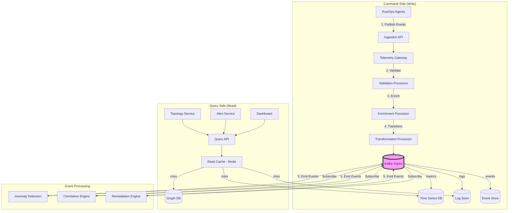

# ADR 0004: Event-Driven Architecture with CQRS

## Metadata

| Field | Value |
|-------|-------|
| **ADR ID** | 0004 |
| **Title** | Event-Driven Architecture with CQRS for RustOps |
| **Status** | Proposed |
| **Date** | 2026-01-18 |
| **Authors** | System Architecture Team |
| **Related ADRs** | 0002 (System Architecture), 0005 (Telemetry Pipeline) |

---

## 1. Status

**Proposed** - Under review

---

## 2. Context

### Problem Statement

RustOps must handle high-throughput telemetry data with complex processing pipelines:

**Challenges with synchronous/request-response**:
- **Temporal coupling**: Callers must wait for processing to complete
- **Cascading failures**: Slow processor blocks entire pipeline
- **Backpressure difficult**: Hard to flow-rate limit across service boundaries
- **Scaling mismatch**: Ingestion and processing have different scaling needs
- **Replay impossible**: Cannot reprocess data after failures or bugs

**Read/Write workload imbalance**:
- **Write-heavy**: 10M metrics/minute written, far fewer queries
- **Read optimization**: Queries need different schemas than writes
- **Real-time vs historical**: Current state queries vs time-series analysis

### Requirements

| Requirement | Description |
|-------------|-------------|
| **Throughput** | Handle 10M metrics/minute sustained |
| **Latency** | <100ms p95 for end-to-end processing |
| **Backpressure** | Graceful degradation under overload |
| **Replayability** | Reprocess data for ML retraining and bug fixes |
| **Scalability** | Independent scaling of read/write paths |
| **Durability** | Zero data loss during failures |

---

## 3. Decision

### Architecture: Event-Driven with CQRS



### Event Schema

```rust
// Domain events
#[derive(Clone, Debug, Serialize, Deserialize)]
pub enum DomainEvent {
    // Telemetry events
    MetricsBatch(MetricsBatchEvent),
    LogBatch(LogBatchEvent),
    TraceBatch(TraceBatchEvent),
    EventBatch(EventBatchEvent),

    // Detection events
    AnomalyDetected(AnomalyEvent),
    ThresholdViolation(ThresholdEvent),

    // Correlation events
    AlertCreated(AlertEvent),
    AlertGrouped(AlertGroupEvent),
    AlertDeduplicated(AlertDedupEvent),

    // Topology events
    ServiceDiscovered(ServiceEvent),
    DependencyDiscovered(DependencyEvent),

    // Remediation events
    RemediationTriggered(RemediationEvent),
    RemediationCompleted(RemediationResultEvent),

    // System events
    HealthCheck(HealthEvent),
    ConfigurationChanged(ConfigEvent),
}

// Metrics batch event
#[derive(Clone, Debug, Serialize, Deserialize)]
pub struct MetricsBatchEvent {
    pub event_id: Uuid,
    pub timestamp: DateTime<Utc>,
    pub source: SourceIdentifier,
    pub metrics: Vec<MetricDataPoint>,
    pub metadata: HashMap<String, String>,
}

#[derive(Clone, Debug, Serialize, Deserialize)]
pub struct MetricDataPoint {
    pub name: String,
    pub value: f64,
    pub labels: HashMap<String, String>,
    pub timestamp: DateTime<Utc>,
    pub metric_type: MetricType, // Gauge, Counter, Histogram
}
```

### CQRS Implementation

```rust
// Command side - Write model
pub struct TelemetryCommandHandler {
    producer: Arc<KafkaProducer>,
    validator: Arc<dyn EventValidator>,
    enricher: Arc<dyn EventEnricher>,
}

impl TelemetryCommandHandler {
    pub async fn ingest_metrics(
        &self,
        batch: MetricsBatch,
    ) -> Result<CommandResult> {
        // 1. Validate
        self.validator.validate(&batch)?;

        // 2. Enrich with metadata
        let enriched = self.enricher.enrich(batch).await?;

        // 3. Create domain event
        let event = DomainEvent::MetricsBatch(MetricsBatchEvent {
            event_id: Uuid::new_v4(),
            timestamp: Utc::now(),
            source: enriched.source.clone(),
            metrics: enriched.metrics,
            metadata: enriched.metadata,
        });

        // 4. Publish to Kafka (async)
        self.producer.send("metrics", &event).await?;

        Ok(CommandResult::Accepted(event.event_id))
    }
}

// Query side - Read model
pub struct TelemetryQueryHandler {
    tsdb: Arc<TimeSeriesDB>,
    cache: Arc<RedisCache>,
}

impl TelemetryQueryHandler {
    pub async fn query_metrics(
        &self,
        query: MetricsQuery,
    ) -> Result<MetricsResult> {
        // Check cache first
        if let Some(cached) = self.cache.get(&query).await? {
            return Ok(cached);
        }

        // Query time-series database
        let result = self.tsdb.query(query.clone()).await?;

        // Populate cache
        self.cache.set(query, result.clone()).await?;

        Ok(result)
    }
}
```

### Kafka Topic Strategy

| Topic | Purpose | Partitions | Retention | Key |
|-------|---------|------------|-----------|-----|
| `telemetry.metrics.raw` | Raw metric ingestion | 100 | 7 days | `source_id` |
| `telemetry.logs.raw` | Raw log ingestion | 100 | 7 days | `source_id` |
| `telemetry.events.raw` | Raw event ingestion | 50 | 30 days | `source_id` |
| `processing.enriched` | Enriched telemetry | 100 | 3 days | `event_id` |
| `detection.anomalies` | Detected anomalies | 50 | 30 days | `anomaly_id` |
| `alerts.created` | Alert events | 20 | 90 days | `alert_id` |
| `remediation.commands` | Remediation actions | 10 | 365 days | `remediation_id` |
| `topology.changes` | Topology updates | 20 | 90 days | `service_id` |

### Backpressure Strategy

```rust
pub struct BackpressureController {
    current_load: AtomicU64,
    threshold: u64,
    sampling_rate: AtomicF64,
}

impl BackpressureController {
    pub async fn should_sample(&self, priority: Priority) -> bool {
        let load = self.current_load.load(Ordering::Relaxed);

        if load < self.threshold {
            return false; // No sampling needed
        }

        // Calculate adaptive sampling rate
        let excess = load - self.threshold;
        let rate = 1.0 - (excess as f64 / self.threshold as f64);
        self.sampling_rate.store(rate, Ordering::Relaxed);

        // High priority events always sampled through
        if priority == Priority::Critical {
            return false;
        }

        // Random sample based on rate
        rand::thread_rng().gen_bool(rate)
    }
}
```

---

## 4. Alternatives Considered

### Alternative 1: Synchronous REST API

**Description**: Services communicate via synchronous HTTP calls

**Pros**:
- Simple to understand
- Easy to test
- Natural request/response

**Cons**:
- Temporal coupling - caller waits for entire pipeline
- Cascading failures - slow component blocks everything
- No backpressure - easy to overwhelm downstream services
- No replay - can't reprocess after bugs

**Rejected**: Latency and reliability requirements incompatible

### Alternative 2: Message Queue (RabbitMQ, SQS)

**Description**: Use traditional message queue instead of Kafka

**Pros**:
- Simple to understand
- Good for work queues
- Message acknowledgment

**Cons**:
- Limited replay capability (once consumed, gone)
- Not designed for high-throughput streaming
- Limited retention (typically hours, not days)
- Harder to support multiple consumers

**Rejected**: Need replay for ML retraining and bug fixes

### Alternative 3: Direct Database Writes (No CQRS)

**Description**: Write directly to databases, no event log

**Pros**:
- Simpler architecture
- One source of truth
- No event store management

**Cons**:
- Can't replay events
- Write schema optimized for reads
- Hard to add new processing steps
- No audit log of changes

**Rejected**: Replayability and audit requirements

---

## 5. Consequences

### Positive

| Benefit | Impact |
|---------|--------|
| **Decoupling** | Producers don't know consumers, independent evolution |
| **Scalability** | Each component scales independently based on load |
| **Reliability** | Kafka provides durability and replay capability |
| **Backpressure** | Natural flow control via consumer lag |
| **Performance** | Read and write optimized independently |
| **Audit trail** | All changes recorded in event store |

### Negative

| Challenge | Mitigation |
|-----------|------------|
| **Complexity** | More moving parts | Comprehensive observability |
| **Eventual consistency** | Reads may lag writes | Document consistency SLAs, use projections |
| **Debugging** | Harder to trace flows | Distributed tracing, correlation IDs |
| **Schema evolution** | Events must stay compatible | Version events, support multiple versions |

### Neutral

- **Latency**: Slightly higher latency vs direct DB, but within requirements
- **Cost**: Additional Kafka infrastructure, but enables scaling

---

## 6. Implementation

### Phase 1: Kafka Infrastructure (Week 1)

- Deploy Kafka cluster (Redpanda for ease of use)
- Configure topics with optimal partitioning
- Set up monitoring and alerting

### Phase 2: Event Schema Design (Week 2)

- Define domain events
- Create event versioning strategy
- Build serialization/deserialization

### Phase 3: Command Side (Weeks 3-4)

- Implement ingestion gateway
- Build validation and enrichment processors
- Implement Kafka producer

### Phase 4: Query Side (Weeks 5-6)

- Implement read models
- Build query API with caching
- Create materialized views

### Phase 5: Event Processors (Weeks 7-10)

- Anomaly detection consumer
- Correlation engine consumer
- Remediation engine consumer

---

## 7. References

### Documentation
- [Kafka Documentation](https://kafka.apache.org/documentation/)
- [CQRS Pattern by Martin Fowler](https://martinfowler.com/bliki/CQRS.html)
- [Event-Driven Architecture](https://www.confluent.io/blog/event-driven-architecture-primer/)

### Technologies
- [Redpanda](https://vectorized.io/redpanda) - Kafka-compatible, faster, easier
- [rdkafka](https://github.com/fede1024/rust-rdkafka) - Rust Kafka client
- [Redis](https://redis.io/) - Caching layer

### Research
- "Event Sourcing and CQRS" - Greg Young
- "Making Sense of Event-Driven Architecture" - O'Reilly 2023
- "Kafka: The Definitive Guide" - Confluent
