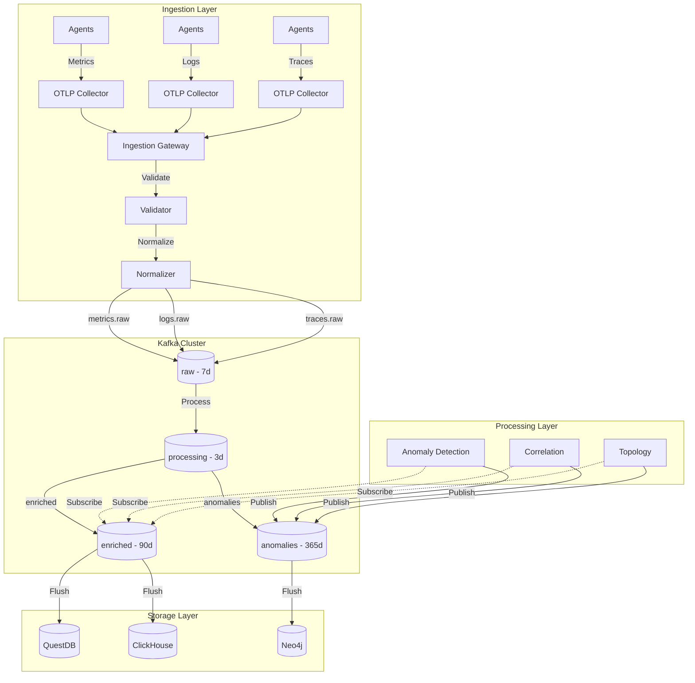

# ADR 0005: Telemetry Pipeline with Kafka

## Metadata

| Field | Value |
|-------|-------|
| **ADR ID** | 0005 |
| **Title** | Telemetry Pipeline Architecture with Kafka |
| **Status** | Proposed |
| **Date** | 2026-01-18 |
| **Authors** | Core Platform Team |
| **Related ADRs** | 0002 (System Architecture), 0004 (Event-Driven), 0010 (Time-Series Storage) |

---

## 1. Status

**Proposed** - Under review

---

## 2. Context

### Problem Statement

RustOps must ingest and process massive telemetry volumes:

| Data Type | Volume | Velocity | Sources |
|-----------|--------|----------|---------|
| **Metrics** | 10M/minute | Bursty | Prometheus, CloudWatch, Datadog, custom |
| **Logs** | 1TB/day | Continuous | Fluentd, Logstash, CloudWatch Logs |
| **Traces** | 100K spans/sec | Bursty | Jaeger, Zipkin, OpenTelemetry |
| **Events** | 50K/sec | Sporadic | Kubernetes, AWS, webhooks |

**Challenges**:
- **Heterogeneous formats**: Protobuf, JSON, plain text, binary
- **Bursty traffic**: Sudden spikes during incidents
- **Backpressure**: Prevent overwhelming downstream services
- **Ordering**: Some events require ordering within a stream
- **Durability**: Zero data loss during failures
- **Replayability**: Reprocess for ML retraining, bug fixes

### Requirements

| Requirement | Target |
|-------------|--------|
| **Throughput** | 10M metrics/minute sustained |
| **Latency** | <50ms p95 from ingestion to processing |
| **Durability** | 99.999% (0.001% data loss) |
| **Backpressure** | Graceful degradation, no crashes |
| **Scalability** | Horizontal scaling to 10x load |
| **Retention** | 7-365 days depending on topic |

---

## 3. Decision

### Architecture: Kafka-Based Streaming Pipeline



### Pipeline Stages

```rust
// 1. Ingestion Gateway
pub struct IngestionGateway {
    receiver: mpsc::Receiver<TelemetryBatch>,
    validator: Arc<Validator>,
    normalizer: Arc<Normalizer>,
    producer: Arc<KafkaProducer>,
    metrics: Arc<Metrics>,
}

impl IngestionGateway {
    pub async fn run(mut self) {
        let mut semaphore = Semaphore::new(MAX_CONCURRENT_BATCHES);

        while let Some(batch) = self.receiver.recv().await {
            let permit = semaphore.acquire().await.unwrap();

            let validator = self.validator.clone();
            let normalizer = self.normalizer.clone();
            let producer = self.producer.clone();
            let metrics = self.metrics.clone();

            tokio::spawn(async move {
                let _permit = permit; // Release on drop

                // Validate
                match validator.validate(&batch).await {
                    Ok(()) => {},
                    Err(e) => {
                        metrics.validation_errors.inc();
                        error!("Validation error: {}", e);
                        return;
                    }
                }

                // Normalize
                let normalized = match normalizer.normalize(batch).await {
                    Ok(n) => n,
                    Err(e) => {
                        metrics.normalization_errors.inc();
                        error!("Normalization error: {}", e);
                        return;
                    }
                };

                // Publish to Kafka
                if let Err(e) = producer.produce(normalized).await {
                    metrics.publish_errors.inc();
                    error!("Publish error: {}", e);
                    // Dead letter queue
                    producer.produce_dlq(normalized, e).await;
                }
            });
        }
    }
}
```

### Kafka Configuration

```toml
# kafka-cluster/config/cluster.toml

[broker]
id = 1
advertised_listeners = "kafka://rustops-kafka:9092"

[log]
retention_hours = 168  # 7 days default
segment_bytes = 1073741824  # 1GB
retention_check_interval_ms = 300000

[topic.metrics-raw]
partitions = 100
replication_factor = 3
min_insync_replicas = 2
retention_ms = 604800000  # 7 days
cleanup_policy = "delete"

[topic.metrics-raw.config]
max_message_bytes = 1048576  # 1MB
compression_type = "lz4"
flush_messages = 10000
flush_ms = 100

[topic.anomalies]
partitions = 50
replication_factor = 3
retention_ms = 31536000000  # 365 days (learn forever)
cleanup_policy = "compact"  # Retention by compaction
```

### Backpressure Implementation

```rust
pub struct BackpressureManager {
    producer_lag: Arc<RwLock<HashMap<TopicPartition, u64>>>,
    thresholds: BackpressureThresholds,
}

pub struct BackpressureThresholds {
    warning: u64,   // 10K messages lag
    critical: u64,  // 100K messages lag
    sampling: f64,  // Sampling rate at critical
}

impl BackpressureManager {
    pub async fn should_throttle(&self, topic: &str) -> ThrottleAction {
        let lag = self.get_current_lag(topic).await;

        match lag {
            l if l < self.thresholds.warning => ThrottleAction::None,
            l if l < self.thresholds.critical => {
                warn!("High consumer lag for {}: {}", topic, l);
                ThrottleAction::Delay(Duration::from_millis(100))
            },
            _ => {
                error!("Critical consumer lag for {}: {}", topic, lag);
                ThrottleAction::Sample(self.thresholds.sampling)
            }
        }
    }
}

pub enum ThrottleAction {
    None,
    Delay(Duration),
    Sample(f64),  // Rate 0.0-1.0
}
```

### Message Schema

```rust
#[derive(Clone, Debug, Serialize, Deserialize)]
pub struct TelemetryEnvelope {
    pub envelope_id: Uuid,
    pub timestamp: DateTime<Utc>,
    pub source: SourceIdentifier,
    pub data_type: DataType,
    pub payload: Payload,

    pub metadata: Metadata,
    pub headers: HashMap<String, String>,
}

#[derive(Clone, Debug, Serialize, Deserialize)]
#[serde(rename_all = "snake_case")]
pub enum Payload {
    Metrics(Vec<Metric>),
    Logs(Vec<LogEntry>),
    Traces(Vec<Span>),
    Events(Vec<Event>),
}

#[derive(Clone, Debug, Serialize, Deserialize)]
pub struct Metadata {
    pub schema_version: String,
    pub content_encoding: String,
    pub content_type: String,

    // Routing
    pub tenant_id: Option<String>,
    pub environment: Environment,
    pub region: Option<String>,

    // Processing
    pub retry_count: u32,
    pub original_ingestion_time: DateTime<Utc>,
}
```

---

## 4. Alternatives Considered

### Alternative 1: Direct Database Writes

**Description**: Write telemetry directly to databases, bypassing streaming

**Pros**:
- Simpler architecture
- Lower latency
- No Kafka management

**Cons**:
- No backpressure - easy to overwhelm databases
- No replay - can't reprocess after ML model updates
- Single point of scaling - DB must handle write load
- No decoupling - changes to storage affect ingestion

**Rejected**: Replay and backpressure are requirements

### Alternative 2: Redis Streams

**Description**: Use Redis Streams instead of Kafka

**Pros**:
- Simpler to operate
- Faster (in-memory)
- Lower latency

**Cons**:
- Limited retention (memory bound)
- Not designed for massive scale
- Less robust replication
- No native compaction

**Rejected**: Doesn't meet 7-365 day retention requirement

### Alternative 3: RabbitMQ

**Description**: Use AMQP message broker

**Pros**:
- Mature and stable
- Good for work queues
- Message acknowledgments

**Cons**:
- Limited replay (once consumed, gone)
- Not designed for streaming analytics
- Limited retention (hours vs days)
- Higher overhead for high throughput

**Rejected**: Need long-term retention for ML retraining

---

## 5. Consequences

### Positive

| Benefit | Impact |
|---------|--------|
| **Throughput** | Kafka handles 10M+ messages/minute per cluster |
| **Durability** | Replication prevents data loss |
| **Replay** | Retained messages enable reprocessing |
| **Backpressure** | Natural flow control via consumer lag |
| **Decoupling** | Producers and consumers evolve independently |
| **Scalability** | Add brokers/partitions horizontally |

### Negative

| Challenge | Mitigation |
|-----------|------------|
| **Complexity** | Kafka is complex to operate | Use Redpanda for simpler ops, comprehensive monitoring |
| **Latency** | Slightly higher than direct writes | Optimize batch sizes, compression |
| **Cost** | Additional infrastructure | Cost justified by reliability and scalability |
| **Learning curve** | Team needs Kafka expertise | Training, start with Redpanda (simpler) |

### Neutral

- **Operational overhead**: Additional service to manage, but enables platform
- **Storage cost**: 7-365 day retention, but necessary for ML and compliance

---

## 6. Implementation

### Phase 1: Infrastructure Setup (Week 1)

```bash
# Deploy Redpanda (Kafka-compatible, easier)
helm install redpanda redpanda/redpanda --namespace rustops --create-namespace

# Configure topics
rpk topic create telemetry.metrics.raw -p 100 --config retention.ms=604800000
rpk topic create telemetry.logs.raw -p 100 --config retention.ms=604800000
rpk topic create processing.enriched -p 100 --config retention.ms=259200000
rpk topic create detection.anomalies -p 50 --config retention.ms=31536000000
```

### Phase 2: Ingestion Gateway (Weeks 2-3)

- OTLP collector integration
- Validation and normalization
- Kafka producer implementation

### Phase 3: Backpressure (Week 4)

- Consumer lag monitoring
- Throttling logic
- Sampling under overload

### Phase 4: Optimization (Weeks 5-6)

- Batch tuning
- Compression (LZ4)
- Partition rebalancing

---

## 7. References

### Technologies
- [Redpanda](https://vectorized.io/redpanda) - Kafka-compatible, simpler operations
- [rdkafka](https://github.com/fede1024/rust-rust-rdkafka) - Rust Kafka client
- [OpenTelemetry Collector](https://opentelemetry.io/docs/collector/) - Telemetry ingestion

### Documentation
- [Kafka Documentation](https://kafka.apache.org/documentation/)
- [Kafka Performance Tuning](https://www.confluent.io/blog/kafka-performance-tuning/)
- [Backpressure in Reactive Systems](https://www.reactivemanifesto.org/)

### Research
- "Large-scale Cluster Management at Google with Borg" - Google 2023
- "Stream Processing at Scale" - Confluent 2024
