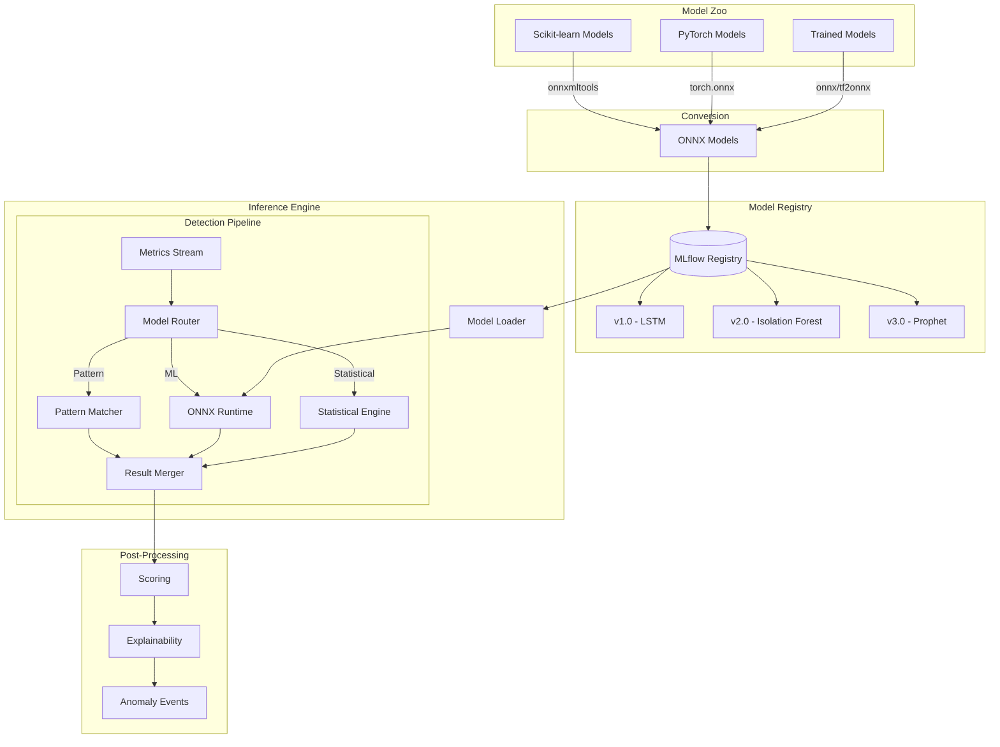

# ADR 0006: Anomaly Detection with ONNX Runtime

## Metadata

| Field | Value |
|-------|-------|
| **ADR ID** | 0006 |
| **Title** | Anomaly Detection Engine with ONNX Runtime |
| **Status** | Proposed |
| **Date** | 2026-01-18 |
| **Authors** | ML Engineering Team |
| **Related ADRs** | 0002 (System Architecture), 0005 (Telemetry Pipeline) |

---

## 1. Status

**Proposed** - Under review

---

## 2. Context

### Problem Statement

RustOps must detect anomalies across multiple telemetry types:

| Detection Type | Data | Algorithm | Latency Requirement |
|----------------|------|-----------|---------------------|
| **Spike Detection** | Metrics | Z-score, IQR | <10ms |
| **Trend Change** | Metrics | CUSUM, Prophet | <50ms |
| **Seasonality** | Metrics | STL Decomposition | <100ms |
| **Log Anomaly** | Logs | Clustering, TF-IDF | <500ms |
| **Pattern Match** | All | LSTM, Autoencoder | <200ms |

**Challenges**:
- **Mixed algorithms**: Statistical (fast) + ML (accurate but slow)
- **Model diversity**: Train in Python, deploy in Rust
- **Model lifecycle**: Training, validation, deployment, retraining
- **Performance**: Must process 10M metrics/minute
- **Explainability**: SREs need to understand why anomaly detected

### Requirements

| Requirement | Target |
|-------------|--------|
| **Latency** | <100ms p95 for detection |
| **Throughput** | 10M metrics/minute |
| **Accuracy** | 90% for known patterns |
| **False Positive Rate** | <15% |
| **Model formats** | TensorFlow, PyTorch, Scikit-learn |
| **Retraining** | Automatic when drift detected |

---

## 3. Decision

### Architecture: ONNX Runtime with Hybrid Approach



### Hybrid Detection Strategy

```rust
pub trait AnomalyDetector: Send + Sync {
    async fn detect(&self, data: &TelemetryBatch) -> Result<Vec<Anomaly>>;
    fn model_type(&self) -> ModelType;
    fn latency(&self) -> Duration;
}

// 1. Fast statistical detectors (rule-based, sub-millisecond)
pub struct StatisticalDetector {
    z_score_threshold: f64,
    iqr_multiplier: f64,
    cusum_threshold: f64,
}

impl AnomalyDetector for StatisticalDetector {
    async fn detect(&self, data: &TelemetryBatch) -> Result<Vec<Anomaly>> {
        let mut anomalies = Vec::new();

        for metric in &data.metrics {
            // Z-score for spike detection
            if let Some(z_score) = self.calculate_z_score(metric) {
                if z_score.abs() > self.z_score_threshold {
                    anomalies.push(Anomaly {
                        metric_name: metric.name.clone(),
                        anomaly_type: AnomalyType::Spike,
                        score: z_score.abs(),
                        confidence: 0.95,
                        explanation: format!("Z-score of {:.2} exceeds threshold", z_score),
                    });
                }
            }

            // IQR for outlier detection
            if self.is_iqr_outlier(metric) {
                anomalies.push(Anomaly {
                    metric_name: metric.name.clone(),
                    anomaly_type: AnomalyType::Outlier,
                    score: 0.8,
                    confidence: 0.85,
                    explanation: "Value outside IQR bounds".to_string(),
                });
            }
        }

        Ok(anomalies)
    }

    fn model_type(&self) -> ModelType { ModelType::Statistical }
    fn latency(&self) -> Duration { Duration::from_micros(100) }
}

// 2. ML-based detectors (accurate but slower)
pub struct MLDetector {
    session: OrtSession,
    model_name: String,
    model_version: String,
    preprocessor: Arc<dyn Preprocessor>,
}

impl AnomalyDetector for MLDetector {
    async fn detect(&self, data: &TelemetryBatch) -> Result<Vec<Anomaly>> {
        // Preprocess
        let features = self.preprocessor.prepare(data)?;

        // Run inference
        let input = OrtInput::new(features)?;
        let outputs: Vec<OrtOutput> = self.session.run(vec![input]).await?;

        // Post-process
        let anomalies = self.postprocess(outputs, data)?;

        Ok(anomalies)
    }

    fn model_type(&self) -> ModelType { ModelType::ML }
    fn latency(&self) -> Duration { Duration::from_millis(50) }
}

// 3. Model router - routes to optimal detector
pub struct ModelRouter {
    detectors: Vec<Box<dyn AnomalyDetector>>,
    routing_rules: Vec<RoutingRule>,
}

impl ModelRouter {
    pub async fn detect(&self, data: &TelemetryBatch) -> Result<Vec<Anomaly>> {
        // Route based on data characteristics
        let detector = self.select_detector(data)?;

        // Detect anomalies
        let anomalies = detector.detect(data).await?;

        Ok(anomalies)
    }

    fn select_detector(&self, data: &TelemetryBatch) -> Result<&dyn AnomalyDetector> {
        // Rules:
        // 1. Use statistical for simple metrics (CPU, memory)
        // 2. Use ML for complex patterns (request latency, error rates)
        // 3. Use pattern matcher for known signatures

        for rule in &self.routing_rules {
            if rule.matches(data) {
                return Ok(&*self.detectors[rule.detector_index]);
            }
        }

        // Default to statistical (fastest)
        Ok(&*self.detectors[0])
    }
}
```

### ONNX Integration

```toml
[dependencies]
ort = "2.0"           # ONNX Runtime
ndarray = "0.15"      # Numerical arrays
ndarray-stats = "0.5" # Statistical functions
```

```rust
use ort::{Environment, SessionBuilder};

pub struct ONNXModelManager {
    env: Environment,
    registry: ModelRegistry,
    sessions: HashMap<String, OrtSession>,
}

impl ONNXModelManager {
    pub async fn load_model(&mut self, spec: &ModelSpec) -> Result<()> {
        // Download from registry
        let model_bytes = self.registry.download_model(spec).await?;

        // Create session
        let session = SessionBuilder::new(&self.env)?
            .with_optimization_level(ort::GraphOptimizationLevel::Level3)?
            .with_intra_threads(4)?
            .with_model_from_memory(&model_bytes)?;

        self.sessions.insert(spec.name.clone(), session);

        Ok(())
    }

    pub async fn run_inference(
        &self,
        model_name: &str,
        inputs: Vec<OrtInput>,
    ) -> Result<Vec<OrtOutput>> {
        let session = self.sessions.get(model_name)
            .ok_or_else(|| Error::ModelNotFound(model_name.to_string()))?;

        let outputs = session.run(inputs).await?;

        Ok(outputs)
    }
}
```

### Model Training Pipeline

```python
# Python training script (train_model.py)
import pandas as pd
from sklearn.ensemble import IsolationForest
import onnx
from skl2onnx import convert_sklearn
from skl2onnx.common.data_types import FloatTensorType

def train_model(training_data_path: str):
    # Load training data
    df = pd.read_parquet(training_data_path)

    # Train model
    model = IsolationForest(
        contamination=0.1,
        n_estimators=100,
        max_samples='auto',
        random_state=42
    )
    model.fit(df)

    # Convert to ONNX
    initial_type = [('float_input', FloatTensorType([None, df.shape[1]]))]
    onnx_model = convert_sklearn(
        model,
        initial_types=initial_type,
        target_opset=12
    )

    # Save ONNX model
    onnx.save(onnx_model, 'isolation_forest.onnx')

    # Register with MLflow
    import mlflow
    mlflow.log_artifact('isolation_forest.onnx')
    mlflow.sklearn.log_model(model, "model")

if __name__ == '__main__':
    train_model('s3://rustops-training-data/metrics/')
```

### Model Lifecycle Management

```rust
pub struct ModelLifecycleManager {
    registry: Arc<MLflowClient>,
    current_models: HashMap<String, ModelVersion>,
    metrics: Arc<TrainingMetrics>,
}

impl ModelLifecycleManager {
    pub async fn check_and_retrain(&self, model_name: &str) -> Result<()> {
        let current = self.current_models.get(model_name).unwrap();

        // Check for drift
        if self.detect_drift(model_name).await? {
            info!("Model drift detected for {}", model_name);

            // Trigger retraining
            self.trigger_retraining(model_name).await?;

            // Validate new model
            let new_version = self.validate_new_model(model_name).await?;

            // Canary deployment
            self.canary_deploy(model_name, new_version).await?;

            // Promote if successful
            if self.canary_successful(model_name, new_version).await? {
                self.promote_model(model_name, new_version).await?;
            }
        }

        Ok(())
    }

    async fn detect_drift(&self, model_name: &str) -> Result<bool> {
        // Compare recent predictions vs actual
        // Calculate population stability index (PSI)
        // Return true if PSI > threshold
        todo!()
    }
}
```

---

## 4. Alternatives Considered

### Alternative 1: Pure Python Inference

**Description**: Run Python models directly via PyO3

**Pros**:
- Direct model execution
- No conversion needed
- Full ecosystem access

**Cons**:
- GIL limits concurrency
- Higher memory overhead
- Slower performance
- Complex deployment (Python in Rust)

**Rejected**: Performance and concurrency requirements

### Alternative 2: TensorFlow C API

**Description**: Use TensorFlow C API directly

**Pros**:
- Official support
- Good performance
- Direct model loading

**Cons**:
- TensorFlow-specific
- Heavy dependencies
- Complex build process
- Limited to TF models

**Rejected**: Need framework-agnostic solution

### Alternative 3: REST API to Python Service

**Description**: Call Python inference service over HTTP

**Pros**:
- Simple integration
- Language isolation
- Easy to update models

**Cons**:
- Network latency
- Scaling complexity
- Additional service to manage
- No sharing of preprocessing

**Rejected**: Latency overhead too high

---

## 5. Consequences

### Positive

| Benefit | Impact |
|---------|--------|
| **Framework agnostic** | Support TF, PyTorch, Scikit-learn |
| **Performance** | Near-native Rust performance |
| **Optimization** | ONNX Runtime optimizes for CPU/GPU |
| **Versioning** | Multiple model versions coexist |
| **Retraining** | Train in Python, deploy in Rust |
| **Interoperability** | Standard model format |

### Negative

| Challenge | Mitigation |
|-----------|------------|
| **Conversion complexity** | Need to convert models to ONNX | Automated CI/CD pipeline |
| **Operator support** | Limited ONNX ops vs native | Custom ops when needed |
| **Debugging** | Harder to debug ONNX model | Extensive logging, validation |
| **Model size** | ONNX models can be large | Model optimization, quantization |

### Neutral

- **Training**: Still done in Python (better ML ecosystem)
- **Deployment**: Models deployed as artifacts alongside Rust binary

---

## 6. Implementation

### Phase 1: ONNX Integration (Week 1)

- Add `ort` crate to dependencies
- Build model loader
- Implement basic inference

### Phase 2: Statistical Detectors (Weeks 2-3)

- Z-score, IQR, CUSUM implementations
- Unit tests for accuracy

### Phase 3: Model Pipeline (Weeks 4-5)

- Training scripts in Python
- ONNX conversion in CI/CD
- Model registry integration

### Phase 4: Production Readiness (Weeks 6-7)

- Model lifecycle management
- Drift detection
- Canary deployment

---

## 7. References

### Technologies
- [ONNX Runtime](https://onnxruntime.ai/) - Cross-platform inference
- [ort](https://github.com/pykeio/ort) - Rust ONNX Runtime bindings
- [MLflow](https://mlflow.org/) - Model lifecycle management

### Documentation
- [ONNX Model Zoo](https://github.com/onnx/models)
- [skl2onnx](https://onnxruntime.ai/docs/) - Scikit-learn to ONNX
- [tf2onnx](https://github.com/onnx/tensorflow-onnx) - TensorFlow to ONNX

### Research
- "Production Machine Learning Systems" - O'Reilly 2024
- "Anomaly Detection: A Survey" - ACM Computing Surveys 2023
