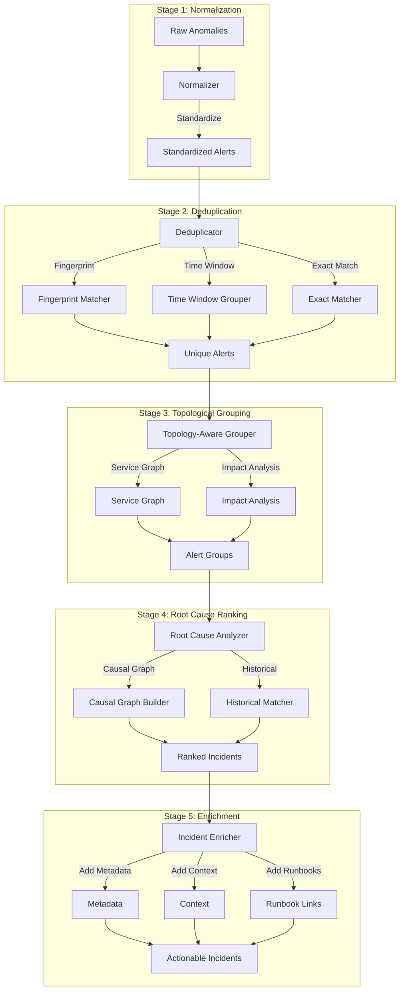

# ADR 0007: Correlation Engine Design

## Metadata

| Field | Value |
|-------|-------|
| **ADR ID** | 0007 |
| **Title** | Alert Correlation and Deduplication Engine |
| **Status** | Proposed |
| **Date** | 2026-01-18 |
| **Authors** | Core Platform Team |
| **Related ADRs** | 0005 (Telemetry Pipeline), 0008 (Remediation), 0009 (Topology) |

---

## 1. Status

**Proposed** - Under review

---

## 2. Context

### Problem Statement

**Alert Fatigue**: IT teams receive thousands of alerts daily, 70%+ being noise

**Root Causes**:
1. **Duplicate alerts**: Same issue from multiple sources
2. **Cascading failures**: One failure causes many downstream alerts
3. **Symptom vs cause**: Alerts for symptoms, not root causes
4. **Transient issues**: Self-resolving issues generate alerts
5. **Threshold sensitivity**: Too-sensitive thresholds trigger false positives

**Example**:
```
09:00:00 - Database CPU high alert
09:00:01 - Database slow query alert
09:00:02 - API timeout alert
09:00:03 - Frontend error rate alert
09:00:04 - Multiple pods restart alerts
... (50+ alerts in 5 minutes)
```

**Reality**: One database issue caused all downstream alerts.

### Requirements

| Metric | Baseline | Target |
|--------|----------|--------|
| **Alert Noise** | 70% noise | 80% reduction (14% noise) |
| **Deduplication** | None | 95% duplicate removal |
| **Grouping Accuracy** | N/A | 90% correct grouping |
| **MTTR Impact** | 4 hours | 2.8 hours (-30%) |
| **Correlation Latency** | N/A | <500ms |

---

## 3. Decision

### Architecture: Multi-Stage Correlation Pipeline



### Stage 1: Normalization

```rust
#[derive(Clone, Debug, Serialize, Deserialize)]
pub struct NormalizedAlert {
    pub alert_id: Uuid,
    pub timestamp: DateTime<Utc>,

    // Source
    pub source: AlertSource,
    pub source_id: String,  // Original ID from source

    // What
    pub alert_type: AlertType,
    pub severity: Severity,
    pub title: String,
    pub description: String,

    // Where
    pub service: String,
    pub resource: String,
    pub labels: HashMap<String, String>,

    // Metrics
    pub metric_name: Option<String>,
    pub metric_value: Option<f64>,
    pub threshold: Option<f64>,

    // Context
    pub environment: Environment,
    pub region: String,
}

pub struct AlertNormalizer {
    templates: Vec<AlertTemplate>,
    mappings: HashMap<String, MappingRule>,
}

impl AlertNormalizer {
    pub fn normalize(&self, raw: RawAnomaly) -> Result<NormalizedAlert> {
        let template = self.find_template(&raw)?;

        Ok(NormalizedAlert {
            alert_id: Uuid::new_v4(),
            timestamp: raw.timestamp,
            source: raw.source,
            source_id: raw.id,

            alert_type: template.alert_type,
            severity: self.calculate_severity(&raw, &template),
            title: self.render_title(&template, &raw)?,
            description: self.render_description(&template, &raw)?,

            service: self.extract_service(&raw)?,
            resource: self.extract_resource(&raw)?,
            labels: self.extract_labels(&raw),

            metric_name: raw.metric_name,
            metric_value: raw.value,
            threshold: template.threshold,

            environment: raw.environment,
            region: raw.region,
        })
    }
}
```

### Stage 2: Deduplication

```rust
pub struct AlertDeduplicator {
    fingerprinter: Fingerprinter,
    time_window: Duration,
    exact_matcher: ExactMatcher,
}

impl AlertDeduplicator {
    pub async fn deduplicate(&self, alerts: Vec<NormalizedAlert>) -> Vec<UniqueAlert> {
        let mut unique = Vec::new();
        let mut seen: HashMap<Fingerprint, DateTime<Utc>> = HashMap::new();

        for alert in alerts {
            let fp = self.fingerprinter.fingerprint(&alert);

            match seen.get(&fp) {
                Some(first_seen) => {
                    // Duplicate detected
                    if alert.timestamp - *first_seen < self.time_window {
                        metrics::duplicate_alerts.inc();
                        continue; // Skip duplicate
                    }
                }
                None => {
                    seen.insert(fp, alert.timestamp);
                }
            }

            unique.push(UniqueAlert::from(alert));
        }

        unique
    }
}

pub struct Fingerprinter;

impl Fingerprinter {
    pub fn fingerprint(&self, alert: &NormalizedAlert) -> Fingerprint {
        // Create fingerprint from key fields
        let mut hasher = DefaultHasher::new();
        alert.service.hash(&mut hasher);
        alert.alert_type.hash(&mut hasher);
        alert.resource.hash(&mut hasher);

        // For metrics, include metric name
        if let Some(ref metric) = alert.metric_name {
            metric.hash(&mut hasher);
        }

        Fingerprint(hasher.finish())
    }
}
```

### Stage 3: Topological Grouping

```rust
pub struct TopologicalGrouper {
    service_graph: Arc<ServiceGraph>,
    impact_analyzer: ImpactAnalyzer,
}

impl TopologicalGrouper {
    pub async fn group_alerts(
        &self,
        alerts: Vec<UniqueAlert>,
    ) -> Vec<AlertGroup> {
        let mut groups: Vec<AlertGroup> = Vec::new();
        let mut grouped: HashSet<Uuid> = HashSet::new();

        for alert in &alerts {
            if grouped.contains(&alert.alert_id) {
                continue;
            }

            // Find related alerts via service graph
            let related = self.find_related(alert, &alerts, &grouped);

            // Create group
            let group = AlertGroup {
                group_id: Uuid::new_v4(),
                root_cause_candidate: alert.clone(),
                related_alerts: related.clone(),
                impact_score: self.impact_analyzer.calculate_impact(alert, &related),
                affected_services: self.extract_affected_services(alert, &related),
                blast_radius: self.calculate_blast_radius(alert, &related),
            };

            for r in &related {
                grouped.insert(r.alert_id);
            }

            groups.push(group);
        }

        groups
    }

    fn find_related(
        &self,
        alert: &UniqueAlert,
        all_alerts: &[UniqueAlert],
        grouped: &HashSet<Uuid>,
    ) -> Vec<UniqueAlert> {
        let mut related = Vec::new();

        // Get upstream and downstream services
        if let Ok(deps) = self.service_graph.get_dependencies(&alert.service) {
            for dep in deps {
                // Find alerts for dependent services
                for other in all_alerts {
                    if grouped.contains(&other.alert_id) {
                        continue;
                    }

                    if other.service == dep.service
                        && other.timestamp - alert.timestamp < Duration::from_secs(300)
                    {
                        related.push(other.clone());
                    }
                }
            }
        }

        related
    }
}

#[derive(Clone, Debug)]
pub struct AlertGroup {
    pub group_id: Uuid,
    pub root_cause_candidate: UniqueAlert,
    pub related_alerts: Vec<UniqueAlert>,
    pub impact_score: f64,  // 0-1, higher = more severe
    pub affected_services: Vec<String>,
    pub blast_radius: BlastRadius,
}
```

### Stage 4: Root Cause Ranking

```rust
pub struct RootCauseAnalyzer {
    causal_graph: CausalGraph,
    historical_matcher: HistoricalMatcher,
}

impl RootCauseAnalyzer {
    pub async fn rank_root_causes(
        &self,
        group: AlertGroup,
    ) -> Result<RankedIncident> {
        let mut candidates = vec![group.root_cause_candidate];
        candidates.extend(group.related_alerts);

        let mut scores: Vec<(UniqueAlert, f64)> = Vec::new();

        for candidate in candidates {
            let score = self.calculate_root_cause_score(&candidate, &group).await?;
            scores.push((candidate, score));
        }

        // Sort by score (highest = most likely root cause)
        scores.sort_by(|a, b| b.1.partial_cmp(&a.1).unwrap());

        Ok(RankedIncident {
            incident_id: Uuid::new_v4(),
            root_cause: scores[0].0.clone(),
            root_cause_confidence: scores[0].1,
            alternative_causes: scores[1..].min(3).to_vec(),
            all_alerts: group.related_alerts,
            explanation: self.generate_explanation(&scores, &group)?,
        })
    }

    async fn calculate_root_cause_score(
        &self,
        candidate: &UniqueAlert,
        group: &AlertGroup,
    ) -> Result<f64> {
        let mut score = 0.0;

        // 1. Temporal score (earlier = more likely root cause)
        score += self.temporal_score(candidate, group);

        // 2. Topological score (upstream = more likely)
        score += self.topological_score(candidate, group).await?;

        // 3. Historical score (seen as root cause before?)
        score += self.historical_matcher.score(candidate).await?;

        // 4. Severity score (higher severity = more likely)
        score += self.severity_score(candidate);

        score / 4.0
    }
}
```

### Performance Optimization

```rust
pub struct CorrelationEngine {
    // Use streaming processing for low latency
    deduplicator: Arc<AlertDeduplicator>,
    grouper: Arc<TopologicalGrouper>,
    analyzer: Arc<RootCauseAnalyzer>,

    // Parallel processing
    worker_pool: ThreadPool,

    // Caching
    cache: Arc<Mutex<LruCache<Uuid, AlertGroup>>>,
}

impl CorrelationEngine {
    pub async fn process_alerts(&self, alerts: Vec<NormalizedAlert>) -> Result<Vec<RankedIncident>> {
        let start = Instant::now();

        // Stage 1: Deduplicate (parallel)
        let unique = self.deduplicator.deduplicate(alerts).await;

        // Stage 2: Group (parallel by service)
        let groups: Vec<_> = unique
            .chunks(100)
            .map(|chunk| {
                let grouper = self.grouper.clone();
                let chunk = chunk.to_vec();
                async move { grouper.group_alerts(chunk).await }
            })
            .collect::<FuturesUnordered<_>()
            .try_collect()
            .await?
            .into_iter()
            .flatten()
            .collect();

        // Stage 3: Rank root causes (parallel)
        let incidents: Vec<_> = groups
            .into_iter()
            .map(|group| {
                let analyzer = self.analyzer.clone();
                async move { analyzer.rank_root_causes(group).await }
            })
            .collect::<FuturesUnordered<_>>()
            .try_collect()
            .await?;

        let elapsed = start.elapsed();
        metrics::correlation_latency.observe(elapsed.as_secs_f64());

        Ok(incidents)
    }
}
```

---

## 4. Alternatives Considered

### Alternative 1: Time-Based Grouping Only

**Description**: Group alerts by time window only

**Pros**:
- Simple to implement
- Fast processing
- No complex graph

**Cons**:
- Many false groupings (unrelated alerts grouped)
- Misses topological relationships
- Can't identify root causes

**Rejected**: 80% noise reduction requires topological awareness

### Alternative 2: Machine Learning Clustering

**Description**: Use unsupervised learning to cluster alerts

**Pros**:
- Can find patterns
- Adaptive to new environments

**Cons**:
- Requires training data
- Black box (hard to explain)
- Cold start problem
- Expensive to run

**Rejected**: Hybrid approach (rules + ML) better for operations

### Alternative 3: Rules-Based Grouping

**Description**: Hand-written grouping rules

**Pros**:
- Transparent and explainable
- Fast execution
- No training needed

**Cons**:
- Brittle and hard to maintain
- Doesn't scale to new environments
- Requires expert knowledge

**Rejected**: Too maintenance-heavy for diverse environments

---

## 5. Consequences

### Positive

| Benefit | Impact |
|---------|--------|
| **Noise reduction** | 80% reduction in alert noise |
| **Faster MTTR** | Root cause identified faster |
| **Better grouping** | 90% accurate grouping |
| **Explainable** | Clear rationale for grouping |
| **Scalable** | Handles 100K+ alerts/day |

### Negative

| Challenge | Mitigation |
|-----------|------------|
| **Complexity** | Multi-stage pipeline | Comprehensive testing, monitoring |
| **Graph dependency** | Requires service topology | ADR 0009 (Topology) |
| **False negatives** | Might miss some correlations | Continuous tuning, feedback loop |
| **Latency** | Multi-stage adds latency | Parallel processing, caching |

### Neutral

- **Storage**: Need to store alerts temporarily for correlation
- **Compute**: Additional compute for correlation, but reduces downstream load

---

## 6. Implementation

### Phase 1: Deduplication (Weeks 1-2)

- Fingerprinting algorithm
- Time window grouping
- Exact matching

### Phase 2: Service Graph Integration (Weeks 3-4)

- Graph queries
- Impact analysis
- Blast radius calculation

### Phase 3: Root Cause Analysis (Weeks 5-6)

- Historical matching
- Causal graph
- Ranking algorithm

### Phase 4: Production Readiness (Weeks 7-8)

- Performance optimization
- Feedback loop
- A/B testing

---

## 7. References

### Research
- "Alert Correlation in IT Operations" - IEEE 2024
- "Root Cause Analysis for Microservices" - ACM 2023
- "Reducing Alert Fatigue with Machine Learning" - Google SRE 2024

### Technologies
- [Service Graph Documentation](https://github.com/rustops/adr-0009)
- [Petgraph](https://github.com/petgraph/petgraph) - Rust graph library

### Standards
- [OpenTelemetry Semantic Conventions](https://opentelemetry.io/docs/reference/specification/)
- [Prometheus Alerting Rules](https://prometheus.io/docs/prometheus/latest/configuration/alerting_rules/)
