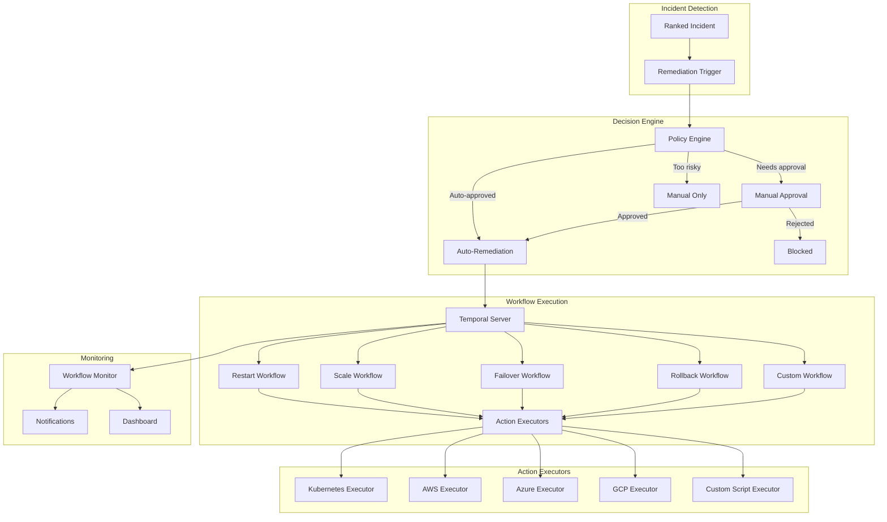

# ADR 0008: Remediation Engine with Temporal

## Metadata

| Field | Value |
|-------|-------|
| **ADR ID** | 0008 |
| **Title** | Remediation Engine with Temporal Workflows |
| **Status** | Proposed |
| **Date** | 2026-01-18 |
| **Authors** | Automation Team |
| **Related ADRs** | 0007 (Correlation), 0009 (Topology) |

---

## 1. Status

**Proposed** - Under review

---

## 2. Context

### Problem Statement

**Manual Remediation is Too Slow**:
- Average incident resolution: 4 hours
- Engineer on-call time: high burnout
- Simple issues (restart service) take 30+ minutes
- Complex issues require coordination across teams

**Automation Challenges**:
- **Idempotency**: Actions must be safe to retry
- **Rollback**: Failed actions must be reversible
- **Approval**: Dangerous actions need human approval
- **Coordination**: Multiple steps across multiple systems
- **Visibility**: Need to see what's happening in real-time
- **Durability**: System crashes shouldn't leave actions half-done

### Requirements

| Requirement | Target |
|-------------|--------|
| **Auto-remediation rate** | 50% of incidents |
| **Success rate** | 95% for automated actions |
| **Latency** | <30s from trigger to action start |
| **Rollback time** | <60s for failed actions |
| **Approval latency** | <5 min for human approval |
| **Visibility** | Real-time status of all workflows |

---

## 3. Decision

### Architecture: Temporal-Based Workflow Orchestration



### Workflow Definitions

```rust
use temporal_sdk::{WfContext, ActivityOptions};

// Restart workflow - simple, common action
pub fn restart_service_workflow(ctx: &mut WfContext, input: RestartInput) -> Result<RestartOutput, Error> {
    // Step 1: Pre-flight checks
    let health = ctx.activity(ActivityOptions {
        activity_type: "check_service_health".to_string(),
        input: input.clone(),
        timeout: Duration::from_secs(30),
        retry_policy: RetryPolicy {
            max_attempts: 3,
            backoff: Duration::from_secs(1),
        },
    }).await?;

    if !health.is_healthy {
        return Ok(RestartOutput {
            success: false,
            reason: "Service already unhealthy, restart may not help".to_string(),
        });
    }

    // Step 2: Take action (with approval if risky)
    if input.requires_approval {
        ctx.activity(ActivityOptions {
            activity_type: "request_approval".to_string(),
            input: ApprovalRequest {
                action: "restart".to_string(),
                service: input.service_name.clone(),
                reason: input.reason.clone(),
            },
            timeout: Duration::from_secs(300), // 5 min for approval
            retry_policy: RetryPolicy::none(),
        }).await?;
    }

    let result = ctx.activity(ActivityOptions {
        activity_type: "restart_service".to_string(),
        input: input.clone(),
        timeout: Duration::from_secs(120),
        retry_policy: RetryPolicy {
            max_attempts: 2,
            backoff: Duration::from_secs(5),
        },
    }).await?;

    // Step 3: Verify action worked
    let post_health = ctx.activity(ActivityOptions {
        activity_type: "check_service_health".to_string(),
        input: input.clone(),
        timeout: Duration::from_secs(30),
        retry_policy: RetryPolicy::default(),
    }).await?;

    if !post_health.is_healthy {
        // Rollback
        ctx.activity(ActivityOptions {
            activity_type: "rollback_restart".to_string(),
            input: RollbackInput {
                original_state: health,
            },
            timeout: Duration::from_secs(60),
            retry_policy: RetryPolicy::default(),
        }).await?;

        return Ok(RestartOutput {
            success: false,
            reason: "Service still unhealthy after restart, rolled back".to_string(),
        });
    }

    // Step 4: Update monitoring
    ctx.activity(ActivityOptions {
        activity_type: "update_incident_status".to_string(),
        input: IncidentUpdate {
            incident_id: input.incident_id,
            status: IncidentStatus::Resolved,
            resolution: "Service restarted successfully".to_string(),
        },
        timeout: Duration::from_secs(10),
        retry_policy: RetryPolicy::default(),
    }).await?;

    Ok(RestartOutput {
        success: true,
        reason: "Service restarted and verified healthy".to_string(),
    })
}

// Scale workflow - more complex, multiple steps
pub fn scale_service_workflow(ctx: &mut WfContext, input: ScaleInput) -> Result<ScaleOutput, Error> {
    let original_replicas = ctx.activity(ActivityOptions {
        activity_type: "get_current_replicas".to_string(),
        input: input.clone(),
        timeout: Duration::from_secs(10),
        retry_policy: RetryPolicy::default(),
    }).await?;

    // Calculate new replica count
    let target_replicas = calculate_target_replicas(&input, &original_replicas);

    // Step 1: Pre-scale checks (capacity, limits)
    ctx.activity(ActivityOptions {
        activity_type: "check_scale_constraints".to_string(),
        input: ScaleCheckInput {
            service: input.service_name.clone(),
            target_replicas,
        },
        timeout: Duration::from_secs(20),
        retry_policy: RetryPolicy::default(),
    }).await?;

    // Step 2: Scale (with gradual rollout for large changes)
    if target_replicas > original_replicas.count * 2 {
        // Gradual scale up
        let steps = (target_replicas / original_replicas.count).max(3);
        for i in 1..=steps {
            let step_replicas = original_replicas.count + (target_replicas - original_replicas.count) * i / steps;

            ctx.activity(ActivityOptions {
                activity_type: "scale_service".to_string(),
                input: ScaleActionInput {
                    service: input.service_name.clone(),
                    replicas: step_replicas,
                },
                timeout: Duration::from_secs(60),
                retry_policy: RetryPolicy::default(),
            }).await?;

            // Wait and verify
            tokio::time::sleep(Duration::from_secs(30)).await;
            ctx.activity(ActivityOptions {
                activity_type: "verify_scale_health".to_string(),
                input: input.clone(),
                timeout: Duration::from_secs(30),
                retry_policy: RetryPolicy::default(),
            }).await?;
        }
    } else {
        // Direct scale
        ctx.activity(ActivityOptions {
            activity_type: "scale_service".to_string(),
            input: ScaleActionInput {
                service: input.service_name.clone(),
                replicas: target_replicas,
            },
            timeout: Duration::from_secs(60),
            retry_policy: RetryPolicy::default(),
        }).await?;
    }

    // Step 3: Monitor for stability period
    ctx.timer(Duration::from_secs(300)).await; // Wait 5 minutes

    let final_health = ctx.activity(ActivityOptions {
        activity_type: "check_service_health".to_string(),
        input: input.clone(),
        timeout: Duration::from_secs(30),
        retry_policy: RetryPolicy::default(),
    }).await?;

    if !final_health.is_healthy {
        // Rollback scale
        ctx.activity(ActivityOptions {
            activity_type: "scale_service".to_string(),
            input: ScaleActionInput {
                service: input.service_name.clone(),
                replicas: original_replicas.count,
            },
            timeout: Duration::from_secs(60),
            retry_policy: RetryPolicy::default(),
        }).await?;

        return Ok(ScaleOutput {
            success: false,
            reason: "Service unhealthy after scaling, rolled back".to_string(),
        });
    }

    Ok(ScaleOutput {
        success: true,
        original_replicas: original_replicas.count,
        new_replicas: target_replicas,
        reason: format!("Scaled from {} to {} replicas", original_replicas.count, target_replicas),
    })
}
```

### Policy Engine

```rust
pub struct RemediationPolicy {
    pub action_type: ActionType,
    pub approval_required: bool,
    pub risk_level: RiskLevel,
    pub constraints: Vec<Constraint>,
    pub rate_limits: RateLimit,
}

pub struct PolicyEngine {
    policies: HashMap<ActionType, RemediationPolicy>,
    approval_client: ApprovalClient,
    risk_analyzer: RiskAnalyzer,
}

impl PolicyEngine {
    pub async fn evaluate_action(
        &self,
        incident: &RankedIncident,
        action: &ProposedAction,
    ) -> PolicyDecision {
        let policy = self.policies.get(&action.action_type)
            .unwrap_or(&RemediationPolicy::default());

        // Check risk level
        let risk = self.risk_analyzer.assess_risk(incident, action).await?;

        // High-risk actions always need approval
        if risk > policy.risk_level.max_threshold() {
            return PolicyDecision::ManualApproval {
                reason: format!("High risk action: {}", risk),
                timeout: Duration::from_secs(300),
            };
        }

        // Check constraints
        for constraint in &policy.constraints {
            if !constraint.check(incident, action).await {
                return PolicyDecision::Blocked {
                    reason: constraint.reason(),
                };
            }
        }

        // Check rate limits
        if !policy.rate_limits.check(&action.action_type) {
            return PolicyDecision::Throttled {
                reason: "Rate limit exceeded".to_string(),
                retry_after: Duration::from_secs(60),
            };
        }

        // Auto-approve if safe
        if !policy.approval_required {
            return PolicyDecision::AutoApprove;
        }

        // Request approval
        PolicyDecision::ManualApproval {
            reason: "Policy requires approval".to_string(),
            timeout: Duration::from_secs(300),
        }
    }
}

pub enum PolicyDecision {
    AutoApprove,
    ManualApproval { reason: String, timeout: Duration },
    Blocked { reason: String },
    Throttled { reason: String, retry_after: Duration },
}
```

### Activity Implementations

```rust
pub struct KubernetesActivities {
    client: kube::Client,
}

impl KubernetesActivities {
    pub async fn restart_service(&self, input: RestartInput) -> Result<RestartResult, Error> {
        let pods: Api<Pod> = Api::namespaced(
            self.client.clone(),
            &input.namespace,
        );

        // Get pods for the service
        let pod_list = pods.list(&ListParams::default()).await?;

        // Restart each pod (delete and let deployment recreate)
        for pod in pod_list.items {
            if let Some(ref owner) = pod.metadata.owner_references {
                if owner.iter().any(|o| o.kind == "ReplicaSet") {
                    continue; // Let deployment handle it
                }
            }

            pods.delete(&pod.name(), &DeleteParams::default()).await?;
        }

        Ok(RestartResult { restarted: true })
    }

    pub async fn scale_service(&self, input: ScaleActionInput) -> Result<ScaleResult, Error> {
        let deployments: Api<Deployment> = Api::namespaced(
            self.client.clone(),
            &input.namespace,
        );

        let mut deployment = deployments.get(&input.service_name).await?;

        deployment.spec.as_mut()
            .unwrap()
            .replicas = Some(input.replicas as i32);

        deployments.patch(&input.service_name, &PatchParams::apply(""), &Patch::Strategic(deployment)).await?;

        Ok(ScaleResult { scaled: true })
    }
}

pub struct AwsActivities {
    ec2_client: Ec2Client,
    rds_client: RdsClient,
}

impl AwsActivities {
    pub async fn reboot_instance(&self, input: RebootInput) -> Result<RebootResult, Error> {
        self.ec2_client.reboot_instances(RebootInstancesRequest {
            instance_ids: vec![input.instance_id],
            ..Default::default()
        }).await?;

        Ok(RebootResult { rebooted: true })
    }

    pub async fn failover_database(&self, input: FailoverInput) -> Result<FailoverResult, Error> {
        self.rds_client.failover_db_instance(FailoverDBInstanceRequest {
            db_instance_identifier: input.instance_id,
            ..Default::default()
        }).await?;

        Ok(FailoverResult { failed_over: true })
    }
}
```

### Error Handling and Rollback

```rust
pub struct WorkflowErrorHandler {
    rollback_manager: RollbackManager,
    incident_updater: IncidentUpdater,
}

impl WorkflowErrorHandler {
    pub async fn handle_workflow_failure(
        &self,
        workflow_id: &str,
        error: &Error,
        context: &WorkflowContext,
    ) -> Result<HandledError, Error> {
        error!("Workflow {} failed: {}", workflow_id, error);

        // Execute rollback if available
        if let Some(rollback) = context.rollback_plan {
            match self.rollback_manager.execute(rollback).await {
                Ok(_) => {
                    info!("Rollback successful for workflow {}", workflow_id);
                }
                Err(e) => {
                    error!("Rollback failed for workflow {}: {}", workflow_id, e);
                    // Escalate for manual intervention
                }
            }
        }

        // Update incident status
        self.incident_updater.update(IncidentUpdate {
            incident_id: context.incident_id,
            status: IncidentStatus::Escalated,
            notes: format!("Automated remediation failed: {}", error),
        }).await?;

        // Notify on-call
        self.notify_on_call(Notification {
            severity: Severity::Critical,
            message: format!("Automated remediation failed for incident {}: {}", context.incident_id, error),
            workflow_id: workflow_id.to_string(),
        }).await?;

        Ok(HandledError {
            rolled_back: true,
            escalated: true,
            notified: true,
        })
    }
}
```

---

## 4. Alternatives Considered

### Alternative 1: Custom State Machine

**Description**: Build custom workflow orchestration

**Pros**:
- Full control
- No external dependency

**Cons**:
- Reinventing the wheel
- Durability hard to get right
- Must implement retries, timeouts, visibility
- Time to build: 6+ months

**Rejected**: Temporal provides battle-tested durability

### Alternative 2: Kubernetes Jobs/CronJobs

**Description**: Use Kubernetes for workflow execution

**Pros**:
- Native to K8s
- Simple for basic tasks

**Cons**:
- No durable execution (pod crash = lost progress)
- Limited workflow capabilities
- No built-in approval
- Hard to coordinate multi-step workflows

**Rejected**: Doesn't meet durability requirement

### Alternative 3: AWS Step Functions

**Description**: Use AWS Step Functions for orchestration

**Pros**:
- Managed service
- Good visualization

**Cons**:
- AWS-specific
- Limited to AWS region
- Vendor lock-in
- Less flexible than Temporal

**Rejected**: Need multi-cloud support

---

## 5. Consequences

### Positive

| Benefit | Impact |
|---------|--------|
| **Durable execution** | Survives crashes and restarts |
| **Visibility** | Real-time workflow progress |
| **Retries** | Automatic retry with backoff |
| **Approval** | Built-in human-in-the-loop |
| **Rollback** | Easy rollback of failed actions |
| **Multi-cloud** | Works across all clouds |

### Negative

| Challenge | Mitigation |
|-----------|------------|
| **Temporal complexity** | Learning curve | Training, start simple |
| **Operational overhead** | Another service to run | Managed Temporal Cloud option |
| **Testing complexity** | Harder to test workflows | Comprehensive test framework |

### Neutral

- **Development speed**: Slower initially, but faster long-term
- **Debugging**: Easier with Temporal UI

---

## 6. Implementation

### Phase 1: Temporal Setup (Week 1)

- Deploy Temporal server
- Configure namespaces
- Build Rust SDK integration

### Phase 2: Basic Workflows (Weeks 2-3)

- Restart workflow
- Scale workflow
- Kubernetes activities

### Phase 3: Policy Engine (Weeks 4-5)

- Risk assessment
- Approval workflow
- Constraint checking

### Phase 4: Advanced Workflows (Weeks 6-7)

- Failover workflows
- Rollback workflows
- Custom workflows

### Phase 5: Production (Weeks 8-10)

- Monitoring and alerting
- Runbook integration
- Gradual rollout

---

## 7. References

### Technologies
- [Temporal](https://temporal.io/) - Workflow orchestration
- [Temporal Rust SDK](https://github.com/temporalio/sdk-core) - Rust client
- [Kubernetes Client](https://github.com/clux/kube-rs) - Rust K8s client

### Documentation
- [Temporal Documentation](https://docs.temporal.io/)
- [Temporal Best Practices](https://docs.temporal.io/best-practices/)

### Research
- "Workflow Orchestration at Scale" - Temporal 2024
- "Automation in SRE" - Google SRE Book
