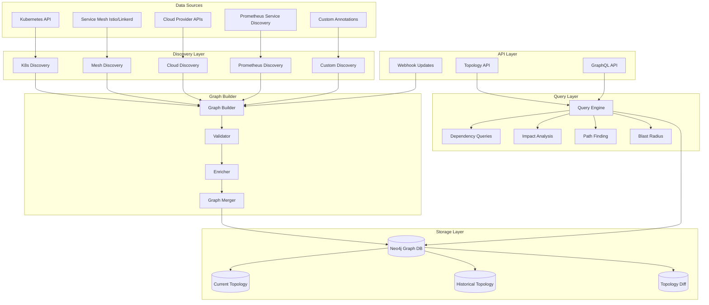

# ADR 0009: Service Topology with Graph Database

## Metadata

| Field | Value |
|-------|-------|
| **ADR ID** | 0009 |
| **Title** | Service Topology Discovery with Graph Database |
| **Status** | Proposed |
| **Date** | 2026-01-18 |
| **Authors** | Platform Team |
| **Related ADRs** | 0007 (Correlation), 0008 (Remediation) |

---

## 1. Status

**Proposed** - Under review

---

## 2. Context

### Problem Statement

**Modern microservices are complex**:
- 100s of services with thousands of dependencies
- Dynamic topology (services scale up/down, new deployments)
- Multiple layers (frontend → backend → database → cache)
- Multi-region, multi-cloud deployments

**Impact without topology**:
- Can't identify blast radius of incidents
- Don't know upstream/downstream dependencies
- Can't prioritize incident response
- Blind to cascade failures
- Difficult change impact analysis

**Example**:
```
Frontend → API Gateway → Service A → Database
                ↓
              Service B → Cache
                ↓
              Service C → External API
```

If Database fails, we need to know:
- All upstream services affected (Frontend, API Gateway, Service A, Service B, Service C)
- Priority (Frontend > API Gateway > others)
- Workarounds (Cache might still work)

### Requirements

| Requirement | Target |
|-------------|--------|
| **Discovery latency** | <30s for new services |
| **Topology freshness** | <5 min stale |
| **Query latency** | <100ms for dependency queries |
| **Graph size** | Support 100K+ nodes, 1M+ edges |
| **Update rate** | 1000+ updates/second |
| **Retention** | 90 days of topology history |

---

## 3. Decision

### Architecture: Neo4j Graph Database with Real-Time Discovery



### Graph Schema

```cypher
// Node Types
(:Service {
    id: "service-123",
    name: "api-gateway",
    namespace: "production",
    environment: "us-west-2",
    type: "deployment" | "statefulset" | "daemonset" | "external",
    health: "healthy" | "degraded" | "unhealthy",
    created_at: datetime(),
    updated_at: datetime()
})

(:Workload {
    id: "pod-abc",
    name: "api-gateway-7d9f8b-x",
    service_id: "service-123",
    node: "ip-10-0-1-123",
    phase: "Running" | "Pending" | "Failed",
    cpu_limit: "2",
    memory_limit: "4Gi"
})

(:Database {
    id: "db-postgres-1",
    name: "users-db",
    type: "PostgreSQL" | "MySQL" | "Redis" | "MongoDB",
    version: "14.5",
    connection_string: "postgres://...",
    region: "us-west-2"
})

(:Cache {
    id: "cache-redis-1",
    name: "api-cache",
    type: "Redis" | "Memcached",
    size: "1GB"
})

(:ExternalService {
    id: "ext-stripe-1",
    name: "Stripe API",
    url: "https://api.stripe.com",
    criticality: "high"
})

// Edge Types (Relationships)
-[:CALLS {
    protocol: "HTTP" | "gRPC" | "TCP",
    port: 8080,
    rate: 1000, // requests per minute
    error_rate: 0.01,
    p95_latency_ms: 50
}]->

-[:READS {
    access_pattern: "read-heavy" | "write-heavy" | "balanced",
    query_rate: 500
}]->

-[:WRITES]->

-[:DEPLOYS_TO {
    replicas: 3,
    resource_limits: {...}
}]->

-[:HOSTS_ON {
    node_name: "ip-10-0-1-123",
    availability_zone: "us-west-2a"
}]->

-[:FAILS_OVER {
    region: "us-east-1",
    enabled: true
}]->

// Example Graph
(service:api-gateway)-[:CALLS]->(service:users)
(service:api-gateway)-[:CALLS]->(service:orders)
(service:users)-[:READS]->(database:users-db)
(service:users)-[:WRITES]->(cache:user-cache)
(service:orders)-[:CALLS]->(external:stripe)
```

### Discovery Implementations

```rust
// Kubernetes discovery
pub struct KubernetesDiscovery {
    client: kube::Client,
    namespace: Option<String>,
}

impl KubernetesDiscovery {
    pub async fn discover_services(&self) -> Result<Vec<ServiceNode>> {
        let deployments: Api<Deployment> = match &self.namespace {
            Some(ns) => Api::namespaced(self.client.clone(), ns),
            None => Api::all(self.client.clone()),
        };

        let dp_list = deployments.list(&ListParams::default()).await?;

        let mut services = Vec::new();

        for dp in dp_list.items {
            let service = ServiceNode {
                id: format!("{}-{}", dp.metadata.namespace.unwrap_or_default(), dp.metadata.name.unwrap_or_default()),
                name: dp.metadata.name.unwrap_or_default(),
                namespace: dp.metadata.namespace.unwrap_or_default(),
                service_type: ServiceType::Deployment,
                replicas: dp.spec.and_then(|s| s.replicas).unwrap_or(0),
                labels: dp.metadata.labels.unwrap_or_default(),
                annotations: dp.metadata.annotations.unwrap_or_default(),
            };

            services.push(service);
        }

        Ok(services)
    }

    pub async fn discover_dependencies(&self) -> Result<Vec<DependencyEdge>> {
        // Discover dependencies from:
        // 1. Service mesh (Istio/Linkerd)
        // 2. Network policies
        // 3. Environment variables
        // 4. ConfigMaps and secrets

        let mut edges = Vec::new();

        // From ServiceMesh
        if let Ok(mesh_edges) = self.discover_from_mesh().await {
            edges.extend(mesh_edges);
        }

        // From NetworkPolicies
        if let Ok(np_edges) = self.discover_from_network_policies().await {
            edges.extend(np_edges);
        }

        Ok(edges)
    }
}

// Service mesh discovery (Istio)
pub struct IstioDiscovery {
    client: kube::Client,
}

impl IstioDiscovery {
    pub async fn discover_mesh_topology(&self) -> Result<MeshTopology> {
        // Query Istio VirtualServices
        let virtualservices: Api<VirtualService> = Api::all(self.client.clone());
        let vs_list = virtualservices.list(&ListParams::default()).await?;

        let mut calls = Vec::new();

        for vs in vs_list.items {
            for http in vs.spec.http.unwrap_or_default() {
                for route in http.route.unwrap_or_default() {
                    calls.push(DependencyEdge {
                        from: vs.metadata.namespace.unwrap_or_default(),
                        to: route.destination.host.unwrap_or_default(),
                        edge_type: EdgeType::Calls,
                        metadata: {
                            protocol: "HTTP".to_string(),
                            port: route.destination.port.unwrap_or_default().number,
                        },
                    });
                }
            }
        }

        Ok(MeshTopology { calls })
    }
}

// Prometheus discovery
pub struct PrometheusDiscovery {
    client: reqwest::Client,
    url: String,
}

impl PrometheusDiscovery {
    pub async fn discover_from_metrics(&self) -> Result<Vec<DependencyEdge>> {
        // Query service graph from Prometheus
        let query = r#"
            sum(rate(http_requests_total[5m])) by (source_service, destination_service)
        "#;

        let response = self.client
            .post(format!("{}/api/v1/query", self.url))
            .json(&json!({"query": query}))
            .send()
            .await?
            .json::<PrometheusResponse>()
            .await?;

        let mut edges = Vec::new();

        for result in response.data.result {
            if let (Some(source), Some(dest)) = (
                result.metric.get("source_service"),
                result.metric.get("destination_service"),
            ) {
                edges.push(DependencyEdge {
                    from: source.clone(),
                    to: dest.clone(),
                    edge_type: EdgeType::Calls,
                    metadata: {
                        rate: result.value.get(1).and_then(|v| v.as_f64()).unwrap_or(0.0),
                    },
                });
            }
        }

        Ok(edges)
    }
}
```

### Graph Queries

```cypher
// 1. Find all upstream dependencies of a service
MATCH path = (upstream:Service)-[:CALLS*]->(service:Service {name: "api-gateway"})
RETURN upstream.name AS upstream_service, length(path) AS hops
ORDER BY hops

// 2. Find all downstream dependencies
MATCH path = (service:Service {name: "api-gateway"})-[:CALLS*]->(downstream:Service)
RETURN downstream.name AS downstream_service, length(path) AS hops
ORDER BY hops

// 3. Calculate blast radius
MATCH (service:Service {name: "database"})
MATCH (affected:Service)-[:CALLS*1..3]->(service)
RETURN count(DISTINCT affected) AS blast_radius

// 4. Find critical path (most traffic)
MATCH path = (s1:Service)-[:CALLS]->(s2:Service)
WHERE s1.name = "frontend"
WITH s1, s2, sum(s1.rate) AS total_traffic
RETURN s1.name AS from_service, s2.name AS to_service, total_traffic
ORDER BY total_traffic DESC
LIMIT 10

// 5. Find single points of failure
MATCH (service:Service)
WHERE NOT (service)-[:FAILS_OVER]->()
WITH service, count{ (other)-[:CALLS]->(service) } AS dependent_services
WHERE dependent_services > 5
RETURN service.name AS spof, dependent_services
ORDER BY dependent_services DESC

// 6. Impact analysis for a change
MATCH (changed:Service {name: "users-api"})
MATCH (affected)-[:CALLS*1..5]->(changed)
RETURN DISTINCT affected.name AS potentially_affected

// 7. Find circular dependencies
MATCH path = (s1:Service)-[:CALLS+]->(s1)
WHERE s1 IN [n IN nodes(path) WHERE n:Service]
RETURN [n IN nodes(path) | n.name] AS cycle
```

### Real-Time Updates

```rust
pub struct TopologyUpdater {
    neo4j: Neo4jClient,
    discovery: Vec<Box<dyn Discovery>>,
    update_interval: Duration,
}

impl TopologyUpdater {
    pub async fn run(&self) {
        let mut interval = tokio::time::interval(self.update_interval);

        loop {
            interval.tick().await;

            // Discover current topology
            let mut current_nodes = Vec::new();
            let mut current_edges = Vec::new();

            for discovery in &self.discovery {
                let (nodes, edges) = discovery.discover().await?;
                current_nodes.extend(nodes);
                current_edges.extend(edges);
            }

            // Calculate diff
            let diff = self.calculate_diff(&current_nodes, &current_edges).await?;

            // Apply updates
            self.apply_updates(diff).await?;

            // Emit topology change events
            self.emit_change_events(diff).await?;
        }
    }

    async fn calculate_diff(
        &self,
        current_nodes: &[ServiceNode],
        current_edges: &[DependencyEdge],
    ) -> Result<TopologyDiff> {
        // Query current state from Neo4j
        let existing_nodes = self.neo4j.query(
            "MATCH (s:Service) RETURN s.id AS id"
        ).await?;

        let existing_edges = self.neo4j.query(
            "MATCH (s1:Service)-[r:CALLS]->(s2:Service) RETURN s1.id, s2.id"
        ).await?;

        // Calculate diffs
        let added_nodes: Vec<_> = current_nodes
            .iter()
            .filter(|n| !existing_nodes.contains(&n.id))
            .cloned()
            .collect();

        let removed_nodes: Vec<_> = existing_nodes
            .iter()
            .filter(|id| !current_nodes.iter().any(|n| &n.id == id))
            .cloned()
            .collect();

        // ... similar for edges

        Ok(TopologyDiff {
            added_nodes,
            removed_nodes,
            added_edges,
            removed_edges,
        })
    }

    async fn apply_updates(&self, diff: TopologyDiff) -> Result<()> {
        // Use Neo4j transactions for atomic updates
        let mut tx = self.neo4j.begin_transaction().await?;

        for node in diff.added_nodes {
            tx.run(format!(
                "CREATE (s:Service $props)",
                props = node.to_map()
            )).await?;
        }

        for edge in diff.added_edges {
            tx.run(format!(
                "MATCH (s1:Service {{id: $from}}), (s2:Service {{id: $to}})
                 CREATE (s1)-[:CALLS $props]->(s2)",
                from = edge.from,
                to = edge.to,
                props = edge.metadata
            )).await?;
        }

        tx.commit().await?;

        Ok(())
    }
}
```

---

## 4. Alternatives Considered

### Alternative 1: Relational Database

**Description**: Store topology in PostgreSQL/MySQL

**Pros**:
- Familiar technology
- Good for simple queries

**Cons**:
- Recursive queries (CTEs) are slow
- No native graph algorithms
- Complex JOINs for simple graph queries
- Harder to model relationships

**Rejected**: Performance degrades with deep hierarchies

### Alternative 2: In-Memory Graph

**Description**: Use in-memory graph library (petgraph)

**Pros**:
- Very fast queries
- No external dependency
- Simple

**Cons**:
- Limited by memory
- No persistence
- Must rebuild on restart
- Hard to share across instances

**Rejected**: Need persistence and sharing across services

### Alternative 3: Time-Series Database

**Description**: Store topology in QuestDB/VictoriaMetrics

**Pros**:
- Already have TSDB
- Good for time-based queries

**Cons**:
- Not designed for relationships
- No graph algorithms
- Hard to model topology

**Rejected**: Relationships are core to topology

---

## 5. Consequences

### Positive

| Benefit | Impact |
|---------|--------|
| **Fast queries** | Native graph algorithms |
| **Flexible** | Easy to model complex relationships |
| **Scalable** | Handles 100K+ nodes |
| **Visualizable** | Built-in visualization (Neo4j Bloom) |
| **Expressive** | Cypher query language |

### Negative

| Challenge | Mitigation |
|-----------|------------|
| **New technology** | Team needs to learn Neo4j/Cypher | Training, documentation |
| **Operational overhead** | Another service to manage | Managed Neo4j Aura option |
| **Cost** | Additional infrastructure | Justified by value |
| **Complexity** | More moving parts | Comprehensive monitoring |

### Neutral

- **Storage**: Graph databases can be larger than relational
- **Consistency**: Eventual consistency for topology updates

---

## 6. Implementation

### Phase 1: Graph Schema Design (Week 1)

- Define node and edge types
- Create indexes
- Design constraints

### Phase 2: Kubernetes Discovery (Weeks 2-3)

- Service discovery
- Pod discovery
- Deployment discovery

### Phase 3: Service Mesh Integration (Weeks 4-5)

- Istio discovery
- Dependency extraction
- Traffic metrics

### Phase 4: Query Layer (Weeks 6-7)

- Dependency queries
- Impact analysis
- Blast radius calculation

### Phase 5: Production (Weeks 8-10)

- Real-time updates
- Historical topology
- API layer

---

## 7. References

### Technologies
- [Neo4j](https://neo4j.com/) - Graph database
- [neo4rs](https://github.com/wolf4ood/neo4rs) - Rust Neo4j client
- [Istio](https://istio.io/) - Service mesh

### Documentation
- [Neo4j Cypher Manual](https://neo4j.com/docs/cypher-manual/)
- [Graph Algorithms](https://neo4j.com/docs/graph-algorithms/current/)

### Research
- "Graph Databases for Microservices" - ACM 2023
- "Service Topology Discovery" - IEEE 2024
