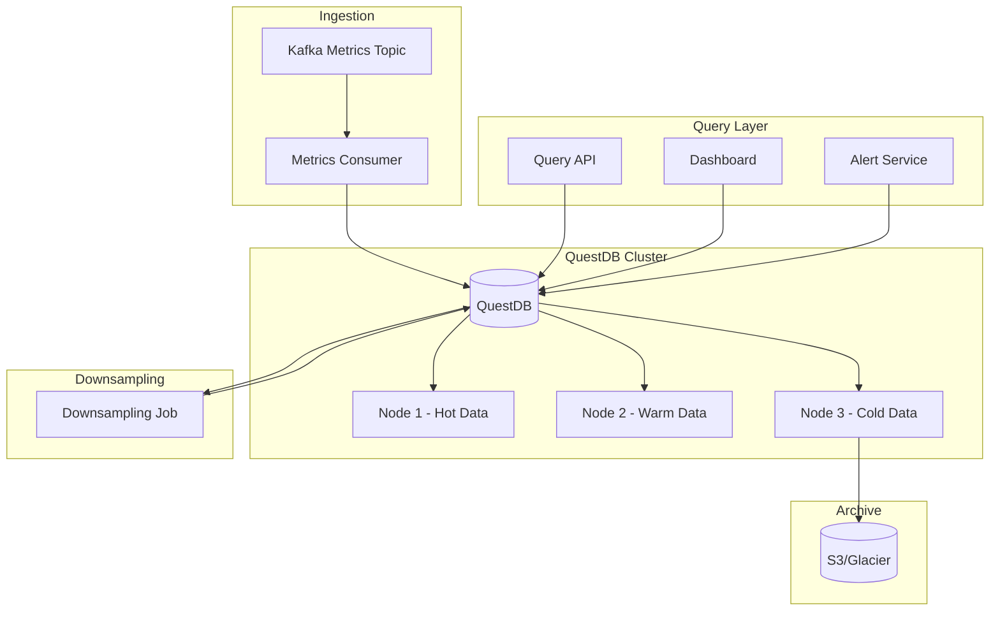

# ADR 0010: Time-Series Data Storage Strategy

## Metadata

| Field | Value |
|-------|-------|
| **ADR ID** | 0010 |
| **Title** | Time-Series Data Storage: QuestDB vs VictoriaMetrics |
| **Status** | Proposed |
| **Date** | 2026-01-18 |
| **Authors** | Data Engineering Team |
| **Related ADRs** | 0005 (Telemetry Pipeline), 0011 (Log Storage) |

---

## 1. Status

**Proposed** - Under review

---

## 2. Context

### Problem Statement

RustOps must store massive volumes of time-series metrics:

| Metric | Requirement |
|--------|-------------|
| **Ingestion rate** | 10M metrics/minute |
| **Retention** | 90 days full resolution |
| **Query latency** | <200ms p95 |
| **Compression** | >90% (reduce storage costs) |
| **SQL support** | Required for complex analytics |
| **High availability** | 99.99% uptime |

**Time-series data characteristics**:
- High write throughput, lower read throughput
- Append-only (no updates to past data)
- Time-based queries (ranges, aggregations)
- Downsampling (reduce resolution over time)

### Requirements

| Requirement | Target |
|-------------|--------|
| **Write throughput** | 10M metrics/minute |
| **Query performance** | <200ms p95 |
| **Compression ratio** | >90% |
| **SQL support** | Full SQL for analytics |
| **Operational simplicity** | Minimal maintenance |

---

## 3. Decision

### Selection: QuestDB for Primary Time-Series Storage



### QuestDB Configuration

```sql
-- Create table for high-frequency metrics
CREATE TABLE metrics_high_freq (
    timestamp TIMESTAMP,
    metric_name SYMBOL,
    labels VARCHAR,  -- JSON-encoded labels
    value DOUBLE,
    labels_hash LONG
) timestamp (timestamp) PARTITION BY DAY;

-- Create index for fast label-based queries
CREATE INDEX idx_labels_hash ON metrics_high_freq(labels_hash);

-- Create table for downsampled metrics (5-minute averages)
CREATE TABLE metrics_5m (
    timestamp TIMESTAMP,
    metric_name SYMBOL,
    labels VARCHAR,
    avg_value DOUBLE,
    min_value DOUBLE,
    max_value DOUBLE,
    count_value LONG
) timestamp (timestamp) PARTITION BY DAY;

-- Downsample job (run via scheduled task)
INSERT INTO metrics_5m
SELECT
    timestamp - (timestamp % 300000) AS timestamp,  -- Round to 5 minutes
    metric_name,
    labels,
    avg(value) AS avg_value,
    min(value) AS min_value,
    max(value) AS max_value,
    count(value) AS count_value
FROM metrics_high_freq
WHERE timestamp > now() - 300000
SAMPLE BY 5m;
```

### Rust Integration

```toml
[dependencies]
questdb = "2.0"  # QuestDB Rust client
tokio = { version = "1.0", features = ["full"] }
```

```rust
use questdb::{IngressBuilder, Result};

pub struct QuestDBWriter {
    sender: Sender<MetricBatch>,
    buffer: Vec<Metric>,
    buffer_size: usize,
    flush_interval: Duration,
}

impl QuestDBWriter {
    pub async fn write_metrics(&mut self, metrics: Vec<Metric>) -> Result<()> {
        self.buffer.extend(metrics);

        if self.buffer.len() >= self.buffer_size {
            self.flush().await?;
        }

        Ok(())
    }

    pub async fn flush(&mut self) -> Result<()> {
        if self.buffer.is_empty() {
            return Ok(());
        }

        let mut ingress = IngressBuilder::new()
            .await?
            .table("metrics_high_freq")
            .timestamp_nanos_column("timestamp")
            .symbol_column("metric_name")
            .string_column("labels")
            .double_column("value")
            .long_column("labels_hash")
            .build()?;

        for metric in &self.buffer {
            ingress
                .timestamp_nanos(metric.timestamp.timestamp_nanos_opt().unwrap())?
                .symbol(&metric.name)?
                .string(&metric.labels_json)?
                .double(metric.value)?
                .long(metric.labels_hash)?
                .submit()?;
        }

        ingress.flush().await?;
        self.buffer.clear();

        Ok(())
    }
}

pub struct QuestDBReader {
    client: QuestDBClient,
}

impl QuestDBReader {
    pub async fn query_range(
        &self,
        metric_name: &str,
        start: DateTime<Utc>,
        end: DateTime<Utc>,
        step: Duration,
    ) -> Result<Vec<DataPoint>> {
        let query = format!(
            r#"
            SELECT timestamp, value
            FROM metrics_high_freq
            WHERE metric_name = '{}'
              AND timestamp BETWEEN '{}' AND '{}'
            SAMPLE BY {}s
            "#,
            metric_name,
            start.to_rfc3339(),
            end.to_rfc3339(),
            step.as_secs()
        );

        let result = self.client.query(&query).await?;

        // Parse result into DataPoints
        todo!()
    }

    pub async fn query_aggregated(
        &self,
        metric_name: &str,
        aggregation: Aggregation,
        start: DateTime<Utc>,
        end: DateTime<Utc>,
    ) -> Result<f64> {
        let agg_fn = match aggregation {
            Aggregation::Avg => "avg",
            Aggregation::Min => "min",
            Aggregation::Max => "max",
            Aggregation::Sum => "sum",
        };

        let query = format!(
            r#"
            SELECT {}(value)
            FROM metrics_high_freq
            WHERE metric_name = '{}'
              AND timestamp BETWEEN '{}' AND '{}'
            "#,
            agg_fn, metric_name, start.to_rfc3339(), end.to_rfc3339()
        );

        let result = self.client.query(&query).await?;
        // Parse result
        todo!()
    }
}
```

### Downsampling Strategy

```rust
pub struct DownsamplingScheduler {
    questdb: Arc<QuestDBClient>,
    schedules: Vec<DownsampleSchedule>,
}

pub struct DownsampleSchedule {
    pub source_table: String,
    pub target_table: String,
    pub interval: Duration,
    pub retention: Duration,
}

impl DownsamplingScheduler {
    pub async fn run(&self) {
        for schedule in &self.schedules {
            let query = self.build_downsample_query(schedule);

            if let Err(e) = self.questdb.execute(&query).await {
                error!("Downsampling failed for {}: {}", schedule.source_table, e);
            }
        }
    }

    fn build_downsample_query(&self, schedule: &DownsampleSchedule) -> String {
        format!(
            r#"
            INSERT INTO {}
            SELECT
                timestamp - (timestamp % {}) AS timestamp,
                metric_name,
                labels,
                avg(value) AS avg_value,
                min(value) AS min_value,
                max(value) AS max_value,
                count(value) AS count_value
            FROM {}
            WHERE timestamp > now() - {}
            SAMPLE BY {}s
            "#,
            schedule.target_table,
            schedule.interval.as_millis(),
            schedule.source_table,
            schedule.retention.as_millis(),
            schedule.interval.as_secs()
        )
    }
}

// Downsampling schedule
const SCHEDULES: &[DownsampleSchedule] = &[
    DownsampleSchedule {
        source_table: "metrics_high_freq",
        target_table: "metrics_1m",
        interval: Duration::from_secs(60),
        retention: Duration::from_days(7),
    },
    DownsampleSchedule {
        source_table: "metrics_1m",
        target_table: "metrics_5m",
        interval: Duration::from_secs(300),
        retention: Duration::from_days(30),
    },
    DownsampleSchedule {
        source_table: "metrics_5m",
        target_table: "metrics_1h",
        interval: Duration::from_secs(3600),
        retention: Duration::from_days(90),
    },
];
```

---

## 4. Alternatives Considered

### Alternative 1: VictoriaMetrics

**Description**: Use VictoriaMetrics as primary TSDB

**Pros**:
- Excellent compression (up to 10x better than Prometheus)
- High performance
- Prometheus-compatible (drop-in replacement)
- Lower memory usage

**Cons**:
- **No SQL support** (Query via MetricsQL, not full SQL)
- Limited analytical capabilities
- Smaller community
- Less mature for complex analytics

**Rejected**: SQL support is requirement for advanced analytics

### Alternative 2: Prometheus + Thanos

**Description**: Use Prometheus with Thanos for long-term storage

**Pros**:
- Industry standard
- Huge ecosystem
- Well-understood
- Good integration

**Cons**:
- **No SQL** (PromQL only)
- Complex architecture (Prometheus + Thanos + ObjStore)
- Higher operational overhead
- More expensive to scale

**Rejected**: Complexity and lack of SQL

### Alternative 3: InfluxDB

**Description**: Use InfluxDB 2.0

**Pros**:
- Purpose-built for time-series
- Good performance
- Flux query language

**Cons**:
- **Flux is complex** (not standard SQL)
- Higher resource requirements
- Expensive at scale
- Less predictable performance

**Rejected**: Performance and cost at scale

---

## 5. Consequences

### Positive

| Benefit | Impact |
|---------|--------|
| **SQL support** | Standard SQL for analytics |
| **Performance** | 20-100x faster than InfluxDB |
| **Compression** | 90%+ compression ratio |
| **Simplicity** | Single binary, minimal config |
| **Cost-effective** | Lower resource requirements |

### Negative

| Challenge | Mitigation |
|-----------|------------|
| **Less mature** | Newer than VictoriaMetrics/Prometheus | Comprehensive testing |
| **Smaller community** | Less support available | Direct support from QuestDB team |
| **Feature gaps** | Some features not yet implemented | Contribute back, use workarounds |

### Neutral

- **Learning curve**: Team needs to learn QuestDB specifics
- **Ecosystem**: Smaller than Prometheus, but growing

---

## 6. Implementation

### Phase 1: QuestDB Deployment (Week 1)

```bash
# Deploy QuestDB cluster
kubectl create namespace questdb
helm install questdb questdb/questdb --set replicaCount=3

# Create tables
psql -h questdb.rustops.svc -port 8812 -f schema.sql
```

### Phase 2: Rust Integration (Weeks 2-3)

- Implement QuestDB writer
- Implement QuestDB reader
- Optimize batch sizes

### Phase 3: Downsampling (Weeks 4-5)

- Implement downsampling scheduler
- Create retention policies
- Archive to S3

### Phase 4: Optimization (Weeks 6-7)

- Partitioning strategy
- Index optimization
- Query optimization

---

## 7. References

### Technologies
- [QuestDB](https://questdb.io/) - Time-series database
- [questdb-rust](https://github.com/questdb/questdb-rust) - Rust client
- [VictoriaMetrics](https://victoriametrics.com/) - Alternative (for comparison)

### Documentation
- [QuestDB Documentation](https://questdb.io/docs/)
- [QuestDB SQL Reference](https://questdb.io/docs/reference/sql/)

### Benchmarks
- [QuestDB Benchmarks](https://questdb.io/benchmark/)
- [TSDB Comparison](https://questdb.io/blog/questdb-vs-timescaledb-vs-influxdb/)

### Research
- "Time-Series Database Performance" - VLDB 2024
- "Columnar Storage for Time-Series" - SIGMOD 2023
