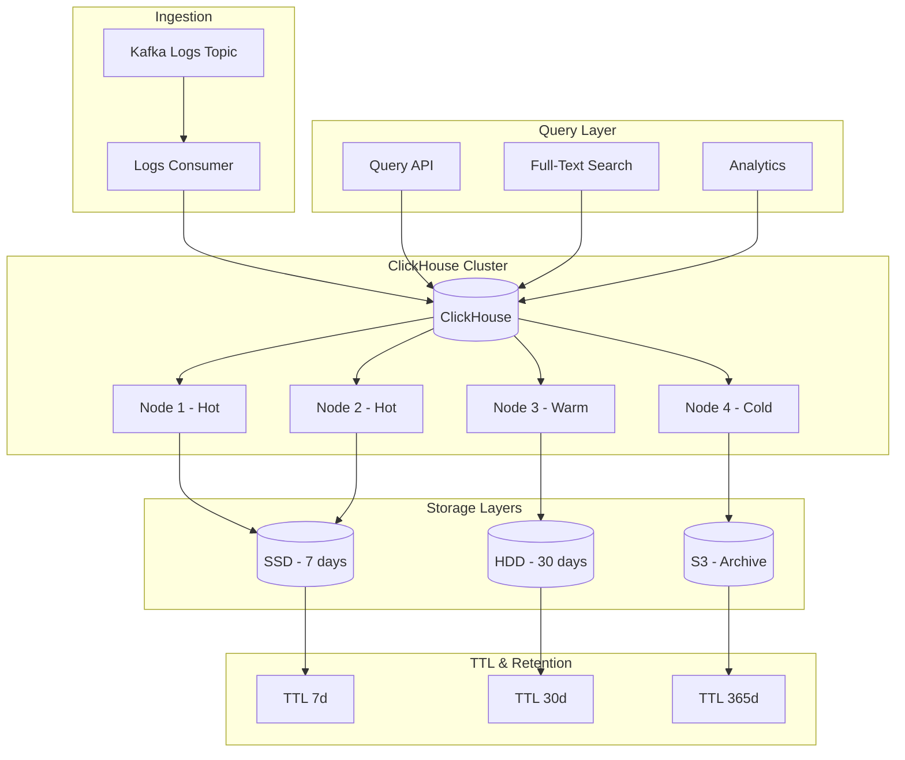

# ADR 0011: Log Storage with ClickHouse

## Metadata

| Field | Value |
|-------|-------|
| **ADR ID** | 0011 |
| **Title** | Log Storage Strategy with ClickHouse |
| **Status** | Proposed |
| **Date** | 2026-01-18 |
| **Authors** | Data Engineering Team |
| **Related ADRs** | 0005 (Telemetry Pipeline), 0010 (Time-Series Storage) |

---

## 1. Status

**Proposed** - Under review

---

## 2. Context

### Problem Statement

RustOps must store and query massive volumes of log data:

| Metric | Requirement |
|--------|-------------|
| **Ingestion rate** | 1TB/day |
| **Retention** | 30 days full-text search |
| **Query latency** | <5 seconds for full-text search |
| **Compression** | >95% (critical for cost) |
| **Full-text search** | Required |
| **Aggregation** | Fast GROUP BY, COUNT, etc. |

**Log data characteristics**:
- Very high write throughput
- Append-only (no updates)
- Time-based queries
- Full-text search requirements
- Heavy aggregations (error rates by service, etc.)

### Requirements

| Requirement | Target |
|-------------|--------|
| **Write throughput** | 1TB/day |
| **Full-text search** | <5 seconds p95 |
| **Compression** | >95% |
| **SQL support** | Full SQL with extensions |
| **Cost-effective** | Minimize storage costs |

---

## 3. Decision

### Selection: ClickHouse for Log Storage



### ClickHouse Schema Design

```sql
-- Main logs table (MergerTree engine for performance)
CREATE TABLE logs (
    timestamp DateTime64(3) CODEC(DoubleDelta),
    timestamp_date Date MATERIALIZED toDate(timestamp),
    level LowCardinality(String) CODEC(ZSTD),
    service LowCardinality(String) CODEC(ZSTD),
    namespace LowCardinality(String) CODEC(ZSTD),
    pod LowCardinality(String) CODEC(ZSTD),
    container LowCardinality(String) CODEC(ZSTD),
    node LowCardinality(String) CODEC(ZSTD),

    -- Full-text search fields
    message String CODEC(ZSTD(1)),
    message_minhash String MATERIALized minHash(message),  -- For similarity search
    message_tokens String MATERIALIZED arrayJoin(tokenizeMessage(message)),

    -- Structured fields (parsed from JSON)
    json_fields Map(String, String) CODEC(ZSTD(1)),

    -- Metadata
    trace_id String CODEC(ZSTD(1)),
    span_id String CODEC(ZSTD(1)),
    labels Map(String, String) CODEC(ZSTD(1)),

    -- Indexing
    INDEX idx_level level TYPE bloom_filter GRANULARITY 1,
    INDEX idx_service service TYPE bloom_filter GRANULARITY 1,
    INDEX idx_message message TYPE tokenbf_v1(32768, 3, 0) GRANULARITY 1,
    INDEX idx_trace trace_id TYPE bloom_filter GRANULARITY 1
) ENGINE = MergeTree()
PARTITION BY toYYYYMMDD(timestamp_date)
ORDER BY (timestamp_date, service, level, timestamp)
TTL timestamp_date + INTERVAL 30 DAY
SETTINGS index_granularity = 8192;

-- Materialized view for error logs (fast access to errors)
CREATE MATERIALIZED VIEW logs_errors_mv
ENGINE = MergeTree()
PARTITION BY toYYYYMMDD(toDate(timestamp))
ORDER BY (service, timestamp)
AS SELECT *
FROM logs
WHERE level = 'ERROR';

-- Aggregated metrics by service (pre-computed)
CREATE MATERIALIZED VIEW logs_service_metrics_mv
ENGINE = SummingMergeTree()
PARTITION BY toYYYYMMDD(timestamp_date)
ORDER BY (timestamp_date, service, level)
AS SELECT
    toStartOfMinute(timestamp) AS timestamp,
    timestamp_date,
    service,
    level,
    count() AS count,
    sum(1) AS error_count
FROM logs
GROUP BY timestamp, service, level
TTL timestamp_date + INTERVAL 90 DAY;

-- Full-text search optimization: tokenize function
CREATE FUNCTION tokenizeMessage AS (msg) -> arraySplitByChar(msg, ' ');
```

### Data Ingestion (Rust)

```toml
[dependencies]
clickhouse-rs = "1.1"
tokio = { version = "1.0", features = ["full"] }
```

```rust
use clickhouse::{Client, Row};
use serde::{Serialize, Deserialize};

#[derive(Debug, Clone, Serialize, Deserialize)]
pub struct LogEntry {
    pub timestamp: DateTime<Utc>,
    pub level: String,
    pub service: String,
    pub namespace: String,
    pub pod: String,
    pub container: String,
    pub node: String,
    pub message: String,
    pub json_fields: HashMap<String, String>,
    pub trace_id: Option<String>,
    pub span_id: Option<String>,
    pub labels: HashMap<String, String>,
}

pub struct ClickHouseWriter {
    client: Client,
    buffer: Vec<LogEntry>,
    buffer_size: usize,
    flush_interval: Duration,
}

impl ClickHouseWriter {
    pub async fn write_logs(&mut self, logs: Vec<LogEntry>) -> Result<()> {
        self.buffer.extend(logs);

        if self.buffer.len() >= self.buffer_size {
            self.flush().await?;
        }

        Ok(())
    }

    pub async fn flush(&mut self) -> Result<()> {
        if self.buffer.is_empty() {
            return Ok(());
        }

        let mut insert = self.client
            .insert("logs")
            .await?;

        for log in &self.buffer {
            insert.write(&log).await?;
        }

        insert.end().await?;
        self.buffer.clear();

        Ok(())
    }
}

// Batch insert for high throughput
pub struct BatchLogWriter {
    client: Client,
    batch_size: usize,
}

impl BatchLogWriter {
    pub async fn insert_batch(&self, logs: Vec<LogEntry>) -> Result<()> {
        let mut inserts = Vec::new();

        for chunk in logs.chunks(self.batch_size) {
            let insert = self.client
                .insert("logs")
                .with_option("async_insert", "1")
                .with_option("wait_for_async_insert", "0")
                .await?;

            for log in chunk {
                insert.write(log).await?;
            }

            insert.end().await?;
        }

        Ok(())
    }
}
```

### Query Patterns

```sql
-- 1. Full-text search
SELECT timestamp, service, message
FROM logs
WHERE message LIKE '%error%'
  AND timestamp >= now() - INTERVAL 1 HOUR
ORDER BY timestamp DESC
LIMIT 100;

-- 2. Filter by service and level
SELECT timestamp, pod, message
FROM logs
WHERE service = 'api-gateway'
  AND level = 'ERROR'
  AND timestamp >= now() - INTERVAL 15 MINUTE
ORDER BY timestamp DESC;

-- 3. Search by trace ID
SELECT timestamp, service, message, trace_id
FROM logs
WHERE trace_id = 'abc123'
ORDER BY timestamp;

-- 4. Aggregation: error rate by service
SELECT
    service,
    countIf(level = 'ERROR') AS errors,
    count() AS total,
    errors / total * 100 AS error_rate
FROM logs
WHERE timestamp >= now() - INTERVAL 1 HOUR
GROUP BY service
ORDER BY errors DESC;

-- 5. Search with structured fields (JSON)
SELECT timestamp, service, message, json_fields
FROM logs
WHERE json_fields['user_id'] = '12345'
  AND json_fields['request_id'] = 'abc-def'
ORDER BY timestamp DESC;

-- 6. Correlated logs (same trace)
SELECT
    timestamp,
    service,
    level,
    message
FROM logs
WHERE trace_id IN (
    SELECT DISTINCT trace_id
    FROM logs
    WHERE level = 'ERROR'
      AND timestamp >= now() - INTERVAL 5 MINUTE
)
ORDER BY timestamp, trace_id;

-- 7. Log patterns (similar errors)
SELECT
    multiIf(
        position(message, 'Connection refused') > 0, 'Connection refused',
        position(message, 'Timeout') > 0, 'Timeout',
        position(message, '500') > 0, 'HTTP 500',
        'Other'
    ) AS error_pattern,
    count() AS count
FROM logs
WHERE level = 'ERROR'
  AND timestamp >= now() - INTERVAL 1 HOUR
GROUP BY error_pattern
ORDER BY count DESC;
```

### Storage Optimization

```sql
-- Compression optimization
ALTER TABLE logs MODIFY COLUMN message CODEC(ZSTD(3));
ALTER TABLE logs MODIFY COLUMN json_fields CODEC(ZSTD(1));

-- TTL with moves to colder storage
ALTER TABLE logs
MODIFY TTL
    timestamp_date + INTERVAL 7 DAY TO VOLUME 'ssd',
    timestamp_date + INTERVAL 30 DAY TO VOLUME 'hdd',
    timestamp_date + INTERVAL 365 DAY DELETE;

-- Partition management (drop old partitions)
OPTIMIZE TABLE logs PARTITION tuple() FINAL;
```

### Hybrid Storage Strategy

```sql
-- Create storage policies
CREATE STORAGE POLICY tiered
VOLUMES
(
    ssd,
    hdd
);

-- Apply to logs table
ALTER TABLE logs MODIFY SETTING storage_policy = 'tiered';

-- Move old partitions to S3
ALTER TABLE logs
MOVE PARTITION '20240101' TO DISK 's3';
```

---

## 4. Alternatives Considered

### Alternative 1: Elasticsearch

**Description**: Use Elasticsearch for log storage

**Pros**:
- Industry standard (ELK stack)
- Excellent full-text search
- Rich ecosystem

**Cons**:
- **Poor compression** (10x more storage than ClickHouse)
- **Expensive** at scale
- **Complex architecture** (multiple nodes, shards, replicas)
- **Heavy resource usage**

**Rejected**: Storage cost too high at TB scale

### Alternative 2: Loki

**Description**: Use Grafana Loki

**Pros**:
- Designed for logs
- Good compression
- Prometheus-like (Grafana integration)
- Lower cost than ELK

**Cons**:
- **No full SQL** (LogQL only)
- Less flexible for complex queries
- Smaller community
- Limited analytical capabilities

**Rejected**: SQL support requirement

### Alternative 3: Cloud-Native (CloudWatch Logs, Log Analytics)

**Description**: Use cloud provider logging

**Pros**:
- No infrastructure to manage
- Good integration
- Scalable

**Cons**:
- **Vendor lock-in**
- **Expensive** at scale
- Limited control
- Egress costs

**Rejected**: Need multi-cloud support

---

## 5. Consequences

### Positive

| Benefit | Impact |
|---------|--------|
| **Compression** | 95%+ compression (10x less storage) |
| **Performance** | Columnar storage for fast aggregations |
| **SQL support** | Full SQL with extensions |
| **Cost-effective** | Significant storage cost savings |
| **Scalability** | Linear scaling with cluster size |

### Negative

| Challenge | Mitigation |
|-----------|------------|
| **Operational complexity** | Cluster management | Managed ClickHouse Cloud option |
| **Full-text search** | Not as good as Elasticsearch | Use bloom filters, tokenization |
| **Learning curve** | New technology | Training, documentation |

### Neutral

- **Query language**: SQL vs LogQL (team knows SQL)
- **Ecosystem**: Smaller than ELK, but growing

---

## 6. Implementation

### Phase 1: ClickHouse Deployment (Week 1)

```bash
# Deploy ClickHouse cluster
kubectl create namespace clickhouse
helm install clickhouse clickhouse/clickhouse --set shards=3,replicas=2

# Create schema
clickhouse-client --host clickhouse.rustops.svc --query "$(cat schema.sql)"
```

### Phase 2: Rust Integration (Weeks 2-3)

- Implement ClickHouse writer
- Implement ClickHouse reader
- Optimize batch sizes

### Phase 3: Query Layer (Weeks 4-5)

- Implement full-text search
- Implement aggregations
- Build query API

### Phase 4: Optimization (Weeks 6-7)

- Compression tuning
- TTL policies
- Tiered storage

---

## 7. References

### Technologies
- [ClickHouse](https://clickhouse.com/) - Analytical database
- [clickhouse-rs](https://github.com/suharev7/clickhouse-rs) - Rust client
- [Loki](https://grafana.com/loki/) - Alternative (for comparison)

### Documentation
- [ClickHouse Documentation](https://clickhouse.com/docs/en/)
- [ClickHouse Log Management](https://clickhouse.com/blog/managing-logs-with-clickhouse/)

### Benchmarks
- [ClickHouse vs Elasticsearch](https://clickhouse.com/blog/storing-log-data-in-clickhouse-is-cheaper-than-elasticsearch/)
- [ClickHouse Benchmarks](https://clickhouse.com/benchmark/)

### Research
- "Columnar Storage for Log Analytics" - VLDB 2024
- "ClickHouse: Architecture and Performance" - SIGMOD 2023
