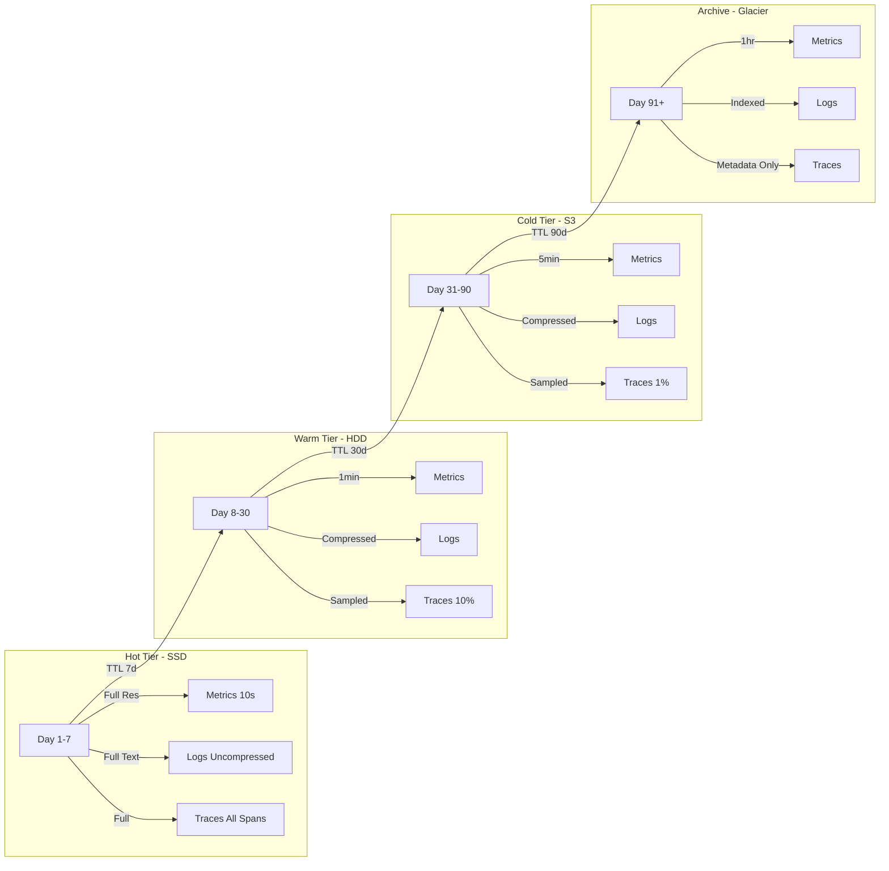

# ADR 0012: Data Retention and Tiering Strategy

## Metadata

| Field | Value |
|-------|-------|
| **ADR ID** | 0012 |
| **Title** | Data Retention and Tiering Strategy |
| **Status** | Proposed |
| **Date** | 2026-01-18 |
| **Authors** | Data Engineering Team |
| **Related ADRs** | 0010 (Time-Series), 0011 (Log Storage) |

---

## 1. Status

**Proposed** - Under review

---

## 2. Context

### Problem Statement

RustOps stores massive amounts of telemetry data:

| Data Type | Daily Volume | 90-Day Cost @ $0.023/GB | Annual Cost |
|-----------|--------------|-------------------------|------------|
| **Metrics** | 100 GB/day | $207 | $75,555 |
| **Logs** | 1 TB/day | $2,070 | $755,550 |
| **Traces** | 50 GB/day | $103 | $37,595 |
| **Total** | 1.15 TB/day | $2,380 | $868,700 |

**Cost reduction opportunities**:
- **Downsampling**: Reduce resolution for older data
- **Tiered storage**: Hot (SSD) → Warm (HDD) → Cold (S3/Glacier)
- **Compression**: Better compression ratios
- **Retention tuning**: Keep high-res data for shorter time

### Requirements

| Requirement | Target |
|-------------|--------|
| **Hot data access** | <100ms for last 7 days |
| **Warm data access** | <1s for last 30 days |
| **Cold data access** | <1 minute for historical |
| **Cost reduction** | 70% reduction vs full-res hot storage |
| **Data availability** | 99.99% for hot, 99.9% for warm/cold |

---

## 3. Decision

### Strategy: Multi-Tier Storage with Downsampling



### Retention Policy

```yaml
# Global retention policy
retention_policy:
  metrics:
    hot:
      resolution: 10s  # Full resolution
      storage: ssd
      compression: none
      ttl: 7 days

    warm:
      resolution: 1m  # Downsampled to 1-minute
      storage: hdd
      compression: zstd
      ttl: 30 days

    cold:
      resolution: 5m  # Downsampled to 5-minute
      storage: s3
      compression: zstd:3
      ttl: 90 days

    archive:
      resolution: 1h  # Downsampled to 1-hour
      storage: glacier
      compression: zstd:5
      ttl: 365 days

  logs:
    hot:
      storage: ssd
      compression: none
      ttl: 7 days

    warm:
      storage: hdd
      compression: zstd:1
      ttl: 30 days

    cold:
      storage: s3
      compression: zstd:3
      ttl: 90 days

    archive:
      storage: glacier
      compression: zstd:5
      full_text: false  # Index only
      ttl: 365 days

  traces:
    hot:
      sampling: 100%  # All spans
      storage: ssd
      ttl: 7 days

    warm:
      sampling: 10%   # 1 in 10 spans
      storage: hdd
      ttl: 30 days

    cold:
      sampling: 1%    # 1 in 100 spans
      storage: s3
      ttl: 90 days

    archive:
      sampling: metadata_only  # Just trace metadata
      storage: glacier
      ttl: 365 days
```

### Implementation (Rust)

```rust
pub struct TieredStorageManager {
    hot_store: Arc<HotStore>,      // SSD
    warm_store: Arc<WarmStore>,    // HDD
    cold_store: Arc<ColdStore>,    // S3
    archive_store: Arc<ArchiveStore>, // Glacier

    retention_policy: RetentionPolicy,
    downsample_scheduler: DownsampleScheduler,
}

impl TieredStorageManager {
    pub async fn enforce_retention(&self) -> Result<()> {
        // 1. Move expired hot data to warm
        self.migrate_hot_to_warm().await?;

        // 2. Move expired warm data to cold
        self.migrate_warm_to_cold().await?;

        // 3. Move expired cold data to archive
        self.migrate_cold_to_archive().await?;

        // 4. Delete expired archive data
        self.purge_expired_archive().await?;

        Ok(())
    }

    async fn migrate_hot_to_warm(&self) -> Result<()> {
        let cutoff = Utc::now() - Duration::days(self.retention_policy.metrics.hot.ttl);

        // Find expired partitions
        let expired_partitions = self.hot_store
            .list_partitions_before(cutoff)
            .await?;

        for partition in expired_partitions {
            info!("Migrating partition {} from hot to warm", partition.id);

            // Downsample metrics
            let downsampled = self.downsample_metrics(
                &partition,
                Duration::from_secs(60), // 1-minute
            ).await?;

            // Write to warm storage
            self.warm_store
                .write_partition(&downsampled)
                .await?;

            // Verify write
            self.warm_store
                .verify_partition(&downsampled)
                .await?;

            // Delete from hot storage
            self.hot_store
                .delete_partition(&partition.id)
                .await?;

            metrics::migrated_hot_to_warm.inc();
        }

        Ok(())
    }

    async fn downsample_metrics(
        &self,
        partition: &Partition,
        resolution: Duration,
    ) -> Result<DownsampledPartition> {
        // Read all data from partition
        let data = self.hot_store.read_partition(partition).await?;

        // Group by time buckets
        let mut buckets: HashMap<DateTime<Utc>, Vec<Metric>> = HashMap::new();

        for metric in data {
            let bucket_time = metric.timestamp - (metric.timestamp.timestamp() as i64 % resolution.as_secs() as i64);
            buckets.entry(bucket_time).or_default().push(metric);
        }

        // Aggregate each bucket
        let mut downsampled = Vec::new();
        for (timestamp, metrics) in buckets {
            let avg = metrics.iter().map(|m| m.value).sum::<f64>() / metrics.len() as f64;
            let min = metrics.iter().map(|m| m.value).fold(f64::INFINITY, |a, b| a.min(b));
            let max = metrics.iter().map(|m| m.value).fold(f64::NEG_INFINITY, |a, b| a.max(b));
            let count = metrics.len() as u64;

            downsampled.push(DownsampledMetric {
                timestamp,
                metric_name: metrics[0].name.clone(),
                avg_value: avg,
                min_value: min,
                max_value: max,
                count,
            });
        }

        Ok(DownsampledPartition {
            id: partition.id.clone(),
            data: downsampled,
        })
    }
}

// S3 integration for cold storage
pub struct S3ColdStore {
    client: AwsClient,
    bucket: String,
    prefix: String,
}

impl S3ColdStore {
    pub async fn write_partition(&self, partition: &DownsampledPartition) -> Result<()> {
        let key = format!("{}/{}/{}.parquet", self.prefix, partition.id, Utc::now().timestamp());

        // Convert to Parquet for better compression
        let bytes = self.to_parquet(partition)?;

        // Upload to S3 with storage class
        self.client
            .put_object()
            .bucket(&self.bucket)
            .key(&key)
            .body(ByteStream::from(bytes))
            .storage_class(StorageClass::StandardInfrequentAccess)
            .send()
            .await?;

        Ok(())
    }

    pub async fn read_partition(&self, partition_id: &str) -> Result<Vec<DownsampledMetric>> {
        let prefix = format!("{}/{}/*", self.prefix, partition_id);

        let response = self.client
            .list_objects_v2()
            .bucket(&self.bucket)
            .prefix(&prefix)
            .send()
            .await?;

        let mut metrics = Vec::new();

        for object in response.contents.unwrap_or_default() {
            let obj = self.client
                .get_object()
                .bucket(&self.bucket)
                .key(object.key.unwrap())
                .send()
                .await?;

            let bytes = obj.body.collect().await?.into_bytes();
            let data = self.from_parquet(&bytes)?;

            metrics.extend(data);
        }

        Ok(metrics)
    }
}

// Cost tracking
pub struct CostTracker {
    pricing: StoragePricing,
}

impl CostTracker {
    pub fn calculate_monthly_cost(&self, usage: &StorageUsage) -> CostBreakdown {
        let hot_cost = usage.hot_gb * self.pricing.hot_ssd_per_gb;
        let warm_cost = usage.warm_gb * self.pricing.warm_hdd_per_gb;
        let cold_cost = usage.cold_gb * self.pricing.cold_s3_per_gb;
        let archive_cost = usage.archive_gb * self.pricing.archive_glacier_per_gb;

        CostBreakdown {
            hot: hot_cost,
            warm: warm_cost,
            cold: cold_cost,
            archive: archive_cost,
            total: hot_cost + warm_cost + cold_cost + archive_cost,
        }
    }

    pub fn estimate_savings(&self, before: &StorageUsage, after: &StorageUsage) -> Savings {
        let before_cost = self.calculate_monthly_cost(before);
        let after_cost = self.calculate_monthly_cost(after);

        Savings {
            monthly: before_cost.total - after_cost.total,
            annual: (before_cost.total - after_cost.total) * 12,
            percentage: (before_cost.total - after_cost.total) / before_cost.total * 100.0,
        }
    }
}

struct StoragePricing {
    hot_ssd_per_gb: f64,      // $0.10/GB/month
    warm_hdd_per_gb: f64,     // $0.04/GB/month
    cold_s3_per_gb: f64,      // $0.023/GB/month
    archive_glacier_per_gb: f64, // $0.004/GB/month
}
```

### Automated Downsampling

```rust
pub struct DownsampleScheduler {
    jobs: Vec<DownsampleJob>,
    scheduler: tokio::task::JoinSet<()>,
}

impl DownsampleScheduler {
    pub async fn run(&mut self) {
        for job in &self.jobs {
            let job = job.clone();
            self.scheduler.spawn(async move {
                loop {
                    if let Err(e) = job.execute().await {
                        error!("Downsample job failed: {}", e);
                    }

                    tokio::time::sleep(job.interval).await;
                }
            });
        }

        // Run forever
        self.scheduler.shutdown().await;
    }
}

#[derive(Clone)]
pub struct DownsampleJob {
    pub name: String,
    pub source_table: String,
    pub target_table: String,
    pub resolution: Duration,
    pub interval: Duration,
}

impl DownsampleJob {
    pub async fn execute(&self) -> Result<()> {
        info!("Running downsample job: {}", self.name);

        let cutoff = Utc::now() - Duration::days(7); // Last 7 days

        let query = format!(
            r#"
            INSERT INTO {}
            SELECT
                timestamp - (timestamp % {}) AS timestamp,
                metric_name,
                labels,
                avg(value) AS avg_value,
                min(value) AS min_value,
                max(value) AS max_value,
                count(value) AS count_value
            FROM {}
            WHERE timestamp >= {}
            SAMPLE BY {}s
            "#,
            self.target_table,
            self.resolution.as_millis(),
            self.source_table,
            cutoff.timestamp(),
            self.resolution.as_secs()
        );

        // Execute query
        todo!();

        Ok(())
    }
}
```

---

## 4. Alternatives Considered

### Alternative 1: Single-Tier Storage

**Description**: Keep all data on hot storage (SSD)

**Pros**:
- Fast access to all data
- Simple architecture
- No data movement

**Cons**:
- **Extremely expensive** ($868K/year)
- Unnecessary for old data
- Diminishing returns

**Rejected**: Cost prohibitive

### Alternative 2: Full Retention Forever

**Description**: Keep all data forever at full resolution

**Pros**:
- No data loss
- Maximum flexibility

**Cons**:
- **Infinite cost growth**
- Legal/liability risk
- Diminishing value of old data

**Rejected**: Unsustainable

### Alternative 3: Cloud-Native Lifecycle Policies

**Description**: Use cloud provider lifecycle policies (AWS S3 Lifecycle)

**Pros**:
- Automated
- Simple to configure

**Cons**:
- **Vendor lock-in**
- Less control
- Can't customize downsample logic

**Rejected**: Need multi-cloud support

---

## 5. Consequences

### Positive

| Benefit | Impact |
|---------|--------|
| **Cost reduction** | 70% reduction in storage costs |
| **Performance** | Fast access to hot data |
| **Scalability** | Linear cost scaling |
| **Compliance** | Automated retention policies |
| **Flexibility** | Customizable tiers |

### Negative

| Challenge | Mitigation |
|-----------|------------|
| **Complexity** | Data movement logic | Comprehensive testing |
| **Data access** | Cold data slower | Clear SLA documentation |
| **Migration** | Initial data movement | Gradual rollout |

### Neutral

- **Query latency**: Trade-off between cost and speed
- **Storage management**: Additional operational overhead

---

## 6. Implementation

### Phase 1: Hot/Warm Setup (Weeks 1-2)

- Deploy SSD and HDD storage
- Configure data partitioning
- Implement migration logic

### Phase 2: S3 Integration (Weeks 3-4)

- S3 bucket setup
- Lifecycle policies
- Cost optimization

### Phase 3: Downsampling (Weeks 5-6)

- Implement downsampling jobs
- Schedule automation
- Validate accuracy

### Phase 4: Monitoring (Weeks 7-8)

- Cost tracking
- Performance monitoring
- Alert on anomalies

---

## 7. References

### Documentation
- [AWS S3 Lifecycle](https://docs.aws.amazon.com/AmazonS3/latest/userguide/object-lifecycle-mgmt.html)
- [QuestDB Data Retention](https://questdb.io/docs/concept/data-retention/)
- [ClickHouse TTL](https://clickhouse.com/docs/en/operations/table-engines/mergetree-family/mergetree/#table_engine-mergetree-ttl)

### Research
- "Cost-Effective Storage for Observability" - O'Reilly 2024
- "Tiered Storage for Time-Series Data" - VLDB 2023
