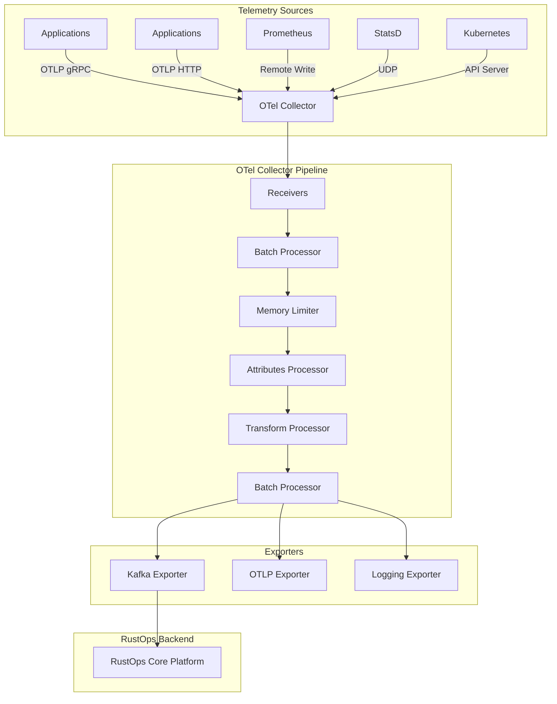

# ADR 0013: OpenTelemetry Integration Strategy

## Metadata

| Field | Value |
|-------|-------|
| **ADR ID** | 0013 |
| **Title** | OpenTelemetry Integration Architecture |
| **Status** | Proposed |
| **Date** | 2026-01-18 |
| **Authors** | Integration Team |
| **Related ADRs** | 0005 (Telemetry Pipeline) |

---

## 1. Status

**Proposed** - Under review

---

## 2. Context

### Problem Statement

RustOps must collect telemetry from heterogeneous sources:

| Source | Protocol | Format | Volume |
|--------|----------|--------|--------|
| **Applications** | OTLP | Protobuf/JSON | 8M metrics/min |
| **Kubernetes** | API Server | JSON | 50K events/min |
| **CloudWatch** | REST API | JSON | 1M metrics/min |
| **Prometheus** | HTTP | Text/Protobuf | 500K metrics/min |
| **Custom** | Various | Various | Ad-hoc |

**Challenges**:
- **Protocol diversity**: OTLP, Prometheus, StatsD, custom
- **Format differences**: Protobuf, JSON, text, binary
- **Transport**: HTTP, gRPC, UDP, TCP
- **Versioning**: Multiple OpenTelemetry spec versions
- **Compatibility**: Legacy instrumentation

### Requirements

| Requirement | Target |
|-------------|--------|
| **Protocol support** | OTLP (HTTP/gRPC), Prometheus, StatsD |
| **Format support** | Protobuf, JSON |
| **Ingestion rate** | 10M metrics/minute |
| **Backward compatibility** | Support legacy formats |
| **Extension** | Easy to add new collectors |

---

## 3. Decision

### Architecture: OpenTelemetry Collector as Ingestion Gateway



### Collector Configuration

```yaml
# otel-collector-config.yaml
receivers:
  # OTLP gRPC receiver (primary)
  otlp:
    protocols:
      grpc:
        endpoint: 0.0.0.0:4317
        max_recv_msg_size_mb: 128
      http:
        endpoint: 0.0.0.0:4318
        max_recv_msg_size_mb: 128

  # Prometheus receiver (for compatibility)
  prometheus:
    config:
      scrape_configs:
        - job_name: 'rustops-scrape'
          static_configs:
            - targets: ['localhost:9090']
          scrape_interval: 15s

  # StatsD receiver (legacy support)
  statsd:
    endpoint: 0.0.0.0:8125
    aggregation_interval: 60s
    enable_metric_type_metadata: true

  # Kubernetes receiver
  k8s_cluster:
    auth_type: serviceAccount
    node_condition_types_to_report:
      - Ready
      - MemoryPressure
      - DiskPressure
    allocatable_types_to_report:
      - cpu
      - memory
      - ephemeral-storage
    labels:
      key1: value1

processors:
  # Batch telemetry
  batch:
    timeout: 5s
    send_batch_size: 10000
    send_batch_max_size: 11000

  # Memory limiter
  memory_limiter:
    check_interval: 1s
    limit_mib: 4096
    spike_limit_mib: 512

  # Add attributes
  attributes:
    actions:
      - key: environment
        value: production
        action: upsert
      - key: collector
        value: rustops-collector-1
        action: insert

  # Transform telemetry
  transform:
    metric_statements:
      - context: metric
        statements:
          - set(description, attr_description) where attr_description != nil
          - set(name, ReplaceAllValue(name, " ", "_"))

    log_statements:
      - context: log
        statements:
          - set(attributes.source_type, attributes."source.type")
          - keep_keys(attributes, ["source_type", "service_name"])

    trace_statements:
      - context: span
        statements:
          - truncate_all(attributes, 4096)

exporters:
  # Export to Kafka (primary)
  kafka:
    brokers:
      - kafka1:9092
      - kafka2:9092
      - kafka3:9092
    topic: telemetry.otlp
    encoding: otlp_proto
    timeout: 30s
    retry_on_failure:
      enabled: true
      initial_interval: 5s
      max_interval: 30s
      max_elapsed_time: 300s

    # Authentication
    authentication:
      plain_text:
        username: rustops-ingest
        password: ${env:KAFKA_PASSWORD}

    # TLS
    tls:
      ca_file: /etc/kafka-ca/ca.pem
      cert_file: /etc/kafka-tls/cert.pem
      key_file: /etc/kafka-tls/key.pem
      insecure_skip_verify: false

  # Logging exporter (debug)
  logging:
    loglevel: debug

  # Health check
  health_check:
    endpoint: 0.0.0.0:13133

service:
  pipelines:
    metrics:
      receivers: [otlp, prometheus, statsd]
      processors: [memory_limiter, batch, attributes, transform]
      exporters: [kafka, logging]

    logs:
      receivers: [otlp]
      processors: [memory_limiter, batch, attributes, transform]
      exporters: [kafka, logging]

    traces:
      receivers: [otlp]
      processors: [memory_limiter, batch, attributes, transform]
      exporters: [kafka, logging]
```

### Rust Application Instrumentation

```toml
[dependencies]
opentelemetry = { version = "0.21", features = ["trace", "metrics"] }
opentelemetry-otlp = { version = "0.14", features = ["trace", "metrics", "grpc-tonic"] }
opentelemetry-semantic-conventions = "0.13"
tracing-opentelemetry = "0.22"
tracing-subscriber = { version = "0.3", features = ["env-filter", "json"] }
```

```rust
use opentelemetry::{
    trace::{TraceError, Tracer},
    metrics::MeterProvider,
    KeyValue,
};
use opentelemetry_otlp::{WithExportConfig, WithTonicConfig};
use opentelemetry::global;
use tracing_subscriber::{prelude::*, Registry};

// Initialize tracing
pub fn init_tracing(service_name: &str) -> Result<(), TraceError> {
    // Create OTLP exporter
    let otlp_exporter = opentelemetry_otlp::new_exporter()
        .tonic()
        .with_endpoint("http://otel-collector:4317")
        .with_timeout(Duration::from_secs(3))
        .build_span_exporter()?;

    // Create tracer provider
    let tracer_provider = opentelemetry::sdk::trace::TracerProvider::builder()
        .with_batch_exporter(otlp_exporter, opentelemetry::runtime::Tokio)
        .with_resource(opentelemetry::sdk::Resource::new(vec![
            KeyValue::new("service.name", service_name.to_string()),
            KeyValue::new("service.version", env!("CARGO_PKG_VERSION")),
            KeyValue::new("environment", "production"),
        ]))
        .build();

    global::set_tracer_provider(tracer_provider.clone());

    // Create tracing layer
    let telemetry = tracing_opentelemetry::layer()
        .with_tracer(tracer_provider.tracer(service_name));

    // Initialize tracing subscriber
    tracing_subscriber::registry()
        .with(telemetry)
        .with(tracing_subscriber::EnvFilter::from_default_env())
        .with(tracing_subscriber::fmt::layer())
        .try_init()?;

    Ok(())
}

// Initialize metrics
pub fn init_metrics(service_name: &str) -> Result<(), TraceError> {
    let otlp_exporter = opentelemetry_otlp::new_exporter()
        .tonic()
        .with_endpoint("http://otel-collector:4317")
        .build_metrics_exporter(Box::new(opentelemetry::sdk::metrics::PeriodicReader::builder(
            opentelemetry::sdk::metrics::TemporalitySelector::default(),
            opentelemetry::runtime::Tokio,
        ).build()))?;

    let meter_provider = opentelemetry::sdk::metrics::MeterProvider::builder()
        .with_reader(otlp_exporter)
        .with_resource(opentelemetry::sdk::Resource::new(vec![
            KeyValue::new("service.name", service_name.to_string()),
        ]))
        .build();

    global::set_meter_provider(meter_provider);

    Ok(())
}

// Usage in application
use tracing::{info, instrument, error, span, Level};

#[instrument(skip(db))]
async fn process_request(request: Request, db: &Database) -> Result<Response> {
    let _span = span!(Level::INFO, "process_request", request_id = %request.id);

    info!("Processing request");

    // Get meter
    let meter = global::meter("rustops-app");
    let request_counter = meter.u64_counter("http_requests_total").init();
    let request_duration = meter.f64_histogram("http_request_duration_ms").init();

    let start = Instant::now();

    // Process request
    let result = match db.query(&request).await {
        Ok(data) => {
            request_counter.add(1, &[
                KeyValue::new("method", request.method.to_string()),
                KeyValue::new("status", "200"),
            ]);

            Ok(Response::from(data))
        }
        Err(e) => {
            error!("Database error: {}", e);

            request_counter.add(1, &[
                KeyValue::new("method", request.method.to_string()),
                KeyValue::new("status", "500"),
            ]);

            Err(e)
        }
    };

    let duration = start.elapsed().as_secs_f64() * 1000.0;
    request_duration.record(duration, &[
        KeyValue::new("method", request.method.to_string()),
    ]);

    result
}
```

### Custom Collector

```rust
use opentelemetry::sdk::export::metrics::{Aggregation, Temporality};
use opentelemetry::sdk::metrics::data::ResourceMetrics;
use opentelemetry::sdk::metrics::Processor;

pub struct RustOpsProcessor {
    kafka_producer: Arc<KafkaProducer>,
    topic: String,
}

impl Processor for RustOpsProcessor {
    fn process(&self, data: &mut ResourceMetrics) {
        // Add custom attributes
        for scope_metrics in &mut data.scope_metrics {
            for metric in &mut scope_metrics.metrics {
                // Add enrichment
                metric.data_mut().describe(&mut Describe::new(
                    Cow::Borrowed("rustops.description"),
                    Cow::Borrowed("1"),
                    Vec::new(),
                ));
            }
        }

        // Convert to OTLP JSON
        let otlp_json = serde_json::to_string(&data).unwrap();

        // Send to Kafka
        tokio::spawn({
            let producer = self.kafka_producer.clone();
            let topic = self.topic.clone();
            async move {
                if let Err(e) = producer.send(&topic, &otlp_json).await {
                    error!("Failed to send metrics to Kafka: {}", e);
                }
            }
        });
    }
}

pub struct CustomMetricExporter {
    kafka_producer: Arc<KafkaProducer>,
}

impl opentelemetry::sdk::export::metrics::MetricExporter for CustomMetricExporter {
    fn export(&self, metrics: &mut ResourceMetrics) -> Result<(), MetricError> {
        // Convert to RustOps format
        let rustops_metrics = self.convert_to_rustops(metrics)?;

        // Send to Kafka
        let bytes = serde_json::to_vec(&rustops_metrics)?;
        self.kafka_producer.send_sync("telemetry.metrics", &bytes)?;

        Ok(())
    }

    fn force_flush(&self) -> Result<(), MetricError> {
        Ok(())
    }

    fn shutdown(&self) -> Result<(), MetricError> {
        Ok(())
    }

    fn temp(&self) -> Temporality {
        Temporality::Cumulative
    }
}
```

---

## 4. Alternatives Considered

### Alternative 1: Direct Ingestion (No Collector)

**Description**: RustOps receives telemetry directly from applications

**Pros**:
- Simpler architecture
- No intermediate hop
- Lower latency

**Cons**:
- **Protocol complexity**: Must implement OTLP, Prometheus, etc.
- **No buffering**: Direct impact on backend
- **Less flexible**: Hard to add new protocols

**Rejected**: Complexity of implementing all protocols

### Alternative 2: Multiple Collectors

**Description**: Separate collectors for each protocol

**Pros**:
- Isolated failures
- Protocol-specific optimization

**Cons**:
- **More infrastructure**: Multiple services to manage
- **Inconsistent processing**: Different transforms per collector
- **Higher cost**: More resources

**Rejected:** Operational complexity

### Alternative 3: Vendor-Specific Agents

**Description**: Use Datadog Agent, Splunk Universal Forwarder, etc.

**Pros**:
- Drop-in replacement
- Vendor-managed

**Cons**:
- **Vendor lock-in**
- **Limited flexibility**
- **Cost**

**Rejected**: Need vendor-agnostic solution

---

## 5. Consequences

### Positive

| Benefit | Impact |
|---------|--------|
| **Standard protocol** | OpenTelemetry is industry standard |
| **Vendor agnostic** | Works with any backend |
| **Flexible** | Easy to add new receivers/exporters |
| **Battle-tested** | Used by thousands of companies |
| **Rich ecosystem** | Instrumentation libraries for all languages |

### Negative

| Challenge | Mitigation |
|-----------|------------|
| **Complexity** | Collector configuration is complex | Good documentation, examples |
| **Resource usage** | Collector uses CPU/memory | Proper sizing, monitoring |
| **Version compatibility** | Multiple spec versions | Support multiple versions |

### Neutral

- **Latency**: Additional hop (1-10ms)
- **Maintenance**: Need to update collector

---

## 6. Implementation

### Phase 1: Collector Deployment (Week 1)

```bash
# Deploy OpenTelemetry Collector
kubectl create namespace telemetry
helm install otel-collector open-telemetry/opentelemetry-collector \
  --set mode=deployment \
  --set replicas=3
```

### Phase 2: Rust Integration (Weeks 2-3)

- Add OpenTelemetry crates
- Implement tracing
- Implement metrics

### Phase 3: Custom Processing (Weeks 4-5)

- Build custom processors
- Implement enrichment
- Add transformations

### Phase 4: Production (Weeks 6-7)

- Load testing
- Performance tuning
- Monitoring

---

## 7. References

### Documentation
- [OpenTelemetry Spec](https://opentelemetry.io/docs/reference/specification/)
- [OTel Collector](https://opentelemetry.io/docs/collector/)
- [Rust SDK](https://github.com/open-telemetry/opentelemetry-rust)

### Technologies
- [OTel Collector Contrib](https://github.com/open-telemetry/opentelemetry-collector-contrib)
- [opentelemetry-rust](https://github.com/open-telemetry/opentelemetry-rust)

### Research
- "OpenTelemetry Best Practices" - CNCF 2024
    - "Observability with OpenTelemetry" - O'Reilly 2023
