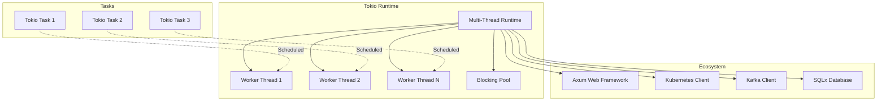

# ADR 0017: Tokio Async Runtime Selection

## Metadata

| Field | Value |
|-------|-------|
| **ADR ID** | 0017 |
| **Title** | Async Runtime Selection: Tokio vs async-std |
| **Status** | Proposed |
| **Date** | 2026-01-18 |
| **Authors** | Rust Engineering Team |
| **Related ADRs** | 0018 (Error Handling), 0019 (Concurrency) |

---

## 1. Status

**Proposed** - Under review

---

## 2. Context

### Problem Statement

RustOps must handle massive concurrent I/O operations:

| Operation | Concurrency | Latency Requirement |
|-----------|-------------|---------------------|
| **Metric ingestion** | 100K+ concurrent connections | <10ms |
| **Log processing** | 10K+ concurrent streams | <50ms |
| **API requests** | 10K+ concurrent requests | <100ms |
| **Kubernetes API calls** | 1K+ concurrent watchers | Real-time |
| **ML inference** | 1K+ concurrent models | <500ms |

**Async runtime requirements**:
- High concurrency (100K+ tasks)
- Low latency (<10ms p99 for hot paths)
- Minimal overhead (memory, CPU)
- Ecosystem compatibility
- Debugging and observability
- Integration with async libraries

### Requirements

| Requirement | Target |
|-------------|--------|
| **Concurrency** | 100K+ concurrent tasks |
| **Latency** | <10ms p99 for hot paths |
| **Memory overhead** | <1KB per task |
| **Ecosystem** | Compatible with major crates |
| **Debugging** | Good tooling support |

---

## 3. Decision

### Selection: Tokio for Async Runtime



### Tokio Configuration

```rust
use tokio::runtime::{Builder, Runtime};

// Configure runtime for production
pub fn create_runtime() -> Runtime {
    Builder::new_multi_thread()
        // Worker threads (default: num CPUs)
        .worker_threads(num_cpus::get())
        // Thread name (for debugging)
        .thread_name("rustops-worker")
        // Stack size (default: 2MB)
        .thread_stack_size(2 * 1024 * 1024)
        // Enable I/O driver
        .enable_io()
        // Enable time driver
        .enable_time()
        // I/O driver events per tick (tunable)
        .max_blocking_threads(512)
        // Build runtime
        .build()
        .expect("Failed to create tokio runtime")
}

// Optimized for high-throughput ingestion
pub fn create_ingestion_runtime() -> Runtime {
    Builder::new_multi_thread()
        .worker_threads(num_cpus::get() * 2)  // More workers for I/O
        .thread_name("rustops-ingestion")
        .enable_io()
        .enable_time()
        .max_blocking_threads(1024)  // More blocking threads
        .build()
        .expect("Failed to create ingestion runtime")
}

// Optimized for ML inference
pub fn create_inference_runtime() -> Runtime {
    Builder::new_multi_thread()
        .worker_threads(num_cpus::get())
        .thread_name("rustops-inference")
        .enable_io()
        .enable_time()
        // Disable thread parking for lower latency
        .on_thread_start(|| {
            // Pin to CPU core for NUMA locality
            // Use thread local storage for model cache
        })
        .build()
        .expect("Failed to create inference runtime")
}
```

### Task Spawning Patterns

```rust
use tokio::task::{JoinHandle, spawn, spawn_blocking};

// Spawn CPU-bound task (uses blocking pool)
pub fn process_ml_model(data: Vec<f64>) -> JoinHandle<Result<Prediction>> {
    spawn_blocking(move || {
        // This runs on blocking pool (doesn't block async tasks)
        let model = load_model()?;
        let prediction = model.predict(data)?;
        Ok(prediction)
    })
}

// Spawn I/O-bound task (uses worker threads)
pub async fn fetch_metrics(source: &str) -> Result<Vec<Metric>> {
    // This runs on worker threads
    let client = reqwest::Client::new();
    let response = client.get(source).send().await?;
    let metrics = response.json().await?;
    Ok(metrics)
}

// Spawn many concurrent tasks
pub async fn process_metrics_batch(metrics: Vec<Metric>) -> Result<Vec<Anomaly>> {
    let tasks: Vec<_> = metrics
        .into_iter()
        .map(|metric| {
            spawn(async move {
                detect_anomaly(metric).await
            })
        })
        .collect();

    // Wait for all tasks with bounded concurrency
    let futures = stream::iter(tasks)
        .buffer_unordered(100)  // Max 100 concurrent
        .collect::<Vec<_>>()
        .await;

    futures.into_iter()
        .map(|r| r??)
        .collect::<Result<Vec<_>, _>>()
}

// Task with timeout
pub async fn process_with_timeout<T>(
    future: impl Future<Output = T>,
    timeout: Duration,
) -> Result<T> {
    tokio::time::timeout(timeout, future)
        .await
        .map_err(|_| Error::Timeout)
}
```

### Integration with Major Crates

```toml
[dependencies]
tokio = { version = "1.0", features = ["full"] }
axum = "0.7"                    # Web framework
kube = "0.87"                   # Kubernetes client
sqlx = { version = "0.7", features = ["runtime-tokio"] }
rdkafka = "0.36"                # Kafka client
reqwest = { version = "0.11", features = ["json"] }
tower = "0.4"                   # Middleware
```

```rust
// Axum web framework (Tokio-based)
use axum::{routing::get, Router};

pub async fn start_api_server() {
    let app = Router::new()
        .route("/health", get(health_check))
        .route("/metrics", get(metrics_handler));

    let listener = tokio::net::TcpListener::bind("0.0.0.0:8080")
        .await
        .unwrap();

    axum::serve(listener, app)
        .await
        .unwrap();
}

// Kubernetes client (Tokio-based)
use kube::{Client, api::ListParams, ResourceExt};

pub async fn watch_pods() -> Result<()> {
    let client = Client::try_default().await?;
    let pods: Api<Pod> = Api::default_namespaced(client);

    let stream = pods.watch(&ListParams::default(), "0").await?;

    loop {
        match stream.try_next().await {
            Ok(Some(event)) => {
                match event {
                    WatchEvent::Added(pod) => {
                        info!("Pod added: {}", pod.name());
                    }
                    WatchEvent::Modified(pod) => {
                        info!("Pod modified: {}", pod.name());
                    }
                    WatchEvent::Deleted(pod) => {
                        info!("Pod deleted: {}", pod.name());
                    }
                    WatchEvent::Error(e) => {
                        error!("Watch error: {}", e);
                    }
                }
            }
            Ok(None) => break,
            Err(e) => {
                error!("Stream error: {}", e);
                tokio::time::sleep(Duration::from_secs(1)).await;
            }
        }
    }

    Ok(())
}
```

### Performance Tuning

```rust
// Optimize for high-throughput ingestion
pub struct IngestionService {
    runtime: Runtime,
    semaphore: Arc<Semaphore>,
}

impl IngestionService {
    pub fn new() -> Self {
        let runtime = create_ingestion_runtime();

        // Limit concurrent connections
        let semaphore = Arc::new(Semaphore::new(100_000));

        Self { runtime, semaphore }
    }

    pub async fn handle_connection(&self, conn: TcpStream) -> Result<()> {
        // Acquire permit (backpressure)
        let _permit = self.semaphore.acquire().await?;

        // Process connection
        self.process_connection(conn).await
    }

    async fn process_connection(&self, conn: TcpStream) {
        // Use task-local storage for connection state
        tokio::task::spawn_local(async move {
            // Connection processing
        });
    }
}

// Task tracing and observability
use tracing::{instrument, info_span};

#[instrument(skip(data))]
pub async fn process_telemetry(data: Vec<u8>) -> Result<()> {
    let span = info_span!("process_telemetry", size = data.len());
    let _enter = span.enter();

    // Processing
    tokio::task::yield_now();  // Fairness

    Ok(())
}

// Task budgeting (prevent starvation)
pub async fn process_with_budget() {
    for item in items {
        process_item(item).await;

        // Yield to other tasks every iteration
        tokio::task::yield_now();
    }
}
```

---

## 4. Alternatives Considered

### Alternative 1: async-std

**Description**: Use async-std as runtime

**Pros**:
- Simpler API
- More "Rust-like" design
- Good documentation

**Cons**:
- **Smaller ecosystem** (fewer crate integrations)
- **Less mature** (younger than Tokio)
- **Lower performance** (some benchmarks)
- **Less adoption** in industry

**Rejected**: Ecosystem compatibility critical

### Alternative 2: Mixed Runtime

**Description**: Use both Tokio and async-std for different components

**Pros**:
- Best of both worlds
- Use each where appropriate

**Cons**:
- **Complex integration** (runtimes don't mix well)
- **Higher memory** (two runtimes)
- **Confusing** for developers
- **Not recommended** by either team

**Rejected**: Integration complexity

### Alternative 3: No Runtime (Async-Await Only)

**Description**: Use async/await without full runtime

**Pros**:
- Minimal overhead
- Simple

**Cons**:
- **No executor** (need custom executor)
- **No I/O driver** (need custom I/O)
- **No timers** (need custom time)
- **Reinventing the wheel**

**Rejected**: Don't want to build runtime from scratch

---

## 5. Consequences

### Positive

| Benefit | Impact |
|---------|--------|
| **Ecosystem** | Largest async ecosystem in Rust |
| **Performance** | Battle-tested, highly optimized |
| **Tooling** | Console, tokio-console for debugging |
| **Integration** | Works with all major crates |
| **Support** | Used by major companies (Discord, AWS, etc.) |

### Negative

| Challenge | Mitigation |
|-----------|------------|
| **Complexity** | More complex API than async-std | Comprehensive documentation |
| **Resource usage** | Higher baseline memory | Profile and optimize |
| **Learning curve** | Steeper for beginners | Training, examples |

### Neutral

- **API style**: Builder pattern vs simple functions
- **Opinionated**: Strong opinions on how to use it

---

## 6. Implementation

### Phase 1: Tokio Integration (Week 1)

- Add tokio with features
- Configure runtime
- Basic examples

### Phase 2: Ecosystem Integration (Weeks 2-3)

- Axum web server
- Kubernetes client
- Kafka consumer

### Phase 3: Optimization (Weeks 4-5)

- Performance tuning
- Memory profiling
- Concurrency optimization

### Phase 4: Observability (Weeks 6-7)

- Tokio console
- Tracing integration
- Metrics collection

---

## 7. References

### Documentation
- [Tokio Documentation](https://tokio.rs/)
- [Tokio Runtime](https://tokio.rs/tokio/topics/runtime)
- [Tokio Console](https://github.com/tokio-rs/console)

### Technologies
- [Tokio](https://github.com/tokio-rs/tokio)
- [async-std](https://github.com/async-rs/async-std) (for comparison)

### Research
- "Tokio: A Platform for Reliable Rust Network Services" - RustConf 2023
- "Async Rust in Production" - AWS 2024
