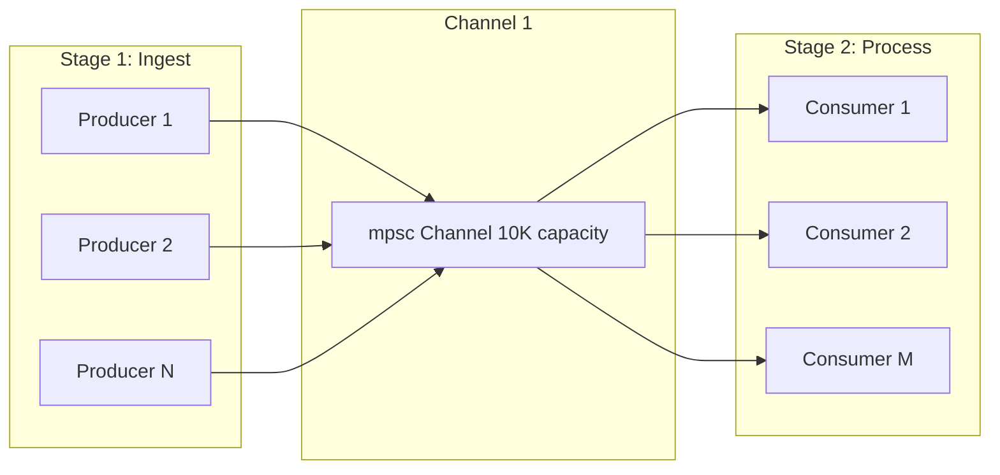

# ADR 0019: Concurrency Patterns for Pipeline Processing

## Metadata

| Field | Value |
|-------|-------|
| **ADR ID** | 0019 |
| **Title** | Concurrency Patterns: Channels, Tasks, and Synchronization |
| **Status** | Proposed |
| **Date** | 2026-01-18 |
| **Authors** | Rust Engineering Team |
| **Related ADRs** | 0017 (Tokio), 0018 (Error Handling) |

---

## 1. Status

**Proposed** - Under review

---

## 2. Context

### Problem Statement

RustOps must process data through multiple concurrent stages:

```
Ingest → Validate → Normalize → Enrich → Store
   ↓        ↓          ↓         ↓        ↓
 10K/s   10K/s     10K/s    10K/s   10K/s
```

**Concurrency challenges**:
- **Backpressure**: Slow stages shouldn't overwhelm fast stages
- **Buffering**: Need bounded buffers to prevent memory explosion
- **Fairness**: All data should get fair processing time
- **Coordination**: Stages need to coordinate without blocking
- **Performance**: Minimize synchronization overhead

### Requirements

| Requirement | Target |
|-------------|--------|
| **Throughput** | 10M metrics/minute |
| **Latency** | <100ms end-to-end p95 |
| **Memory** | <1GB buffer per pipeline |
| **CPU utilization** | >80% during load |
| **Backpressure** | No unbounded memory growth |

---

## 3. Decision

### Architecture: Multi-Producer Multi-Consumer Pipelines



### Channel-Based Pipeline

```rust
use tokio::sync::mpsc;
use tokio::sync::semaphore::Semaphore;

// Pipeline stage configuration
pub struct StageConfig {
    pub channel_size: usize,
    pub num_workers: usize,
    pub max_concurrent: usize,
}

// Multi-producer, multi-consumer pipeline
pub struct PipelineStage<T, U> {
    tx: mpsc::Sender<T>,
    rx: mpsc::Receiver<T>,
    config: StageConfig,
    _phantom: PhantomData<U>,
}

impl<T, U> PipelineStage<T, U>
where
    T: Send + 'static,
    U: Send + 'static,
{
    pub fn new(config: StageConfig) -> Self {
        let (tx, rx) = mpsc::channel(config.channel_size);

        Self {
            tx,
            rx,
            config,
            _phantom: PhantomData,
        }
    }

    pub fn sender(&self) -> mpsc::Sender<T> {
        self.tx.clone()
    }

    pub async fn run<F, Fut>(self, mut processor: F) -> PipelineHandle<U>
    where
        F: FnMut(T) -> Fut + Send + 'static,
        Fut: std::future::Future<Output = Result<U>> + Send,
        U: Send + 'static,
    {
        let (output_tx, output_rx) = mpsc::channel(self.config.channel_size);
        let semaphore = Arc::new(Semaphore::new(self.config.max_concurrent));

        let mut workers = Vec::new();

        for worker_id in 0..self.config.num_workers {
            let mut rx = self.rx.clone();
            let output_tx = output_tx.clone();
            let semaphore = semaphore.clone();
            let mut processor = processor.clone();

            let worker = tokio::spawn(async move {
                // Clone the receiver to avoid moving it
                while let Some(item) = rx.recv().await {
                    // Acquire permit (backpressure)
                    let _permit = semaphore.acquire().await.unwrap();

                    // Process item
                    match processor(item).await {
                        Ok(result) => {
                            if output_tx.send(result).await.is_err() {
                                break; // Channel closed
                            }
                        }
                        Err(e) => {
                            error!("Worker {} failed: {}", worker_id, e);
                            metrics::worker_errors.inc();
                        }
                    }
                }
            });

            workers.push(worker);
        }

        // Drop original receivers (workers have clones)
        drop(self.rx);
        drop(output_tx);

        PipelineHandle {
            workers,
            output: output_rx,
        }
    }
}

// Pipeline handle for monitoring and shutdown
pub struct PipelineHandle<T> {
    workers: Vec<tokio::task::JoinHandle<()>>,
    output: mpsc::Receiver<T>,
}

impl<T> PipelineHandle<T> {
    pub async fn recv(&mut self) -> Option<T> {
        self.output.recv().await
    }

    pub async fn shutdown(self) -> Result<()> {
        // Cancel all workers
        for worker in self.workers {
            worker.abort();
        }

        Ok(())
    }
}

// Cloneable wrapper for closures
#[derive(Clone)]
struct Processor<F>(F);

impl<F, Fut, T, U> Fn<(T,)> for Processor<F>
where
    F: Fn(T) -> Fut + Clone,
    Fut: std::future::Future<Output = Result<U>>,
{
    extern "rust-call" fn call(&self, args: (T,)) -> Fut {
        (self.0)(args.0)
    }
}
```

### Pipeline Composition

```rust
// Compose multiple stages
pub async fn build_pipeline() -> Result<()> {
    // Stage 1: Ingest → Validate
    let ingest_stage = PipelineStage::new(StageConfig {
        channel_size: 10_000,
        num_workers: 4,
        max_concurrent: 1000,
    });

    // Stage 2: Validate → Normalize
    let validate_stage = PipelineStage::new(StageConfig {
        channel_size: 10_000,
        num_workers: 4,
        max_concurrent: 1000,
    });

    // Stage 3: Normalize → Enrich
    let normalize_stage = PipelineStage::new(StageConfig {
        channel_size: 10_000,
        num_workers: 4,
        max_concurrent: 1000,
    });

    // Stage 4: Enrich → Store
    let enrich_stage = PipelineStage::new(StageConfig {
        channel_size: 10_000,
        num_workers: 4,
        max_concurrent: 1000,
    });

    // Run pipeline
    let validated = ingest_stage.run(validate).await?;
    let normalized = validate_stage.run(normalize).await?;
    let enriched = normalize_stage.run(enrich).await?;
    let stored = enrich_stage.run(store).await?;

    // Start ingestion
    let ingest_sender = ingest_stage.sender();
    tokio::spawn(async move {
        // Start producers
        start_producers(ingest_sender).await;
    });

    // Process final stage
    while let Some(stored_item) = stored.recv().await {
        // Item successfully stored
        metrics::items_processed.inc();
    }

    Ok(())
}

async fn validate(item: RawMetric) -> Result<ValidatedMetric> {
    item.validate()
}

async fn normalize(item: ValidatedMetric) -> Result<NormalizedMetric> {
    item.normalize()
}

async fn enrich(item: NormalizedMetric) -> Result<EnrichedMetric> {
    item.enrich().await
}

async fn store(item: EnrichedMetric) -> Result<StoredMetric> {
    item.store().await
}
```

### Bounded Buffers and Backpressure

```rust
use tokio::sync::{mpsc, Semaphore};

pub struct BoundedBuffer<T> {
    buffer: mpsc::Sender<T>,
    capacity: usize,
    semaphore: Arc<Semaphore>,
    current_size: Arc<AtomicUsize>,
}

impl<T> BoundedBuffer<T>
where
    T: Send + 'static,
{
    pub fn new(capacity: usize) -> (Self, mpsc::Receiver<T>) {
        let (tx, rx) = mpsc::channel(capacity);
        let semaphore = Arc::new(Semaphore::new(capacity));
        let current_size = Arc::new(AtomicUsize::new(0));

        let buffer = Self {
            buffer: tx,
            capacity,
            semaphore: semaphore.clone(),
            current_size: current_size.clone(),
        };

        // Monitor buffer size
        tokio::spawn(async move {
            loop {
                tokio::time::sleep(Duration::from_secs(1)).await;
                let size = current_size.load(Ordering::Relaxed);
                metrics::buffer_size.set(size as f64);
                metrics::buffer_utilization.set(size as f64 / capacity as f64);
            }
        });

        (buffer, rx)
    }

    pub async fn send(&self, item: T) -> Result<()> {
        // Acquire permit (blocks if buffer full)
        let _permit = self.semaphore.acquire().await?;

        self.current_size.fetch_add(1, Ordering::Relaxed);

        // Send item
        self.buffer.send(item).await
            .map_err(|_| {
                self.current_size.fetch_sub(1, Ordering::Relaxed);
                anyhow::anyhow!("Channel closed")
            })?;

        Ok(())
    }

    pub async fn try_send(&self, item: T) -> Result<()> {
        // Try to acquire permit (non-blocking)
        match self.semaphore.try_acquire() {
            Ok(_permit) => {
                self.current_size.fetch_add(1, Ordering::Relaxed);

                self.buffer.try_send(item)
                    .map_err(|_| {
                        self.current_size.fetch_sub(1, Ordering::Relaxed);
                        anyhow::anyhow!("Buffer full or closed")
                    })?;

                Ok(())
            }
            Err(_) => {
                bail!("Buffer full, backpressure active");
            }
        }
    }
}
```

### Work-Stealing Thread Pool

```rust
use tokio::task::JoinSet;

pub struct WorkStealingPool<T, R> {
    workers: usize,
    work_queue: mpsc::Sender<T>,
    result_queue: mpsc::Receiver<R>,
    _handles: Vec<tokio::task::JoinHandle<()>>,
}

impl<T, R> WorkStealingPool<T, R>
where
    T: Send + 'static,
    R: Send + 'static,
{
    pub fn new<F>(workers: usize, processor: F) -> Self
    where
        F: Fn(T) -> R + Send + Clone + 'static,
    {
        let (work_tx, work_rx) = mpsc::channel(workers * 100);
        let (result_tx, result_rx) = mpsc::channel(workers * 100);

        let mut handles = Vec::new();

        for worker_id in 0..workers {
            let mut rx = work_rx.clone();
            let tx = result_tx.clone();
            let processor = processor.clone();

            let handle = tokio::spawn(async move {
                let local = tokio::task::LocalSet::new();

                local.run_until(async move {
                    while let Some(work) = rx.recv().await {
                        let result = processor(work);
                        if tx.send(result).await.is_err() {
                            break;
                        }
                    }
                }).await;
            });

            handles.push(handle);
        }

        drop(work_rx);
        drop(result_tx);

        Self {
            workers,
            work_queue: work_tx,
            result_queue: result_rx,
            _handles: handles,
        }
    }

    pub async fn submit(&self, work: T) -> Result<()> {
        self.work_queue.send(work).await
            .map_err(|_| anyhow!("Pool closed"))
    }

    pub async fn recv_result(&mut self) -> Option<R> {
        self.result_queue.recv().await
    }
}
```

### Channel Selection Guide

```rust
// Use mpsc for multi-producer, single-consumer
let (tx, rx) = mpsc::channel::<T>(100);

// Use broadcast for multi-producer, multi-consumer (all receive all)
let (tx, _rx) = broadcast::channel::<T>(100);

// Use watch for single-producer, multi-consumer (latest value only)
let (tx, _rx) = watch::channel::<T>(initial_value);

// Use oneshot for single-use channels
let (tx, rx) = oneshot::channel::<T>();

// Use sync channels for blocking sends
let (tx, rx) = sync::channel::<T>(100);

pub async fn channel_selector_example() {
    // msc: Metrics ingestion (multiple sources, single processor)
    let (metrics_tx, metrics_rx) = mpsc::channel(10_000);

    // broadcast: Alert fanout (one alert, multiple alerting systems)
    let (alert_tx, _alert_slack) = broadcast::channel(1000);
    let _alert_pagerduty = alert_tx.subscribe();
    let _alert_email = alert_tx.subscribe();

    // watch: Configuration updates (latest config to all workers)
    let (config_tx, _config_rx) = watch::channel(initial_config);

    // oneshot: Request-response pattern
    let (resp_tx, resp_rx) = oneshot::channel();

    // sync: Blocking batch processing
    let (batch_tx, batch_rx) = sync::channel(100);
}
```

---

## 4. Alternatives Considered

### Alternative 1: Lock-Based Synchronization

**Description**: Use Mutex and Condvar for coordination

**Pros**:
- Familiar pattern
- Simple for simple cases

**Cons**:
- **Blocking** (threads can't do other work)
- **Priority inversion**
- **Deadlocks** possible
- **Poor scalability** (contention)

**Rejected**: Async channels are superior

### Alternative 2: Shared Memory

**Description**: Use Arc<Mutex<Vec<T>>> for shared state

**Pros**:
- Simple concept
- Direct access

**Cons**:
- **Contention** on lock
- **Blocking** operations
- **Harder to reason about**
- **Cache coherency** issues

**Rejected:** Message passing is safer

### Alternative 3: Actor Model (actor crate)

**Description:** Use actor framework

**Pros**:
- Clean isolation
- Message passing

**Cons**:
- **Another dependency**
- **Overhead** for simple cases
- **Less control** than manual channels

**Rejected**: Channel-based approach gives more control

---

## 5. Consequences

### Positive

| Benefit | Impact |
|---------|--------|
| **Backpressure** | Natural flow control via bounded channels |
| **Performance** | Lock-free, minimal synchronization |
| **Scalability** | Linear scaling with workers |
| **Fairness** | Built-in fairness in channel scheduling |
| **Composability** | Easy to compose stages |

### Negative

| Challenge | Mitigation |
|-----------|------------|
| **Channel selection** | Many channel types | Documentation, guidelines |
| **Memory** | Channels allocate memory | Bounded channels |
| **Debugging** | Harder to trace flows | Comprehensive tracing |

### Neutral

- **Latency**: Slightly higher than direct calls
- **Complexity**: More code than simple function calls

---

## 6. Implementation

### Phase 1: Channel Infrastructure (Weeks 1-2)

- Define channel types
- Create bounded buffer
- Implement backpressure

### Phase 2: Pipeline Stages (Weeks 3-4)

- Build ingest stage
- Build processing stages
- Build storage stage

### Phase 3: Composition (Weeks 5-6)

- Pipeline composition
- Error handling
- Monitoring

### Phase 4: Testing (Weeks 7-8)

- Load testing
- Backpressure testing
- Failure scenarios

---

## 7. References

### Documentation
- [Tokio MPSC](https://docs.rs/tokio/latest/tokio/sync/mpsc/index.html)
- [Tokio Channels](https://tokio.rs/tokio/tutorial/channels)
- [Rust Concurrency Book](https://marabos.nl/atomics/)

### Research
- "Lock-Free Data Structures" - O'Reilly 2023
- "Channel-Based Concurrency in Rust" - RustConf 2024
