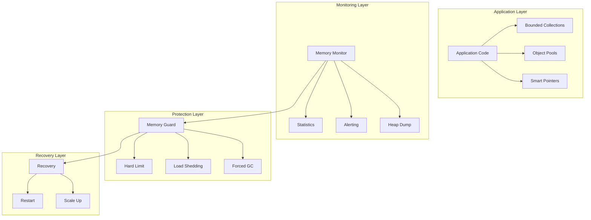

# ADR 0020: Memory Management for Long-Running Services

## Metadata

| Field | Value |
|-------|-------|
| **ADR ID** | 0020 |
| **Title** | Memory Management Strategies for Long-Running Services |
| **Status** | Proposed |
| **Date** | 2026-01-18 |
| **Authors** | Rust Engineering Team |
| **Related ADRs** | 0017 (Tokio), 0019 (Concurrency) |

---

## 1. Status

**Proposed** - Under review

---

## 2. Context

### Problem Statement

RustOps services run continuously for months:

| Service | Runtime | Memory Budget | Risk |
|---------|---------|---------------|------|
| **Ingestion** | 24/7 | 4GB | Memory leaks cause OOM |
| **Processing** | 24/7 | 8GB | Bloat causes swapping |
| **API** | 24/7 | 2GB | Fragmentation causes crashes |
| **ML Inference** | On-demand | 16GB | Model loading causes spikes |

**Memory management challenges**:
- **Memory leaks**: Even Rust can leak (cycles, Rc/Arc)
- **Fragmentation**: Long-running services fragment heap
- **Bloat**: Caches grow unbounded
- **Spikes**: Sudden load causes OOM
- **Leaks**: External resources (files, connections) not released

### Requirements

| Requirement | Target |
|-------------|--------|
| **Memory ceiling** | Never exceed configured limit |
| **Leak detection** | Detect leaks within 1 hour |
| **Bloat prevention** | Bounded caches and buffers |
| **Graceful degradation** | Shed load under memory pressure |
| **Predictable** | Stable memory usage over time |

---

## 3. Decision

### Strategy: Multi-Layered Memory Management



### Bounded Collections

```rust
use std::collections::{VecDeque, HashMap};
use std::num::NonZeroUsize;

// Bounded vector with fixed capacity
pub struct BoundedVec<T> {
    inner: VecDeque<T>,
    capacity: NonZeroUsize,
}

impl<T> BoundedVec<T> {
    pub fn new(capacity: NonZeroUsize) -> Self {
        Self {
            inner: VecDeque::with_capacity(capacity.get()),
            capacity,
        }
    }

    pub fn push(&mut self, item: T) -> Option<T> {
        if self.inner.len() >= self.capacity.get() {
            // Evict oldest
            self.inner.pop_front()
        } else {
            self.inner.push_back(item);
            None
        }
    }

    pub fn len(&self) -> usize {
        self.inner.len()
    }

    pub fn capacity(&self) -> usize {
        self.capacity.get()
    }
}

// LRU cache with bounded size
use lru::LruCache;

pub struct BoundedCache<K, V>
where
    K: Hash + Eq,
{
    inner: LruCache<K, V>,
    max_bytes: usize,
    current_bytes: usize,
}

impl<K, V> BoundedCache<K, V>
where
    K: Hash + Eq,
{
    pub fn new(capacity: NonZeroUsize, max_bytes: usize) -> Self {
        Self {
            inner: LruCache::new(capacity),
            max_bytes,
            current_bytes: 0,
        }
    }

    pub fn put(&mut self, key: K, value: V, size: usize) -> Option<V> {
        // Evict if too large
        while self.current_bytes + size > self.max_bytes {
            if let Some((_, evicted)) = self.inner.pop_lru() {
                self.current_bytes -= size_of_val(&evicted);
            } else {
                break;
            }
        }

        let old_size = self.inner.get(&key)
            .map(|v| size_of_val(v));

        self.inner.put(key, value);

        if let Some(old) = old_size {
            self.current_bytes = self.current_bytes.saturating_sub(old);
        }
        self.current_bytes += size;

        None
    }

    pub fn get(&mut self, key: &K) -> Option<&V> {
        self.inner.get(key)
    }
}
```

### Object Pooling

```rust
use std::sync::Arc;
use std::collections::VecDeque;

// Generic object pool
pub struct ObjectPool<T> {
    objects: Arc<Mutex<VecDeque<T>>>,
    factory: Box<dyn Fn() -> T + Send + Sync>,
    max_size: usize,
}

impl<T> ObjectPool<T>
where
    T: Send + 'static,
{
    pub fn new<F>(factory: F, max_size: usize) -> Self
    where
        F: Fn() -> T + Send + Sync + 'static,
    {
        Self {
            objects: Arc::new(Mutex::new(VecDeque::with_capacity(max_size))),
            factory: Box::new(factory),
            max_size,
        }
    }

    pub async fn acquire(&self) -> PooledObject<T> {
        // Try to get from pool
        let obj = loop {
            let mut pool = self.objects.lock().await;

            if let Some(obj) = pool.pop_front() {
                break obj;
            } else {
                // Pool empty, create new
                drop(pool);
                break (self.factory)();
            }
        };

        PooledObject {
            obj: Some(obj),
            pool: self.objects.clone(),
        }
    }

    async fn release(&self, obj: T) {
        let mut pool = self.objects.lock().await;

        if pool.len() < self.max_size {
            pool.push_back(obj);
        }
        // Otherwise, drop (let it be freed)
    }
}

// Pooled object with automatic return
pub struct PooledObject<T> {
    obj: Option<T>,
    pool: Arc<Mutex<VecDeque<T>>>,
}

impl<T> Drop for PooledObject<T> {
    fn drop(&mut self) {
        if let Some(obj) = self.obj.take() {
            let pool = self.pool.clone();

            tokio::spawn(async move {
                let mut pool = pool.lock().await;
                if pool.len() < pool.capacity() {
                    pool.push_back(obj);
                }
            });
        }
    }
}

impl<T> std::ops::Deref for PooledObject<T> {
    type Target = T;

    fn deref(&self) -> &Self::Target {
        self.obj.as_ref().unwrap()
    }
}

impl<T> std::ops::DerefMut for PooledObject<T> {
    fn deref_mut(&mut self) -> &mut Self::Target {
        self.obj.as_mut().unwrap()
    }
}
```

### Memory Monitoring

```rust
use std::alloc::{GlobalAlloc, Layout, System};
use std::sync::atomic::{AtomicUsize, Ordering};

// Memory tracking allocator
pub struct TrackingAllocator<A> {
    inner: A,
    allocated: AtomicUsize,
    deallocated: AtomicUsize,
}

impl<A> TrackingAllocator<A>
where
    A: GlobalAlloc,
{
    pub const fn new(inner: A) -> Self {
        Self {
            inner,
            allocated: AtomicUsize::new(0),
            deallocated: AtomicUsize::new(0),
        }
    }

    pub fn allocated(&self) -> usize {
        self.allocated.load(Ordering::Relaxed)
    }

    pub fn deallocated(&self) -> usize {
        self.deallocated.load(Ordering::Relaxed)
    }

    pub fn in_use(&self) -> usize {
        self.allocated.load(Ordering::Relaxed) - self.deallocated.load(Ordering::Relaxed)
    }
}

unsafe impl<A> GlobalAlloc for TrackingAllocator<A>
where
    A: GlobalAlloc,
{
    unsafe fn alloc(&self, layout: Layout) -> *mut u8 {
        let size = layout.size();
        let ptr = self.inner.alloc(layout);

        if !ptr.is_null() {
            self.allocated.fetch_add(size, Ordering::Relaxed);
        }

        ptr
    }

    unsafe fn dealloc(&self, ptr: *mut u8, layout: Layout) {
        let size = layout.size();
        self.inner.dealloc(ptr, layout);
        self.deallocated.fetch_add(size, Ordering::Relaxed);
    }
}

// Use with:
// #[global_allocator]
// static ALLOCATOR: TrackingAllocator<System> = TrackingAllocator::new(System);

// Memory monitor task
pub async fn monitor_memory(
    warning_threshold: usize,
    critical_threshold: usize,
) {
    let mut interval = tokio::time::interval(Duration::from_secs(10));

    loop {
        interval.tick().await;

        let allocated = ALLOCATOR.allocated();
        let in_use = ALLOCATOR.in_use();

        metrics::memory_allocated.set(allocated as f64);
        metrics::memory_in_use.set(in_use as f64);

        if in_use > critical_threshold {
            error!("Critical memory usage: {} bytes", in_use);
            metrics::memory_critical.inc();

            // Trigger load shedding
            shed_load().await;
        } else if in_use > warning_threshold {
            warn!("High memory usage: {} bytes", in_use);
            metrics::memory_warning.inc();
        }
    }
}

async fn shed_load() {
    // Implement load shedding strategies:
    // 1. Drop caches
    // 2. Reject new requests
    // 3. Reduce concurrency
    // 4. Force GC if using

    warn!("Shedding load due to memory pressure");
}
```

### Smart Pointer Guidelines

```rust
use std::rc::Rc;
use std::sync::Arc;
use std::weak::{Weak as WeakRc, Weak as WeakArc};

// Guidelines:
//
// 1. Use Box<T> for single ownership
// 2. Use Arc<T> for shared ownership across threads
// 3. Use Rc<T> for shared ownership within thread
// 4. Prefer Weak references to break cycles

// Example: Breaking cycles with Weak
pub struct Service {
    name: String,
    dependencies: Vec<Weak<Dependency>>,
}

pub struct Dependency {
    name: String,
    service: Arc<Service>,
}

impl Service {
    pub fn add_dependency(&mut self, dep: Arc<Dependency>) {
        // Store weak reference to avoid cycle
        self.dependencies.push(Arc::downgrade(&dep));
    }

    pub fn get_dependencies(&self) -> Vec<Arc<Dependency>> {
        self.dependencies
            .iter()
            .filter_map(|weak| weak.upgrade())
            .collect()
    }
}

// Example: Arc with explicit cleanup
pub struct ManagedResource<T> {
    inner: Arc<T>,
    _cleanup: Arc<dyn Fn() + Send + Sync>,
}

impl<T> ManagedResource<T> {
    pub fn new<F>(value: T, cleanup: F) -> Self
    where
        F: Fn() + Send + Sync + 'static,
    {
        Self {
            inner: Arc::new(value),
            _cleanup: Arc::new(cleanup),
        }
    }
}

impl<T> Clone for ManagedResource<T> {
    fn clone(&self) -> Self {
        Self {
            inner: Arc::clone(&self.inner),
            _cleanup: Arc::clone(&self._cleanup),
        }
    }
}

impl<T> Drop for ManagedResource<T> {
    fn drop(&mut self) {
        // Cleanup runs when last clone is dropped
        (self._cleanup)();
    }
}
```

### Memory Leak Detection

```rust
use std::time::{Duration, Instant};

pub struct LeakDetector {
    snapshots: Vec<MemorySnapshot>,
    max_snapshots: usize,
}

struct MemorySnapshot {
    timestamp: Instant,
    allocated: usize,
    in_use: usize,
}

impl LeakDetector {
    pub fn new(max_snapshots: usize) -> Self {
        Self {
            snapshots: Vec::with_capacity(max_snapshots),
            max_snapshots,
        }
    }

    pub fn snapshot(&mut self) {
        let snapshot = MemorySnapshot {
            timestamp: Instant::now(),
            allocated: ALLOCATOR.allocated(),
            in_use: ALLOCATOR.in_use(),
        };

        self.snapshots.push(snapshot);

        if self.snapshots.len() > self.max_snapshots {
            self.snapshots.remove(0);
        }
    }

    pub fn detect_leaks(&self) -> Vec<LeakReport> {
        let mut reports = Vec::new();

        // Compare snapshots over time
        for window in self.snapshots.windows(2) {
            let prev = &window[0];
            let curr = &window[1];

            let growth = curr.in_use as i64 - prev.in_use as i64;
            let duration = curr.timestamp.duration_since(prev.timestamp);

            // If memory growing steadily over time
            if growth > 0 && duration > Duration::from_secs(60) {
                let growth_rate = growth as f64 / duration.as_secs_f64();

                if growth_rate > 1024.0 {  // > 1KB/s
                    reports.push(LeakReport {
                        detected_at: Utc::now(),
                        growth_rate_bytes_per_sec: growth_rate,
                        current_usage: curr.in_use,
                    });
                }
            }
        }

        reports
    }
}

pub struct LeakReport {
    pub detected_at: DateTime<Utc>,
    pub growth_rate_bytes_per_sec: f64,
    pub current_usage: usize,
}
```

---

## 4. Alternatives Considered

### Alternative 1: Unbounded Collections

**Description**: Use standard Vec, HashMap without bounds

**Pros**:
- Simple
- No eviction logic

**Cons**:
- **Unbounded memory growth**
- **OOM kills** service
- **No backpressure**

**Rejected**: Risk of OOM is too high

### Alternative 2: Manual Memory Management

**Description**: Use raw pointers and manual alloc/dealloc

**Pros**:
- Full control
- Optimal performance

**Cons**:
- **Unsafe** (memory safety issues)
- **Complex**
- **Error-prone**
- **Unnecessary** in Rust

**Rejected**: Safety is requirement

### Alternative 3: Rely on OS OOM Killer

**Description**: Let Linux OOM killer handle it

**Pros**:
- No application logic
- OS handles it

**Cons**:
- **Abrupt termination** (no graceful shutdown)
- **Data loss**
- **Unpredictable**
- **Unprofessional**

**Rejected**: Need graceful degradation

---

## 5. Consequences

### Positive

| Benefit | Impact |
|---------|--------|
| **Predictable** | Stable memory usage |
| **Graceful** | Degradation under pressure |
| **Observable** | Full memory visibility |
| **Safe** | No leaks in production |
| **Efficient** | Reuse via pooling |

### Negative

| Challenge | Mitigation |
|-----------|------------|
| **Complexity** | More code than unbounded | Good abstractions |
| **Tuning** | Need to tune pool sizes | Metrics and monitoring |
| **Overhead** | Pooling has overhead | Profile and optimize |

### Neutral

- **Development**: Slightly longer initial development
- **Performance**: Pooling trades CPU for memory

---

## 6. Implementation

### Phase 1: Bounded Collections (Week 1)

- Implement BoundedVec
- Implement BoundedCache
- Add to shared library

### Phase 2: Object Pools (Weeks 2-3)

- Implement ObjectPool
- Pool common objects
- Tune pool sizes

### Phase 3: Memory Monitoring (Weeks 4-5)

- Implement tracking allocator
- Memory metrics
- Alerting

### Phase 4: Leak Detection (Weeks 6-7)

- Snapshot system
- Leak detection
- Automated response

---

## 7. References

### Documentation
- [Rust Ownership](https://doc.rust-lang.org/book/ch04-00-understanding-ownership.html)
- [Rc/Arc Cycles](https://doc.rust-lang.org/book/ch15-06-reference-cycles.html)
- [GlobalAlloc](https://doc.rust-lang.org/std/alloc/trait.GlobalAlloc.html)

### Research
- "Memory Management in Rust" - RustConf 2024
- "Leak Detection in Production" - ACM 2023
