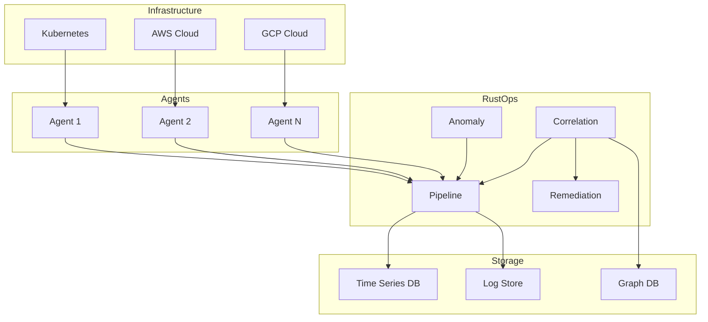

# Documentation Standards

Comprehensive documentation guidelines for the RustOps AIOps platform.

## Documentation Types

```
docs/
├── architecture/           # Architecture documentation
│   ├── adr/               # Architecture Decision Records
│   ├── diagrams/          # Architecture diagrams
│   └── design/            # Design documents
├── api/                   # API documentation
│   ├── rest/              # REST API specs
│   ├── graphql/           # GraphQL schemas
│   └── grpc/              # gRPC service definitions
├── runbooks/              # Operational runbooks
├── guides/                # User and developer guides
│   ├── installation/      # Installation guides
│   ├── configuration/     # Configuration guides
│   ├── integration/       # Integration guides
│   └── development/       # Development guides
└── reference/             # Reference material
    ├── cli/               # CLI reference
    ├── config/            # Config reference
    └── metrics/           # Metrics reference
```

## 1. Architecture Decision Records (ADRs)

### ADR Template

```markdown
# ADR-XXX: [Title]

**Status:** Proposed | Accepted | Deprecated | Superseded

**Date:** YYYY-MM-DD

**Context:**
[Describe the context and problem statement]

**Decision:**
[Describe the decision made]

**Consequences:**
- [Positive consequences]
- [Negative consequences]

**Alternatives Considered:**
1. [Alternative 1]
2. [Alternative 2]

**Related Decisions:**
- ADR-XXX: [Related decision]

**References:**
- [Link to external references]
```

### Example ADR

```markdown
# ADR-001: Use ONNX Runtime for ML Inference

**Status:** Accepted

**Date:** 2025-01-18

**Context:**
We need to run machine learning models for anomaly detection in the RustOps platform.
The models are trained in Python but must run in Rust for performance and reliability.

**Decision:**
Use ONNX Runtime as the ML inference engine. Models will be trained in Python/Scikit-learn,
exported to ONNX format, and executed via the `ort` crate in Rust.

**Consequences:**
- **Positive:**
  - Models trained in any framework can be used
  - Hardware acceleration via CUDA/TensorRT
  - Small runtime overhead (~100MB)
  - Mature, well-supported project
- **Negative:**
  - Additional build complexity for CUDA support
  - ONNX export may not support all model features

**Alternatives Considered:**
1. **Pure Rust ML (SmartCore, Linfa):**
   - Pro: No external dependencies
   - Con: Limited model selection, less mature
2. **TensorFlow Lite:**
   - Pro: Good mobile support
   - Con: Larger runtime, more complex API
3. **Direct Python embedding:**
   - Pro: Full Python ecosystem
   - Con: GIL issues, deployment complexity

**Related Decisions:**
- None

**References:**
- [ONNX Runtime Documentation](https://onnxruntime.ai/docs/)
- [ort Crate](https://docs.rs/ort/)
```

## 2. API Documentation

### REST API Documentation

```markdown
# Metrics API

## List Metrics

Retrieve a list of available metrics.

### HTTP Request

`GET /api/v1/metrics`

### Query Parameters

| Parameter | Type | Required | Description |
|-----------|------|----------|-------------|
| query | string | No | Filter metrics by name pattern |
| limit | integer | No | Maximum number of results (default: 100) |
| offset | integer | No | Number of results to skip (default: 0) |

### Response

```json
{
  "metrics": [
    {
      "name": "cpu_usage_percent",
      "type": "gauge",
      "labels": ["host", "region"],
      "description": "CPU usage as percentage"
    }
  ],
  "total": 1,
  "limit": 100,
  "offset": 0
}
```

### Examples

```bash
# Get all metrics
curl https://api.rustops.dev/v1/metrics

# Filter by pattern
curl "https://api.rustops.dev/v1/metrics?query=cpu_*"

# Pagination
curl "https://api.rustops.dev/v1/metrics?limit=50&offset=50"
```

### Errors

| Status Code | Description |
|-------------|-------------|
| 400 | Invalid query parameters |
| 401 | Authentication required |
| 500 | Internal server error |
```

### GraphQL Schema Documentation

```graphql
"""
A time series metric with value and metadata
"""
type Metric {
  """
  Unique identifier for the metric
  """
  id: ID!

  """
  Metric name (e.g., cpu_usage_percent)
  """
  name: String!

  """
  Metric value
  """
  value: Float!

  """
  Timestamp in Unix epoch seconds
  """
  timestamp: Int64!

  """
  Key-value labels for this metric
  """
  labels: Map<String, String>!
}

"""
Query root for metrics
"""
type Query {
  """
  Retrieve metrics by name and time range
  """
  metrics(
    """
    Metric name pattern
    """
    name: String!

    """
    Start time (Unix timestamp)
    """
    from: Int64!

    """
    End time (Unix timestamp)
    """
    to: Int64!

    """
    Label filters
    """
    labels: Map<String, String>
  ): [Metric!]!
}
```

## 3. Runbooks

### Runbook Template

```markdown
# [Title]

## Severity
P1 (Critical) | P2 (High) | P3 (Medium) | P4 (Low)

## Symptoms
[What does the user/operator see?]

## Impact
[Who/what is affected?]

## Diagnosis Steps

### Step 1: Check Service Health
```bash
# Command to check health
kubectl get pods -n rustops
```

Expected output: [What to expect]

### Step 2: Check Logs
```bash
# Command to check logs
kubectl logs -n rustops deployment/rustops-api
```

Look for: [What to look for]

### Step 3: Check Metrics
[Metrics to check]

## Resolution

### Option 1: [Solution]
[Step-by-step resolution]

### Option 2: [Alternative Solution]
[Step-by-step resolution]

## Verification
[How to verify the issue is resolved]

## Prevention
[How to prevent this in the future]

## Escalation
[When and how to escalate]

## Related
[Links to related runbooks, docs, alerts]
```

### Example Runbook

```markdown
# High Alert Volume

## Severity
P2 (High)

## Symptoms
- Alert rate exceeds 1000/minute
- Dashboard shows alert spike
- PagerDuty/Slack notifications flooding

## Impact
- Alert fatigue for on-call engineers
- Potential missed critical alerts
- Degraded system performance

## Diagnosis Steps

### Step 1: Check Alert Rate
```bash
# Query current alert rate
curl -s http://rustops-api:8080/api/v1/metrics/alerts_per_second | jq '.value'
```

Expected: < 100 alerts/second

### Step 2: Check Top Alert Sources
```bash
# Get top alert sources
curl -s http://rustops-api:8080/api/v1/alerts/top_sources | jq '.'
```

Look for: Single service generating most alerts

### Step 3: Check for Alert Storm
```bash
# Check for duplicate alerts
curl -s http://rustops-api:8080/api/v1/alerts/duplicates | jq '.duplicate_count'
```

Look for: High duplicate count (>50%)

## Resolution

### Option 1: Enable Alert Suppression
```bash
# Enable suppression for noisy service
curl -X POST http://rustops-api:8080/api/v1/alerts/suppress \
  -H "Content-Type: application/json" \
  -d '{"service": "noisy-service", "duration": "1h"}'
```

### Option 2: Increase Correlation Window
```bash
# Update correlation config
kubectl set env deployment/rustops-correlation \
  CORRELATION_WINDOW_SECONDS=300
```

### Option 3: Scale Correlation Service
```bash
# Scale horizontally
kubectl scale deployment/rustops-correlation --replicas=6
```

## Verification
```bash
# Alert rate should decrease
curl -s http://rustops-api:8080/api/v1/metrics/alerts_per_second | jq '.value'
```

Expected: < 100 alerts/second

## Prevention
- Configure proper alert thresholds
- Enable deduplication by default
- Set up alert rate alerts
- Review noisy alerts weekly

## Escalation
Escalate to P1 if:
- Alert rate > 5000/minute for > 5 minutes
- System becomes unresponsive
- Critical services are affected

Contact: platform-oncall@rustops.dev

## Related
- [Alert Configuration Guide](../guides/configuration/alerts.md)
- [Correlation Engine Architecture](../architecture/correlation.md)
- [Incident Response Runbook](incident-response.md)
```

## 4. Developer Guides

### Getting Started Guide

```markdown
# Getting Started with RustOps Development

## Prerequisites

- Rust 1.85+ ([install](https://rustup.rs/))
- Docker 20.10+ ([install](https://docs.docker.com/get-docker/))
- kubectl configured for cluster access
- Node.js 20+ (for web UI)

## Setup

### 1. Clone Repository

```bash
git clone https://github.com/rustops/rustops.git
cd rustops
```

### 2. Install Dependencies

```bash
# Rust dependencies (via Makefile)
make dev-setup

# Or manually
cargo install cargo-watch cargo-nextest cargo-tarpaulin

# Web UI dependencies
cd web
npm install
```

### 3. Start Development Environment

```bash
# Start all services (Kafka, ClickHouse, Redis)
docker-compose -f tests/docker-compose.yml up -d

# Run tests
make test

# Start development server
make dev
```

## Making Changes

### Code Structure

```
crates/
├── agent/         # Telemetry collection agent
├── pipeline/      # Processing pipeline
├── anomaly/       # ML anomaly detection
└── ...
```

### Development Workflow

1. Create a feature branch
```bash
git checkout -b feature/my-feature
```

2. Make changes and test
```bash
# Watch mode for development
cargo watch -x 'check --workspace'

# Run tests
cargo test --workspace

# Format code
cargo fmt
```

3. Commit changes
```bash
git add .
git commit -m "feat: add my feature"
```

4. Push and create PR
```bash
git push origin feature/my-feature
gh pr create --title "feat: add my feature"
```

## Testing

### Unit Tests

```bash
# Run all unit tests
cargo test --workspace --lib

# Run specific test
cargo test --package rustops-agent test_metric_collection
```

### Integration Tests

```bash
# Start test dependencies
docker-compose -f tests/docker-compose.yml up -d

# Run integration tests
cargo test --workspace --test '*'
```

### Benchmarks

```bash
# Run benchmarks
cargo bench --workspace

# Specific benchmark
cargo bench --bench metric_ingestion
```

## Documentation

### Building Documentation

```bash
# Build rustdoc
cargo doc --workspace --no-deps --open

# Build all documentation
make docs
```

### Writing Documentation

```rust
/// Collects metrics from a configured source.
///
/// # Examples
///
/// ```
/// use rustops_agent::MetricCollector;
///
/// let collector = MetricCollector::new();
/// let metrics = collector.collect().await?;
/// ```
///
/// # Errors
///
/// Returns an error if:
/// - The source is unreachable
/// - Authentication fails
/// - Data format is invalid
pub async fn collect(&self) -> Result<Vec<Metric>> {
    // ...
}
```

## Getting Help

- [Documentation](https://docs.rustops.dev)
- [GitHub Issues](https://github.com/rustops/rustops/issues)
- [Slack](https://rustops-dev.slack.com)
```

## 5. In-Code Documentation

### Module Documentation

```rust
//! # Telemetry Collection Agent
//!
//! This crate provides the telemetry collection agent for RustOps.
//!
//! ## Architecture
//!
//! The agent is deployed on each monitored node and collects:
//! - System metrics (CPU, memory, disk, network)
//! - Application metrics (via Prometheus/scrape targets)
//! - Log entries (via file tails or journald)
//! - Distributed traces (via OpenTelemetry)
//!
//! ## Usage
//!
//! ```rust,no_run
//! use rustops_agent::Agent;
//!
//! #[tokio::main]
//! async fn main() -> Result<()> {
//!     let agent = Agent::new().await?;
//!     agent.run().await?;
//!     Ok(())
//! }
//! ```
//!
//! ## Configuration
//!
//! The agent is configured via a YAML file:
//!
//! ```yaml
//! collection:
//!   interval_seconds: 15
//!   metrics:
//!     enabled: true
//!   logs:
//!     enabled: true
//!     paths:
//!       - /var/log/*.log
//! ```
//!
//! ## Performance
//!
//! - CPU overhead: < 1%
//! - Memory footprint: < 150MB
//! - Startup time: < 2 seconds
```

### Function Documentation

```rust
/// Collects metrics from the configured source.
///
/// This function performs a single collection cycle, gathering all
/// configured metrics from the target source. Collection happens
/// asynchronously to avoid blocking.
///
/// # Arguments
///
/// * `source` - The source to collect from
/// * `timeout` - Maximum time to wait for collection
///
/// # Returns
///
/// Returns a `Vec<Metric>` on success, or an error if collection fails.
///
/// # Errors
///
/// This function will return an error if:
/// - The source is unreachable
/// - Authentication fails
/// - The response format is invalid
/// - The timeout is exceeded
///
/// # Examples
///
/// ```
/// use rustops_agent::{collect_metrics, Source};
///
/// # async fn example() -> Result<(), Box<dyn std::error::Error>> {
/// let source = Source::prometheus("http://localhost:9090");
/// let metrics = collect_metrics(&source, Duration::from_secs(5)).await?;
/// assert!(!metrics.is_empty());
/// # Ok(())
/// # }
/// ```
///
/// # Performance
///
/// Collection typically completes within 100-500ms depending on:
/// - Network latency to source
/// - Number of metrics being scraped
/// - Source response time
pub async fn collect_metrics(
    source: &Source,
    timeout: Duration,
) -> Result<Vec<Metric>> {
    // Implementation
}
```

### Struct Documentation

```rust
/// A telemetry metric with metadata.
///
/// Metrics are the primary data type in RustOps, representing individual
/// measurements collected from various sources.
///
/// # Fields
///
/// - `name`: The metric name (e.g., `cpu_usage_percent`)
/// - `value`: The numerical value
/// - `labels`: Key-value pairs for dimensional data
/// - `timestamp`: Unix timestamp when the metric was collected
///
/// # Examples
///
/// Creating a metric:
///
/// ```
/// use rustops_common::telemetry::Metric;
/// use std::collections::HashMap;
///
/// let mut labels = HashMap::new();
/// labels.insert("host".to_string(), "server1".to_string());
///
/// let metric = Metric {
///     name: "cpu_usage_percent".to_string(),
///     value: 75.5,
///     labels,
///     timestamp: 1705536000,
/// };
/// ```
///
/// # Serialization
///
/// Metrics serialize to JSON for transmission:
///
/// ```json
/// {
///   "name": "cpu_usage_percent",
///   "value": 75.5,
///   "labels": {"host": "server1"},
///   "timestamp": 1705536000
/// }
/// ```
#[derive(Debug, Clone, Serialize, Deserialize)]
pub struct Metric {
    /// The metric name (e.g., "cpu_usage_percent")
    pub name: String,

    /// The metric value
    pub value: f64,

    /// Dimensional labels
    pub labels: HashMap<String, String>,

    /// Collection timestamp (Unix seconds)
    pub timestamp: i64,
}
```

## 6. Diagrams

### Architecture Diagrams (Mermaid)

```markdown
## High-Level Architecture


```

## 7. Changelog Standards

### Keep a Changelog Format

```markdown
# Changelog

All notable changes to RustOps will be documented in this file.

The format is based on [Keep a Changelog](https://keepachangelog.com/en/1.0.0/),
and this project adheres to [Semantic Versioning](https://semver.org/spec/v2.0.0.html).

## [Unreleased]

### Added
- New integration with Datadog for metric ingestion
- Support for custom remediation workflows via YAML
- GraphQL API for advanced querying

### Changed
- Improved anomaly detection accuracy by 15%
- Reduced agent memory footprint by 30%

### Deprecated
- Legacy REST API v1 (use v2)

### Removed
- Support for Python 2.7

### Fixed
- Race condition in alert correlation engine
- Memory leak in log collector

### Security
- Updated dependencies to fix CVE-2024-XXXXX

## [1.2.0] - 2025-01-15

### Added
- Prometheus remote write support
- Kubernetes HPA integration

### Changed
- Migrated from custom protocol to OpenTelemetry

## [1.1.0] - 2024-12-01

### Added
- Initial release of anomaly detection
- Service topology discovery
- ITSM integrations (ServiceNow, Jira)
```

## 8. CLI Documentation

### Command Reference

```markdown
# rustops-cli

Command-line interface for RustOps.

## Installation

```bash
cargo install rustops-cli
```

## Usage

```bash
rustops [OPTIONS] <COMMAND>
```

## Global Options

| Option | Short | Description |
|--------|-------|-------------|
| `--config <FILE>` | `-c` | Config file path |
| `--verbose` | `-v` | Increase verbosity |
| `--quiet` | `-q` | Decrease verbosity |
| `--help` | `-h` | Show help |
| `--version` | `-V` | Show version |

## Commands

### `agent`

Manage telemetry collection agents.

```bash
rustops agent [OPTIONS] <COMMAND>
```

#### Subcommands

- `list` - List all deployed agents
- `status` - Show agent status
- `logs` - View agent logs
- `restart` - Restart an agent

#### Examples

```bash
# List all agents
rustops agent list

# View agent status
rustops agent status --node server1

# View logs
rustops agent logs --node server1 --tail 100
```

### `alert`

Manage and query alerts.

```bash
rustops alert [OPTIONS] <COMMAND>
```

#### Subcommands

- `list` - List active alerts
- `acknowledge` - Acknowledge an alert
- `silence` - Silence an alert
- `query` - Query alert history

#### Examples

```bash
# List active alerts
rustops alert list --active

# Acknowledge an alert
rustops alert acknowledge --id 12345 --comment "Investigating"

# Query history
rustops alert query --from "2024-01-01" --to "2024-01-31"
```
```

## Documentation Review Checklist

- [ ] All public APIs documented
- [ ] Code examples compile and run
- [ ] Error conditions documented
- [ ] Performance characteristics noted
- [ ] Security considerations included
- [ ] Thread safety documented
- [ ] Architecture diagrams up to date
- [ ] Runbooks tested and accurate
- [ ] CLI examples work
- [ ] Links are valid
- [ ] Spelling and grammar checked
- [ ] Changelog updated
